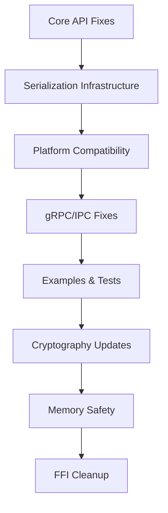

# Design Document

## Overview

This design addresses critical compilation errors across the OpenFlight workspace by implementing systematic fixes for API changes, dependency management, platform compatibility, and type safety issues. The solution is organized into focused modules that can be implemented incrementally while maintaining build stability.

The design follows a crate-by-crate approach, prioritizing fixes that unblock the most dependent code first, then addressing platform-specific issues, and finally cleaning up warnings and test infrastructure.

## Architecture

### Fix Organization Strategy

The compilation fixes are organized into logical groups that minimize interdependencies:



### Dependency Resolution Order

1. **flight-axis** - Core engine API changes (blocks examples and tests)
2. **Serde features** - Serialization infrastructure (blocks multiple crates)
3. **Platform gates** - Windows/Unix compatibility (blocks CI)
4. **flight-simconnect** - Windows-specific dependencies and API fixes
5. **flight-ipc** - gRPC module path corrections
6. **Examples package** - Centralized example management
7. **flight-updater** - Cryptography API migration
8. **flight-virtual** - Packed struct safety
9. **Test infrastructure** - Benchmark and test fixes
10. **FFI sys crates** - Warning suppression

## Components and Interfaces

### 1. Engine API Migration Module

**Purpose**: Update AxisEngine API to match current implementation

**Key Changes**:
- `Engine::new()` → `Engine::new(name: String, config: EngineConfig)`
- Add missing `EngineConfig` fields: `conflict_detector_config`, `enable_conflict_detection`
- Update all call sites consistently

**Interface**:
```rust
// Before
let config = EngineConfig {
    enable_rt_checks: true,
    max_frame_time_us: 500,
    enable_counters: true,
};
let engine = AxisEngine::with_config(config);

// After  
let config = EngineConfig {
    enable_rt_checks: true,
    max_frame_time_us: 500,
    enable_counters: true,
    enable_conflict_detection: true,
    conflict_detector_config: ConflictDetectorConfig::default(),
};
let engine = AxisEngine::with_config("demo".to_string(), config);
```

### 2. Serde Feature Infrastructure

**Purpose**: Implement conditional serialization across crates

**Architecture**:
```rust
// Producer crate (flight-axis/Cargo.toml)
[features]
serde = ["dep:serde"]

[dependencies]
serde = { version = "1", features = ["derive"], optional = true }

// Producer code
#[cfg_attr(feature = "serde", derive(serde::Serialize, serde::Deserialize))]
pub struct AxisFrame { /* ... */ }

// Consumer crate (flight-replay/Cargo.toml)
[dependencies]
flight-axis = { path = "../flight-axis", features = ["serde"] }
serde = { version = "1", features = ["derive"] }
bincode = "1"
```

**Affected Types**:
- `AxisFrame` (flight-axis)
- `SessionConfig` (flight-simconnect)
- Other serializable data structures

### 3. Platform Compatibility Layer

**Purpose**: Provide cross-platform file descriptor and handle abstractions

**Design Pattern**:
```rust
// Platform-specific imports
#[cfg(unix)]
use std::os::fd::{AsRawFd, RawFd, BorrowedFd, FromRawFd};

#[cfg(windows)]
use std::os::windows::io::{AsRawHandle, RawHandle, BorrowedHandle, FromRawHandle};

// Platform-specific test modules
#[cfg(unix)]
mod fd_safety_tests {
    // Unix-specific tests
}

#[cfg(windows)]
mod handle_safety_tests {
    // Windows-specific tests
}
```

**Affected Crates**:
- `flight-hid` - File descriptor tests
- `flight-ipc` - Transport layer tests
- Any crate using raw OS handles

### 4. Windows Dependencies Module

**Purpose**: Add required Windows crate dependencies and fix async patterns

**Dependencies**:
```toml
# flight-simconnect/Cargo.toml
[dependencies]
windows = { version = "0.62", features = [
    "Win32_System_Threading",
    "Win32_Foundation", 
    "Win32_System_Diagnostics_ToolHelp",
    "Win32_System_ProcessStatus"
] }
futures = "0.3"
```

**Async Pattern Fixes**:
```rust
// Wrong - awaiting non-future
let rx = self.event_rx.lock().await;

// Correct - std::sync::Mutex
let rx = self.event_rx.lock();

// Correct - tokio::sync::Mutex  
let rx = self.event_rx.lock().await;
```

### 5. gRPC Module Path Resolver

**Purpose**: Fix tonic-generated module import paths

**Path Mapping**:
```rust
// Old paths (incorrect)
use crate::proto::flight_service_client;
use crate::proto::flight_service_server;

// New paths (tonic 0.14+ structure)
use crate::proto::flight_service::flight_service_client::FlightServiceClient;
use crate::proto::flight_service::flight_service_server::{FlightService, FlightServiceServer};
```

**Stream Type Definitions**:
```rust
// Service implementation
impl FlightService for FlightServiceImpl {
    type HealthSubscribeStream = Pin<Box<dyn Stream<Item = Result<HealthResponse, Status>> + Send>>;
    
    async fn health_subscribe(
        &self, 
        _: Request<HealthRequest>
    ) -> Result<Response<Self::HealthSubscribeStream>, Status> {
        // Implementation
    }
}
```

### 6. Examples Package Architecture

**Purpose**: Centralize cross-crate examples with proper dependency management

**Structure**:
```
examples/
├── Cargo.toml          # Dependencies on all workspace crates
├── src/lib.rs          # Empty library
└── examples/
    ├── capability_demo.rs
    ├── capture_replay_demo.rs
    ├── pipeline_compilation_demo.rs
    └── ...
```

**Configuration Updates**:
```rust
// BlackboxConfig field migrations
let config = BlackboxConfig {
    output_dir: out_dir.into(),           // was: output_path
    enable_compression: true,             // was: compression_enabled  
    buffer_size: 1 << 20,                // new field
    max_recording_duration: Some(Duration::from_secs(60)),
    ..Default::default()
};

// Constructor changes
let writer = BlackboxWriter::new(config);  // Remove ? if not Result<T, E>
```

### 7. Cryptography Migration Module

**Purpose**: Update ed25519-dalek from v1 to v2 API

**API Migration**:
```rust
// Dependencies
ed25519-dalek = { version = "2", features = ["rand_core"] }
rand = "0.8"

// Type migrations
use ed25519_dalek::{
    Signature,           // unchanged
    SigningKey,          // was: Keypair
    VerifyingKey,        // was: PublicKey
    Signer, Verifier
};

// Key generation
let signing_key = SigningKey::generate(&mut OsRng);  // was: Keypair::generate()
let verifying_key = signing_key.verifying_key();     // was: keypair.public

// Signature operations
let signature = signing_key.sign(message);           // was: keypair.sign()
verifying_key.verify(message, &signature)?;         // was: public_key.verify()

// Byte conversions
let sig = Signature::from_bytes(
    sig_bytes.as_slice().try_into()?                 // Handle Vec<u8> -> [u8; 64]
)?;
```

### 8. Memory Safety Module

**Purpose**: Fix packed struct field access violations

**Safe Access Patterns**:
```rust
// Unsafe - creates unaligned reference
let value = &packed_struct.field;

// Safe - copy by value (if Copy)
let value = packed_struct.field;
let reference = &value;

// Safe - unaligned read (if not Copy)
let value = unsafe { 
    core::ptr::read_unaligned(core::ptr::addr_of!(packed_struct.field))
};
```

**Implementation Strategy**:
- Identify all packed struct field accesses
- Replace direct references with safe alternatives
- Use `ptr::addr_of!` for address-only operations
- Maintain functionality while ensuring memory safety

### 9. Test Infrastructure Module

**Purpose**: Fix test compilation and benchmark infrastructure

**Criterion Benchmark Updates**:
```rust
// Cargo.toml
[dev-dependencies]
criterion = "0.5"

[[bench]]
name = "replay_performance" 
harness = false

// Benchmark code
use criterion::{criterion_group, criterion_main, Criterion};

fn replay_bench(c: &mut Criterion) {
    let rt = tokio::runtime::Runtime::new().unwrap();
    c.bench_function("replay async", |b| {
        b.to_async(&rt).iter(|| async {
            std::hint::black_box(expensive_operation().await)  // was: criterion::black_box
        })
    });
}

criterion_group!(benches, replay_bench);
criterion_main!(benches);
```

**Test Visibility Fixes**:
```rust
// Test-only accessors
impl RulesEvaluator {
    #[cfg(test)]
    pub(crate) fn stack(&self) -> &Vec<StackItem> { 
        &self.stack 
    }
    
    #[cfg(test)]
    pub(crate) fn variable_cache(&self) -> &HashMap<String, Value> {
        &self.variable_cache
    }
}
```

### 10. FFI Warning Suppression Module

**Purpose**: Clean up FFI binding warnings without breaking functionality

**Implementation**:
```rust
// At crate root (flight-simconnect-sys/src/lib.rs)
#![allow(non_camel_case_types, non_snake_case, non_upper_case_globals)]

// Preserve all C naming conventions
// Suppress style warnings for generated bindings
// Maintain full C API compatibility
```

## Data Models

### Configuration Migration Map

| Crate | Old Field | New Field | Type Change |
|-------|-----------|-----------|-------------|
| flight-axis | `EngineConfig` | Add `conflict_detector_config` | `ConflictDetectorConfig` |
| flight-axis | `EngineConfig` | Add `enable_conflict_detection` | `bool` |
| flight-replay | `output_path` | `output_dir` | `PathBuf` |
| flight-replay | `compression_enabled` | `enable_compression` | `bool` |
| flight-replay | N/A | `buffer_size` | `usize` |

### Dependency Version Matrix

| Crate | Dependency | Old Version | New Version | Features |
|-------|------------|-------------|-------------|----------|
| flight-simconnect | windows | Missing | 0.62 | Win32_System_* |
| flight-simconnect | futures | Missing | 0.3 | default |
| flight-updater | ed25519-dalek | 1.x | 2.x | rand_core |
| flight-updater | rand | Missing | 0.8 | default |
| examples | criterion | 0.4 | 0.5 | default |

## Error Handling

### Compilation Error Categories

1. **Missing Fields** - Add required struct fields with sensible defaults
2. **API Signature Changes** - Update function calls to match new signatures  
3. **Missing Dependencies** - Add required crates to Cargo.toml
4. **Import Path Changes** - Update module paths for generated code
5. **Type Mismatches** - Convert between old and new type representations
6. **Platform Incompatibility** - Add conditional compilation gates
7. **Memory Safety** - Replace unsafe patterns with safe alternatives

### Error Recovery Strategy

Each fix module includes rollback procedures:
- Preserve original API where possible through compatibility shims
- Use feature flags to enable new behavior gradually
- Maintain backward compatibility during transition period
- Provide clear migration paths for dependent code

## Testing Strategy

### Verification Commands

Each requirement maps to specific verification commands:

```bash
# BC-01: flight-axis compilation
cargo build -p flight-axis --examples --tests --benches

# BC-02: Serde feature verification  
cargo check -p flight-axis --features serde
cargo check -p flight-replay  # Should compile with serde features

# BC-03: Windows build verification
cargo build -p flight-simconnect  # On Windows CI

# BC-04: Cross-platform verification
cargo check --workspace  # On both Windows and Linux

# BC-05: gRPC compilation
cargo build -p flight-ipc
cargo test -p flight-ipc

# BC-06: Examples verification
cargo run -p openflight-examples --example capability_demo

# BC-07: Cryptography verification
cargo test -p flight-updater -- signature

# BC-08: Memory safety verification  
cargo clippy -W clippy::unaligned_references

# BC-09: Test infrastructure
cargo test --workspace
cargo bench -p flight-replay

# BC-10: FFI warning cleanup
cargo clippy -p flight-simconnect-sys
```

### CI Integration

The fixes integrate with existing CI infrastructure:
- Windows and Linux build matrices
- Feature flag testing
- Clippy lint enforcement
- Benchmark smoke tests
- Cross-compilation verification

### Regression Prevention

- Lock dependency versions in workspace Cargo.toml
- Add compile-time assertions for API compatibility
- Include negative tests for common mistakes
- Document migration patterns for future API changes

## Implementation Phases

### Phase 1: Core API Stabilization (BC-01, BC-02)
- Fix AxisEngine API signature
- Implement serde feature infrastructure
- Update all engine call sites

### Phase 2: Platform Compatibility (BC-03, BC-04)  
- Add Windows dependencies
- Implement platform-specific code gates
- Fix async/sync mutex usage

### Phase 3: Service Infrastructure (BC-05, BC-06)
- Fix gRPC module paths
- Centralize examples package
- Update configuration field names

### Phase 4: Security & Safety (BC-07, BC-08)
- Migrate cryptography APIs
- Fix packed struct access patterns
- Ensure memory safety compliance

### Phase 5: Quality & Cleanup (BC-09, BC-10)
- Fix test and benchmark infrastructure
- Suppress FFI warnings appropriately
- Verify all compilation targets

Each phase can be implemented and tested independently, allowing for incremental progress and early validation of fixes.