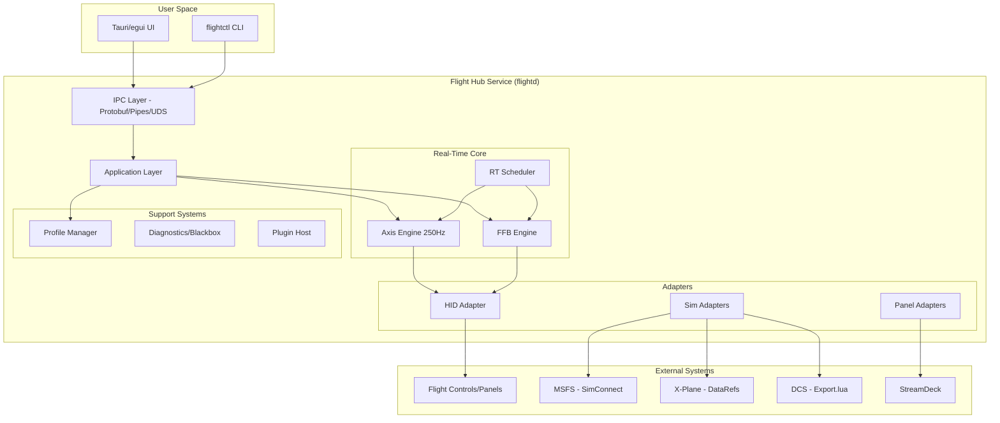
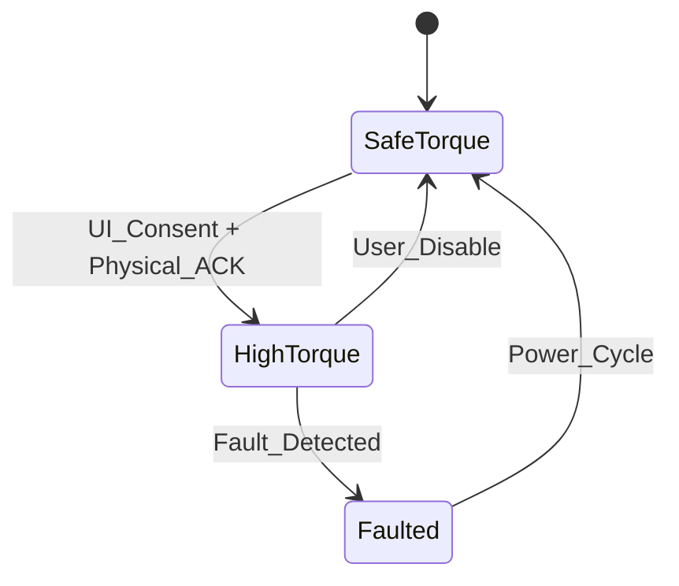

# Flight Hub Design Document

## Overview

Flight Hub is architected as a real-time flight simulation input management system with a protected 250Hz axis processing spine. The design follows a schema-first, driver-light approach with deterministic profiles, safety-first FFB operation, and robust diagnostics. The system uses a modular crate-based architecture in Rust, ensuring memory safety, zero-allocation hot paths, and cross-platform compatibility.

The core principle is maintaining a boring-reliable real-time loop that never compromises on timing guarantees, while allowing the peripheral systems (adapters, panels, plugins) to evolve independently through versioned contracts.

## Architecture

### High-Level System Architecture



### Process Architecture

The system uses a multi-process architecture for isolation and safety:

1. **flightd** - Main service with RT axis/FFB engines
2. **flightd-dsp** - Optional native plugin helper (isolated)
3. **flightctl** - CLI client
4. **flight-ui** - GUI client (Tauri-based)

### Safe Mode & Power Hints

**Safe Mode:**
- CLI flag --safe (and UI toggle) starts with axis-only, no panels/plugins/tactile
- Uses basic profile for troubleshooting

**Power Hints:**
- **Windows:** Check USB selective suspend and power plan; warn if throttling likely
- **Linux:** Check rtkit availability and memlock limits; present fix steps

**First-Run SLO:**
- Wizard target: ≤10 minutes to first circuit: calibration → sim select → "Configure & Verify" (gear/flap/AP test) → save per-aircraft profile

### Thread Model

- **RT Axis Thread** - 250Hz, SCHED_FIFO/MMCSS, zero-alloc, pinned core
- **RT FFB Thread** - 500-1000Hz for raw torque mode, same constraints
- **Application Thread** - Profile compilation, IPC handling, non-RT work
- **Adapter Threads** - HID I/O, sim communication, panel updates
- **Plugin Threads** - WASM execution, native helper communication

### Clock Domains & PLL

**Engine Clock:**
- **Windows:** WaitableTimer with SetWaitableTimerEx(..., PERIODIC, TOLERANCE=0), finish each tick with 50-80μs busy-spin using QPC
- **Linux:** clock_nanosleep(CLOCK_MONOTONIC, TIMER_ABSTIME) + busy-spin tail; pin thread; mlockall(MCL_CURRENT|MCL_FUTURE)

**USB Cadence:** Sample USB OUT completions to estimate effective frame rate; feed simple 1-state PLL to trim phase (±0.1%/s)

**Sim Bus:** 30-60Hz publisher runs fully decoupled (no waits in RT)

### Back-Pressure & Drop Policy

- All cross-thread channels are bounded SPSC rings (power-of-two)
- If consumer is late: drop-tail on producer side and increment metric; RT threads never block
- UI & diagnostics streams are best-effort; bus is lossy; only axis/FFB rings are lossless within one period

### Power & Priority

**Windows:** Set thread to MMCSS "Games" and disable process power throttling (PROCESS_POWER_THROTTLING_EXECUTION_SPEED)

**Linux:** Acquire SCHED_FIFO via rtkit; validate RLIMIT_RTPRIO and memlock on startup; warn & degrade if unavailable

## Components and Interfaces

### Real-Time Axis Engine

The axis engine is the heart of the system, designed for deterministic, zero-allocation operation.

**Core Data Structures:**
```rust
#[repr(C)]
pub struct AxisFrame {
    pub in_raw: f32,
    pub out: f32,
    pub d_in_dt: f32,
    pub ts_mono_ns: u64,
}

pub trait Node {
    #[inline(always)]
    fn step(&mut self, frame: &mut AxisFrame);
}
```

**Pipeline Nodes:**
1. **Deadzone** - Symmetric/asymmetric dead zones
2. **Curve** - Exponential/S-curve transformations (monotonic)
3. **Slew Limiter** - Rate limiting in units/second
4. **Detent Mapper** - Hysteretic detent zones with semantic roles
5. **Mixers** - Cross-axis mixing (e.g., helicopter anti-torque)
6. **Clamp** - Final output limiting

**Data Layout:**
- Pipeline compiles to flat vector of function pointers plus SoA state arena (Vec<u8> aligned to 64 bytes per node) to minimize cache misses
- No trait objects on hot path; codegen uses static fn pointers

**Deterministic Apply:**
- Profiles canonicalized to sorted keys & normalized float precision (round to 1e-6) before hashing
- Two-phase apply: compile off-thread → validate → atomic pointer swap at next tick boundary; return ACK to client
- If compile fails, RT state unchanged; error propagated via IPC

### Force Feedback Engine

**Safety State Machine:**


**Mode Matrix & Negotiation:**
- On device open, query caps: supports_pid, supports_raw_torque, max_torque_nm, min_period_us, has_health_stream
- Selection policy: prefer DI pass-through where sims implement rich FFB; use raw torque when device supports OFP-1; fallback to telemetry-synth only when needed

**FFB Modes (per device):**
1. **DirectInput Pass-through** - Forward PID effects to device
2. **Raw Torque (OFP-1)** - Host-computed torque at 500-1000Hz
3. **Telemetry Synthesis** - Generate effects from normalized telemetry

**Trim Correctness:**
- **Non-FFB:** trim-hold freezes virtual spring, applies new center at release, then ramps spring re-enable over 150-300ms
- **FFB:** setpoint changes limited to ΔNm/Δt and Δ²Nm/Δt² (rate & jerk) to guarantee no torque step

**Safety FMEA (Implementation):**
- **Faults:** USB OUT stall ≥3 frames, endpoint error, NaN in pipeline, over-temp/current, plugin overrun
- **Reaction:** torque→0 ≤50ms, audible cue, latch to SafeTorque; save 2s pre-fault to blackbox
- **High-torque unlock:** requires UI consent + physical button combo returning rolling token from device

### Device Management (HID Adapter)

**Device Identity:**
- Stable binding using VID/PID/Serial/USB_Path composite key
- Survives device reordering and hub changes
- Hot-plug detection within 300ms (connect) / 100ms (disconnect)

**Health Monitoring:**
- 10-20Hz device health polling
- USB packet loss tracking
- Temperature monitoring (if available)
- Fault detection and reporting

### Simulator Adapters

**MSFS Adapter:**
- SimConnect for variable reading and event sending
- Input Events for modern aircraft compatibility
- Aircraft detection via ATC model/type
- Normalized telemetry publishing at 30-60Hz

**X-Plane Adapter:**
- UDP for low-latency readbacks and broad compatibility; plugin for access to protected DataRefs and writes
- Choose by aircraft capability with user toggle
- Web API integration when available

**DCS Adapter:**
- Export.lua is user-installed in Saved Games; document MP-safe variables vs blocked; no writes in MP
- Adapter refuses to run in MP sessions for blocked paths; UI surfaces the reason
- Socket-based communication with version negotiation

### Writers as Data

**Table-Driven Configuration:**
- Writers are versioned JSON diffs (per sim build)
- CI runs golden-file tests against fixture trees; any diff mismatch fails
- Verify/Repair runs short scripted sequence (gear/flap/AP) and compares observed vs expected states; "Repair" applies minimal diffs

### Profile Management

**Schema-First Design:**
```json
{
  "schema": "flight.profile/1",
  "sim": "msfs",
  "aircraft": {"icao": "C172"},
  "axes": {
    "pitch": {
      "deadzone": 0.03,
      "expo": 0.2,
      "slew_rate": 1.2,
      "detents": []
    }
  },
  "pof_overrides": {
    "approach": {
      "axes": {"pitch": {"expo": 0.25}},
      "hysteresis": {"enter": {"ias": 90}, "exit": {"ias": 100}}
    }
  }
}
```

**Merge Hierarchy:**
Global → Sim → Aircraft → Phase of Flight

**Canonicalization:**
- Profiles stored as canonical JSON (sorted keys, normalized float precision)
- Hash computed over canonical form; used to confirm deterministic merge

**Conflict Detector:**
- On sim attach, probe for double-curving (non-linear response)
- If found, show one-click "Disable sim curve" action (via writer) or apply gain compensation

### Panel and StreamDeck Integration

**Rules DSL (flight.ledmap/1):**
```yaml
schema: flight.ledmap/1
rules:
  - when: "gear == DOWN"
    do: "led.panel('GEAR').on()"
  - when: "aoa > alpha_warn"
    do: "led.indexer.blink(rate_hz=6)"
defaults:
  hysteresis: { aoa: 0.5 }
```

**DSL Semantics:**
- Variables are typed (bool, f32, u8), unit-safe where applicable (kt, deg)
- Compiler emits compact bytecode: OP_TEST var op const → OP_HYST key band → OP_ACT led_target code args
- Evaluation runs at 60-120Hz, uses pre-allocated stack, no heap; rule tables are immutable post-compile

**Timing:**
- LED latency budget ≤20ms from bus event to write
- Rate-limit patterns to avoid HID spam (≥8ms min interval)

### Writers System

**Table-Driven Configuration:**
- JSON diff tables per sim/version
- Golden test files for verification
- Verify/Repair matrix for drift detection
- One-click rollback capability

**Writer Structure:**
```json
{
  "sim": "msfs",
  "version": "1.36.0",
  "diffs": [
    {
      "file": "MSFS/SimObjects/Airplanes/C172/panel.cfg",
      "section": "[ELECTRICAL]",
      "changes": {"light_nav": "1"}
    }
  ]
}
```

## Data Models

### Normalized Telemetry Bus

**Core Bus Structure:**
```rust
pub struct BusSnapshot {
    pub sim: SimId,
    pub aircraft: AircraftId,
    pub timestamp: u64,
    pub kinematics: Kinematics,
    pub config: AircraftConfig,
    pub helo: Option<HeloData>,
}

pub struct Kinematics {
    pub ias: f32,
    pub tas: f32,
    pub aoa: f32,
    pub g_force: f32,
    pub mach: f32,
}

pub struct AircraftConfig {
    pub gear_down: bool,
    pub flaps: u8,
    pub ap_state: AutopilotState,
}
```

### Blackbox Format (.fbb)

**File Structure:**
```
Header: FBB1 | Endian | App_Ver | Timebase | Sim_ID | Aircraft_ID | Mode
Stream_A: 250Hz axis pipeline outputs
Stream_B: 60Hz normalized bus snapshots  
Stream_C: Events (faults, profile changes, PoF transitions)
Index: 100ms intervals for seeking
Footer: CRC32C
```

**Writer Performance:**
- Use pre-allocated buffers and chunked writes (4-8KB)
- Append index entries every 100ms for random access; finalize with CRC32C
- No fsync on every chunk; flush at stop or at 1s cadence with rolling window

**Replay Validation:**
- Refeeds frames to axis/FFB engines at recorded cadence
- Pass if outputs match within ε = 1e-6 (axis) and 1e-4 Nm (FFB) and timing drifts ≤0.1ms per second

**Tracing Integration:**
- ETW/tracepoints: TickStart/End, HidWrite, DeadlineMiss, WriterDrop
- Integrate counters into CI perf gate

### Plugin Contracts

**Transport Details:**
- IPC frames are length-prefixed Protobuf
- Endpoints are Named Pipes (Win) and UDS (Linux) with OS ACLs
- Service does not bind to network sockets by default

**WASM Plugin Capabilities:**
- Manifests declare read_bus, emit_panel, read_profiles, etc.
- Default is deny; undeclared capability fails at link

**Native Fast-Path:**
- Runs in flightd-dsp helper with SHM SPSC rings
- Each tick carries budget (100μs). Overruns counted; N per second → quarantine with PLUG_OVERRUN event

## Error Handling

### Fault Taxonomy

**Stable Error Codes:**
- `HID_OUT_STALL` - USB output endpoint stalled
- `WRITER_MISMATCH` - Sim configuration drift detected
- `PLUG_OVERRUN` - Plugin exceeded time budget
- `AXIS_JITTER` - RT loop timing violation
- `FFB_FAULT` - Force feedback safety fault

**Error Response Matrix:**
```
Fault Type          | Detection Time | Response           | Recovery
--------------------|----------------|--------------------|-----------
USB Stall           | 3 frames       | Torque→0, Audio    | Manual
Endpoint Wedged     | 100ms          | Device Reset       | Auto
Plugin Overrun      | 100μs          | Quarantine         | Session
Profile Invalid     | Compile        | Reject, Log        | Manual
Sim Disconnect      | 1s             | Graceful Degrade   | Auto
```

### FMEA (Failure Mode and Effects Analysis)

**Critical Paths:**
1. **RT Loop Jitter** → Missed tick counter → Graceful degrade → Log event
2. **FFB Fault** → Immediate torque cutoff → Audio cue → Latch state
3. **USB Disconnect** → Safe output ramp → Device removal → Continue operation
4. **Plugin Crash** → Process isolation → Quarantine → Engine continues
5. **Memory Exhaustion** → Shed non-RT load → Maintain axis loop → Alert user

## Testing Strategy

### Unit Testing
- **Domain Logic** - Profile merging, curve validation, deterministic hashing
- **Pipeline Nodes** - Individual node behavior, monotonicity, edge cases
- **Safety Logic** - State machine transitions, fault detection, interlocks

### Integration Testing
- **HID Mock** - Virtual device simulation for CI
- **Sim Fixtures** - Recorded telemetry for adapter testing
- **Writer Golden Tests** - Expected configuration diffs per sim version
- **End-to-End** - Complete axis pipeline with virtual hardware

### Performance Testing & CI Quality Gates (Blocking)

**AX-Jitter:** 250Hz p99 ≤0.5ms on virtual and single physical runner (Intel & AMD alternately nightly)

**HID Latency:** p99 ≤300μs on physical runner

**Writers Golden:** Fail on any diff mismatch

**Schema Stability:** Fail on breaking change

**Blackbox:** 10-minute capture, 0 drops

**Soft-Stop:** USB yank → torque→0 ≤50ms

**Soak Testing:** 24-48h stability with synthetic load

**Resource Monitoring:** CPU <3%, RSS <150MB enforcement

### Hardware-in-Loop (HIL)
- **USB Yank Test** - Torque→0 within 50ms verification
- **Detent Sweeps** - Hysteresis behavior validation
- **Panel Verify** - LED response time ≤20ms measurement
- **Multi-Device** - Concurrent device operation stability

### Safety Testing
- **Physical Interlock** - Button combination requirement verification
- **Fault Injection** - Synthetic USB stalls, NaN values, over-temp
- **Quarantine Testing** - Plugin overrun and crash recovery
- **Soft-Stop Timing** - Precise torque ramp measurement

## Security Considerations

### Attack Surface Minimization
- **Local-Only IPC** - No network listeners by default
- **Process Isolation** - Native plugins in separate address space
- **Capability-Based** - WASM plugins declare required permissions
- **Signed Binaries** - Code signing for all distributed components

### Plugin Sandboxing
- **WASM Sandbox** - No file/network access by default
- **Native Isolation** - SHM communication only, watchdog protection
- **Capability Manifests** - Explicit permission declarations
- **Runtime Monitoring** - Budget enforcement and quarantine

### Data Protection
- **No Telemetry** - Analytics opt-in only with explicit consent
- **Local Storage** - Profiles and logs stored locally only
- **Redacted Bundles** - Support packages strip PII automatically
- **Audit Trail** - Stable error codes for forensic analysis

### Interop Policy & Documentation
- **Interop Policy:** Flight Hub owns axis curves; coexists with AAO/SPAD/FSUIPC for panels; StreamDeck via local API; no DLL injection into sims
- **"What We Touch" Docs:** Per sim (MSFS/X-Plane/DCS): precise files/ports/vars, how to revert, MP integrity notes

This design provides a robust foundation for the Flight Hub system, balancing real-time performance requirements with safety, security, and maintainability. The modular architecture allows for independent evolution of components while maintaining strict contracts at all interfaces.## Impl
ementation Details

### Units & Precision
- **AxisFrame:** Comments unit-explicit (d_in_dt is per second normalized)
- **Float Precision:** Carry f32 in RT, f64 in compile/merge to minimize accumulation error; cast at seam
- **Allocator Policy:** Set panic = "abort" for RT threads (feature-gated) and confirm no allocation via hot-path counter

### Multi-Device Scaling
- One RT thread per device, affinity pinning to isolate interference; share the bus
- **HID Writes:** 
  - **Windows:** Prefer WriteFile on handles opened with overlapped I/O; avoid HidD_SetOutputReport in hot path
  - **Linux:** Non-blocking hidraw with write coalescing and error recovery

### Memory Management
- **RT Constraints:** Zero allocations, zero locks, zero syscalls on hot path
- **SoA Layout:** Structure-of-arrays for cache efficiency in pipeline nodes
- **Pre-allocation:** All buffers allocated at startup, reused throughout operation

This design provides a comprehensive foundation that balances real-time performance with safety, maintainability, and operational reliability. The detailed implementation specifications ensure that the system will perform predictably under load while providing the tools necessary for effective debugging and support.