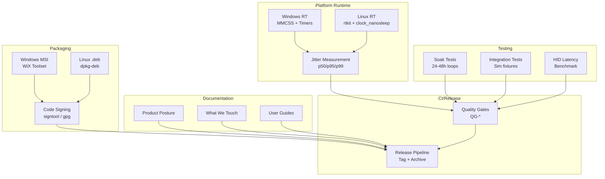

# Design Document

## Overview

This design document provides the technical architecture for bringing Flight Hub to production readiness. It covers five interconnected areas: platform-specific real-time scheduling, packaging and distribution infrastructure, validation and testing frameworks, documentation systems, and release automation.

The design follows Flight Hub's established principles: boring reliability, official APIs only, graceful degradation, and observable behavior. Each component is designed to be testable, with clear interfaces and measurable quality gates.

### Design Principles

1. **Platform-Native**: Use official OS APIs (MMCSS, rtkit) rather than workarounds
2. **Fail-Safe Defaults**: If RT scheduling fails, continue with warnings and metrics
3. **Testable**: Every timing and latency requirement has a corresponding measurement harness
4. **Reversible**: All installer actions can be undone; sim integrations are opt-in
5. **Observable**: Metrics expose RT status, jitter, and latency for validation

## Architecture

### System Context



## Components and Interfaces

### Windows Real-Time Runtime

The Windows RT runtime provides MMCSS integration, high-resolution timers, and power management.

```rust
/// Windows real-time thread configuration
pub struct WindowsRtThread {
    /// MMCSS task handle (0 if registration failed)
    mmcss_handle: u32,
    /// Original thread priority (for restoration)
    original_priority: i32,
    /// Whether power throttling was disabled
    power_throttling_disabled: bool,
}

impl WindowsRtThread {
    /// Create and configure an RT thread
    /// 
    /// Attempts MMCSS registration with "Games" task, elevates priority,
    /// and disables power throttling. Failures are logged but don't prevent
    /// thread creation.
    pub fn new(task_name: &str) -> Result<Self, RtError> {
        let mut task_index: u32 = 0;
        
        // Register with MMCSS
        let mmcss_handle = unsafe {
            AvSetMmThreadCharacteristicsW(
                task_name.encode_utf16().collect::<Vec<_>>().as_ptr(),
                &mut task_index,
            )
        };
        
        if mmcss_handle == 0 {
            let err = std::io::Error::last_os_error();
            warn!("MMCSS registration failed: {}", err);
            // Continue without MMCSS
        }
        
        // Elevate thread priority
        let original_priority = unsafe { GetThreadPriority(GetCurrentThread()) };
        unsafe {
            SetThreadPriority(GetCurrentThread(), THREAD_PRIORITY_TIME_CRITICAL);
        }
        
        // Disable power throttling
        let power_throttling_disabled = disable_power_throttling();
        
        Ok(Self {
            mmcss_handle,
            original_priority,
            power_throttling_disabled,
        })
    }
}

impl Drop for WindowsRtThread {
    fn drop(&mut self) {
        // Restore original priority
        unsafe {
            SetThreadPriority(GetCurrentThread(), self.original_priority);
        }
        
        // Release MMCSS registration
        if self.mmcss_handle != 0 {
            unsafe {
                AvRevertMmThreadCharacteristics(self.mmcss_handle);
            }
        }
    }
}

/// Disable process power throttling
fn disable_power_throttling() -> bool {
    let state = PROCESS_POWER_THROTTLING_STATE {
        Version: PROCESS_POWER_THROTTLING_CURRENT_VERSION,
        ControlMask: PROCESS_POWER_THROTTLING_EXECUTION_SPEED,
        StateMask: 0, // 0 = disable throttling
    };
    
    unsafe {
        SetProcessInformation(
            GetCurrentProcess(),
            ProcessPowerThrottling,
            &state as *const _ as *const c_void,
            std::mem::size_of::<PROCESS_POWER_THROTTLING_STATE>() as u32,
        ) != 0
    }
}
```

### Windows High-Resolution Timer

```rust
/// High-resolution 250Hz timer loop for Windows
pub struct WindowsTimerLoop {
    /// Waitable timer handle
    timer: HANDLE,
    /// Whether high-resolution timer is available
    high_res_available: bool,
    /// Target period in 100ns units (negative = relative)
    period_100ns: i64,
    /// QPC frequency for busy-spin
    qpc_freq: i64,
}

impl WindowsTimerLoop {
    /// Create a 250Hz timer loop
    pub fn new() -> Result<Self, TimerError> {
        // Try high-resolution timer first
        let timer = unsafe {
            CreateWaitableTimerExW(
                std::ptr::null(),
                std::ptr::null(),
                CREATE_WAITABLE_TIMER_HIGH_RESOLUTION,
                TIMER_ALL_ACCESS,
            )
        };
        
        let (timer, high_res_available) = if timer.is_null() {
            // Fall back to standard timer with timeBeginPeriod
            unsafe { timeBeginPeriod(1) };
            let timer = unsafe {
                CreateWaitableTimerW(std::ptr::null(), FALSE, std::ptr::null())
            };
            (timer, false)
        } else {
            (timer, true)
        };
        
        if timer.is_null() {
            return Err(TimerError::CreateFailed(std::io::Error::last_os_error()));
        }
        
        // Get QPC frequency for busy-spin
        let mut freq = LARGE_INTEGER::default();
        unsafe { QueryPerformanceFrequency(&mut freq) };
        
        Ok(Self {
            timer,
            high_res_available,
            period_100ns: -40_000, // 4ms in 100ns units (negative = relative)
            qpc_freq: unsafe { freq.QuadPart },
        })
    }
    
    /// Wait for next tick with busy-spin finish
    /// 
    /// Waits using waitable timer for most of the period, then busy-spins
    /// for the final 50-80μs to minimize jitter.
    pub fn wait_next_tick(&self, target_qpc: i64) -> i64 {
        // Calculate time until target minus busy-spin margin
        let mut now = LARGE_INTEGER::default();
        unsafe { QueryPerformanceCounter(&mut now) };
        let now_qpc = unsafe { now.QuadPart };
        
        let remaining_us = ((target_qpc - now_qpc) * 1_000_000) / self.qpc_freq;
        
        if remaining_us > 100 {
            // Use waitable timer for bulk of wait
            let wait_100ns = -((remaining_us - 80) * 10); // Leave 80μs for busy-spin
            unsafe {
                SetWaitableTimer(
                    self.timer,
                    &wait_100ns as *const i64 as *const LARGE_INTEGER,
                    0,
                    None,
                    std::ptr::null(),
                    FALSE,
                );
                WaitForSingleObject(self.timer, INFINITE);
            }
        }
        
        // Busy-spin for final portion
        loop {
            unsafe { QueryPerformanceCounter(&mut now) };
            if unsafe { now.QuadPart } >= target_qpc {
                break;
            }
            std::hint::spin_loop();
        }
        
        // Return next target
        target_qpc + (self.qpc_freq / 250)
    }
}

impl Drop for WindowsTimerLoop {
    fn drop(&mut self) {
        unsafe { CloseHandle(self.timer) };
        if !self.high_res_available {
            unsafe { timeEndPeriod(1) };
        }
    }
}
```

### Windows Power Manager

```rust
/// Power management for preventing sleep during active operation
pub struct PowerManager {
    /// Power request handle
    request: HANDLE,
    /// Whether request is currently active
    active: bool,
}

impl PowerManager {
    pub fn new() -> Result<Self, PowerError> {
        let context = REASON_CONTEXT {
            Version: POWER_REQUEST_CONTEXT_VERSION,
            Flags: POWER_REQUEST_CONTEXT_SIMPLE_STRING,
            Reason: SimpleReasonString {
                SimpleReasonString: "Flight Hub active operation\0"
                    .encode_utf16()
                    .collect::<Vec<_>>()
                    .as_ptr() as *mut u16,
            },
        };
        
        let request = unsafe { PowerCreateRequest(&context) };
        if request.is_null() || request == INVALID_HANDLE_VALUE {
            return Err(PowerError::CreateFailed(std::io::Error::last_os_error()));
        }
        
        Ok(Self {
            request,
            active: false,
        })
    }
    
    /// Activate power request (prevent sleep)
    pub fn activate(&mut self) {
        if !self.active {
            unsafe {
                PowerSetRequest(self.request, PowerRequestExecutionRequired);
                PowerSetRequest(self.request, PowerRequestSystemRequired);
            }
            self.active = true;
        }
    }
    
    /// Deactivate power request (allow sleep)
    pub fn deactivate(&mut self) {
        if self.active {
            unsafe {
                PowerClearRequest(self.request, PowerRequestExecutionRequired);
                PowerClearRequest(self.request, PowerRequestSystemRequired);
            }
            self.active = false;
        }
    }
}

impl Drop for PowerManager {
    fn drop(&mut self) {
        self.deactivate();
        unsafe { CloseHandle(self.request) };
    }
}
```

### Windows HID Optimization

```rust
/// Optimized HID writer using overlapped I/O
pub struct HidWriter {
    /// Device handle opened with FILE_FLAG_OVERLAPPED
    handle: HANDLE,
    /// Pool of OVERLAPPED structures for async writes
    overlapped_pool: Vec<Box<OVERLAPPED>>,
    /// Index of next available OVERLAPPED
    next_overlapped: usize,
}

impl HidWriter {
    /// Open HID device for optimized writes
    pub fn open(device_path: &str) -> Result<Self, HidError> {
        let path_wide: Vec<u16> = device_path.encode_utf16().chain(Some(0)).collect();
        
        let handle = unsafe {
            CreateFileW(
                path_wide.as_ptr(),
                GENERIC_WRITE,
                FILE_SHARE_READ | FILE_SHARE_WRITE,
                std::ptr::null(),
                OPEN_EXISTING,
                FILE_FLAG_OVERLAPPED, // Critical for async I/O
                std::ptr::null_mut(),
            )
        };
        
        if handle == INVALID_HANDLE_VALUE {
            return Err(HidError::OpenFailed(std::io::Error::last_os_error()));
        }
        
        // Pre-allocate OVERLAPPED pool (4 should be plenty for 250Hz)
        let overlapped_pool: Vec<_> = (0..4)
            .map(|_| Box::new(OVERLAPPED::default()))
            .collect();
        
        Ok(Self {
            handle,
            overlapped_pool,
            next_overlapped: 0,
        })
    }
    
    /// Write HID report asynchronously
    /// 
    /// Uses WriteFile with OVERLAPPED for non-blocking I/O.
    /// Returns immediately; completion is checked on next write.
    pub fn write_async(&mut self, report: &[u8]) -> Result<(), HidError> {
        let overlapped = &mut *self.overlapped_pool[self.next_overlapped];
        self.next_overlapped = (self.next_overlapped + 1) % self.overlapped_pool.len();
        
        // Reset OVERLAPPED for reuse
        *overlapped = OVERLAPPED::default();
        
        let mut bytes_written: u32 = 0;
        let result = unsafe {
            WriteFile(
                self.handle,
                report.as_ptr() as *const c_void,
                report.len() as u32,
                &mut bytes_written,
                overlapped as *mut OVERLAPPED,
            )
        };
        
        if result == 0 {
            let err = std::io::Error::last_os_error();
            if err.raw_os_error() != Some(ERROR_IO_PENDING as i32) {
                return Err(HidError::WriteFailed(err));
            }
            // IO_PENDING is expected for async
        }
        
        Ok(())
    }
}
```

### Linux Real-Time Runtime

```rust
/// Linux real-time thread configuration
pub struct LinuxRtThread {
    /// Whether RT scheduling was acquired
    rt_enabled: bool,
    /// Scheduling policy (SCHED_FIFO, SCHED_OTHER, etc.)
    sched_policy: i32,
    /// RT priority (1-99 for SCHED_FIFO)
    priority: i32,
    /// Whether mlockall succeeded
    mlockall_success: bool,
}

impl LinuxRtThread {
    /// Create and configure an RT thread
    /// 
    /// Attempts rtkit first, falls back to direct sched_setscheduler,
    /// then to normal priority with warnings.
    pub fn new(priority: i32) -> Result<Self, RtError> {
        let mut rt_enabled = false;
        let mut sched_policy = libc::SCHED_OTHER;
        let mut actual_priority = 0;
        
        // Try rtkit first (works without root)
        match try_rtkit(priority) {
            Ok(()) => {
                rt_enabled = true;
                sched_policy = libc::SCHED_FIFO;
                actual_priority = priority;
                info!("RT scheduling acquired via rtkit (priority {})", priority);
            }
            Err(e) => {
                warn!("rtkit failed: {}, trying direct sched_setscheduler", e);
                
                // Try direct sched_setscheduler (requires CAP_SYS_NICE or root)
                let param = libc::sched_param {
                    sched_priority: priority,
                };
                
                let result = unsafe {
                    libc::sched_setscheduler(0, libc::SCHED_FIFO, &param)
                };
                
                if result == 0 {
                    rt_enabled = true;
                    sched_policy = libc::SCHED_FIFO;
                    actual_priority = priority;
                    info!("RT scheduling acquired via sched_setscheduler (priority {})", priority);
                } else {
                    warn!(
                        "RT scheduling unavailable: {}. Running at normal priority.",
                        std::io::Error::last_os_error()
                    );
                }
            }
        }
        
        // Try mlockall if RT is enabled
        let mlockall_success = if rt_enabled {
            let result = unsafe {
                libc::mlockall(libc::MCL_CURRENT | libc::MCL_FUTURE)
            };
            if result != 0 {
                warn!("mlockall failed: {}", std::io::Error::last_os_error());
                false
            } else {
                true
            }
        } else {
            false
        };
        
        Ok(Self {
            rt_enabled,
            sched_policy,
            priority: actual_priority,
            mlockall_success,
        })
    }
    
    /// Get metrics for observability
    pub fn metrics(&self) -> LinuxRtMetrics {
        LinuxRtMetrics {
            rt_enabled: self.rt_enabled,
            sched_policy: self.sched_policy,
            priority: self.priority,
            mlockall_success: self.mlockall_success,
        }
    }
}

/// Try to acquire RT scheduling via rtkit D-Bus
fn try_rtkit(priority: i32) -> Result<(), RtError> {
    // Connect to system bus
    let conn = dbus::blocking::Connection::new_system()
        .map_err(|e| RtError::DbusConnection(e.to_string()))?;
    
    // Get thread ID
    let thread_id = unsafe { libc::syscall(libc::SYS_gettid) } as u64;
    
    // Call rtkit MakeThreadRealtime
    let proxy = conn.with_proxy(
        "org.freedesktop.RealtimeKit1",
        "/org/freedesktop/RealtimeKit1",
        std::time::Duration::from_secs(5),
    );
    
    proxy.method_call(
        "org.freedesktop.RealtimeKit1",
        "MakeThreadRealtime",
        (thread_id, priority as u32),
    ).map_err(|e| RtError::RtkitFailed(e.to_string()))?;
    
    Ok(())
}

/// Metrics for Linux RT status
#[derive(Debug, Clone)]
pub struct LinuxRtMetrics {
    pub rt_enabled: bool,
    pub sched_policy: i32,
    pub priority: i32,
    pub mlockall_success: bool,
}
```

### Linux High-Resolution Timer

```rust
/// High-resolution 250Hz timer loop for Linux
pub struct LinuxTimerLoop {
    /// Target period in nanoseconds
    period_ns: i64,
    /// Next absolute target time
    next_target: libc::timespec,
}

impl LinuxTimerLoop {
    /// Create a 250Hz timer loop
    pub fn new() -> Self {
        let mut now = libc::timespec {
            tv_sec: 0,
            tv_nsec: 0,
        };
        unsafe {
            libc::clock_gettime(libc::CLOCK_MONOTONIC, &mut now);
        }
        
        Self {
            period_ns: 4_000_000, // 4ms = 250Hz
            next_target: now,
        }
    }
    
    /// Wait for next tick with busy-spin finish
    pub fn wait_next_tick(&mut self) -> libc::timespec {
        // Advance target
        self.next_target.tv_nsec += self.period_ns;
        while self.next_target.tv_nsec >= 1_000_000_000 {
            self.next_target.tv_nsec -= 1_000_000_000;
            self.next_target.tv_sec += 1;
        }
        
        // Calculate busy-spin threshold (50μs before target)
        let mut spin_target = self.next_target;
        spin_target.tv_nsec -= 50_000;
        if spin_target.tv_nsec < 0 {
            spin_target.tv_nsec += 1_000_000_000;
            spin_target.tv_sec -= 1;
        }
        
        // Sleep until spin threshold
        unsafe {
            libc::clock_nanosleep(
                libc::CLOCK_MONOTONIC,
                libc::TIMER_ABSTIME,
                &spin_target,
                std::ptr::null_mut(),
            );
        }
        
        // Busy-spin for final portion
        let mut now = libc::timespec {
            tv_sec: 0,
            tv_nsec: 0,
        };
        loop {
            unsafe {
                libc::clock_gettime(libc::CLOCK_MONOTONIC, &mut now);
            }
            if now.tv_sec > self.next_target.tv_sec
                || (now.tv_sec == self.next_target.tv_sec
                    && now.tv_nsec >= self.next_target.tv_nsec)
            {
                break;
            }
            std::hint::spin_loop();
        }
        
        now
    }
}
```

### Cross-Platform Jitter Measurement

```rust
/// Jitter measurement helper for RT validation
pub struct JitterMeasurement {
    /// Target period in nanoseconds
    target_period_ns: u64,
    /// Recorded deviations from ideal period
    deviations: Vec<i64>,
    /// Last tick timestamp
    last_tick_ns: u64,
    /// Warmup ticks to skip
    warmup_ticks: usize,
    /// Current tick count
    tick_count: usize,
}

impl JitterMeasurement {
    /// Create a new jitter measurement for given Hz
    pub fn new(target_hz: u32, warmup_seconds: u32) -> Self {
        let target_period_ns = 1_000_000_000 / target_hz as u64;
        let warmup_ticks = (target_hz * warmup_seconds) as usize;
        
        Self {
            target_period_ns,
            deviations: Vec::with_capacity(target_hz as usize * 600), // 10 min
            last_tick_ns: 0,
            warmup_ticks,
            tick_count: 0,
        }
    }
    
    /// Record a tick and compute deviation
    pub fn record_tick(&mut self, now_ns: u64) {
        self.tick_count += 1;
        
        if self.last_tick_ns > 0 && self.tick_count > self.warmup_ticks {
            let actual_period = now_ns - self.last_tick_ns;
            let deviation = actual_period as i64 - self.target_period_ns as i64;
            self.deviations.push(deviation);
        }
        
        self.last_tick_ns = now_ns;
    }
    
    /// Compute jitter statistics
    pub fn compute_stats(&self) -> JitterStats {
        if self.deviations.is_empty() {
            return JitterStats::default();
        }
        
        let mut sorted: Vec<i64> = self.deviations.iter().map(|d| d.abs()).collect();
        sorted.sort_unstable();
        
        let len = sorted.len();
        let p50 = sorted[len / 2];
        let p95 = sorted[(len * 95) / 100];
        let p99 = sorted[(len * 99) / 100];
        
        JitterStats {
            samples: len,
            p50_ns: p50,
            p95_ns: p95,
            p99_ns: p99,
            p99_ms: p99 as f64 / 1_000_000.0,
        }
    }
}

#[derive(Debug, Default)]
pub struct JitterStats {
    pub samples: usize,
    pub p50_ns: i64,
    pub p95_ns: i64,
    pub p99_ns: i64,
    pub p99_ms: f64,
}
```

### HID Latency Benchmark

```rust
/// HID latency measurement harness
pub struct HidLatencyBench {
    /// Device path
    device_path: String,
    /// Recorded latencies in nanoseconds
    latencies: Vec<u64>,
    /// Report size
    report_size: usize,
}

impl HidLatencyBench {
    pub fn new(device_path: &str, report_size: usize) -> Self {
        Self {
            device_path: device_path.to_string(),
            latencies: Vec::with_capacity(60_000), // 1 minute at 1kHz
            report_size,
        }
    }
    
    /// Run benchmark for specified duration
    #[cfg(target_os = "windows")]
    pub fn run(&mut self, duration: std::time::Duration) -> Result<HidLatencyStats, HidError> {
        let mut writer = HidWriter::open(&self.device_path)?;
        let report = vec![0u8; self.report_size];
        
        let start = std::time::Instant::now();
        let mut qpc_freq = LARGE_INTEGER::default();
        unsafe { QueryPerformanceFrequency(&mut qpc_freq) };
        let freq = unsafe { qpc_freq.QuadPart };
        
        while start.elapsed() < duration {
            let mut before = LARGE_INTEGER::default();
            let mut after = LARGE_INTEGER::default();
            
            unsafe { QueryPerformanceCounter(&mut before) };
            writer.write_async(&report)?;
            // Note: For true latency, we'd need to wait for completion
            // This measures submit latency, not completion latency
            unsafe { QueryPerformanceCounter(&mut after) };
            
            let latency_ns = ((unsafe { after.QuadPart - before.QuadPart }) * 1_000_000_000) / freq;
            self.latencies.push(latency_ns as u64);
            
            std::thread::sleep(std::time::Duration::from_micros(1000)); // 1kHz
        }
        
        Ok(self.compute_stats())
    }
    
    fn compute_stats(&self) -> HidLatencyStats {
        if self.latencies.is_empty() {
            return HidLatencyStats::default();
        }
        
        let mut sorted = self.latencies.clone();
        sorted.sort_unstable();
        
        let len = sorted.len();
        HidLatencyStats {
            samples: len,
            p50_us: sorted[len / 2] / 1000,
            p95_us: sorted[(len * 95) / 100] / 1000,
            p99_us: sorted[(len * 99) / 100] / 1000,
        }
    }
}

#[derive(Debug, Default)]
pub struct HidLatencyStats {
    pub samples: usize,
    pub p50_us: u64,
    pub p95_us: u64,
    pub p99_us: u64,
}
```


### Windows MSI Installer (WiX)

The installer uses WiX Toolset to create a signed MSI with optional features.

```xml
<!-- Product.wxs - Main WiX source -->
<?xml version="1.0" encoding="UTF-8"?>
<Wix xmlns="http://wixtoolset.org/schemas/v4/wxs">
  <Package Name="Flight Hub"
           Manufacturer="OpenFlight Project"
           Version="1.0.0"
           UpgradeCode="GUID-HERE"
           Scope="perUser">
    
    <MajorUpgrade DowngradeErrorMessage="A newer version is installed." />
    
    <!-- Features -->
    <Feature Id="Core" Title="Flight Hub Core" Level="1" Absent="disallow">
      <ComponentGroupRef Id="CoreComponents" />
    </Feature>
    
    <Feature Id="MSFS" Title="MSFS Integration" Level="2">
      <ComponentGroupRef Id="MSFSComponents" />
    </Feature>
    
    <Feature Id="XPlane" Title="X-Plane Integration" Level="2">
      <ComponentGroupRef Id="XPlaneComponents" />
    </Feature>
    
    <Feature Id="DCS" Title="DCS Integration" Level="2">
      <ComponentGroupRef Id="DCSComponents" />
    </Feature>
    
    <!-- Custom Actions -->
    <CustomAction Id="ShowPosture"
                  Directory="INSTALLFOLDER"
                  ExeCommand="[INSTALLFOLDER]flightctl.exe --show-posture"
                  Execute="immediate" />
    
    <CustomAction Id="BackupExportLua"
                  Directory="INSTALLFOLDER"
                  ExeCommand="[INSTALLFOLDER]flightctl.exe dcs backup-export"
                  Execute="deferred"
                  Impersonate="yes" />
    
    <CustomAction Id="RestoreExportLua"
                  Directory="INSTALLFOLDER"
                  ExeCommand="[INSTALLFOLDER]flightctl.exe dcs restore-export"
                  Execute="deferred"
                  Impersonate="yes" />
    
    <InstallExecuteSequence>
      <Custom Action="BackupExportLua" Before="InstallFiles">
        <![CDATA[&DCS=3]]>
      </Custom>
      <Custom Action="RestoreExportLua" After="RemoveFiles">
        <![CDATA[REMOVE="ALL" AND &DCS=2]]>
      </Custom>
    </InstallExecuteSequence>
  </Package>
</Wix>
```

```rust
/// Installer helper for DCS Export.lua management
pub struct DcsInstaller {
    /// DCS variants found
    variants: Vec<DcsVariant>,
}

#[derive(Debug)]
pub struct DcsVariant {
    pub name: String,           // "DCS", "DCS.openbeta", etc.
    pub saved_games_path: PathBuf,
    pub export_lua_path: PathBuf,
    pub backup_path: PathBuf,
}

impl DcsInstaller {
    /// Detect all installed DCS variants
    pub fn detect_variants() -> Vec<DcsVariant> {
        let saved_games = dirs::document_dir()
            .map(|d| d.parent().unwrap().join("Saved Games"))
            .unwrap_or_default();
        
        let variant_names = ["DCS", "DCS.openbeta", "DCS.openalpha"];
        
        variant_names
            .iter()
            .filter_map(|name| {
                let path = saved_games.join(name);
                if path.exists() {
                    Some(DcsVariant {
                        name: name.to_string(),
                        saved_games_path: path.clone(),
                        export_lua_path: path.join("Scripts").join("Export.lua"),
                        backup_path: path.join("Scripts").join("Export.lua.flighthub_backup"),
                    })
                } else {
                    None
                }
            })
            .collect()
    }
    
    /// Backup existing Export.lua
    pub fn backup(&self, variant: &DcsVariant) -> Result<(), InstallError> {
        if variant.export_lua_path.exists() {
            std::fs::copy(&variant.export_lua_path, &variant.backup_path)?;
        }
        Ok(())
    }
    
    /// Install Flight Hub Export.lua shim
    pub fn install(&self, variant: &DcsVariant) -> Result<(), InstallError> {
        let scripts_dir = variant.saved_games_path.join("Scripts");
        std::fs::create_dir_all(&scripts_dir)?;
        
        // Deploy FlightHubExport.lua
        let fh_export = scripts_dir.join("FlightHubExport.lua");
        std::fs::write(&fh_export, include_str!("../lua/FlightHubExport.lua"))?;
        
        // Append dofile to Export.lua
        let dofile_line = format!(
            "\n-- Flight Hub integration\ndofile(lfs.writedir()..[[Scripts\\FlightHubExport.lua]])\n"
        );
        
        let mut export_content = if variant.export_lua_path.exists() {
            std::fs::read_to_string(&variant.export_lua_path)?
        } else {
            String::new()
        };
        
        if !export_content.contains("FlightHubExport.lua") {
            export_content.push_str(&dofile_line);
            std::fs::write(&variant.export_lua_path, export_content)?;
        }
        
        Ok(())
    }
    
    /// Restore original Export.lua from backup
    pub fn restore(&self, variant: &DcsVariant) -> Result<(), InstallError> {
        if variant.backup_path.exists() {
            std::fs::copy(&variant.backup_path, &variant.export_lua_path)?;
            std::fs::remove_file(&variant.backup_path)?;
        }
        
        // Remove FlightHubExport.lua
        let fh_export = variant.saved_games_path.join("Scripts").join("FlightHubExport.lua");
        if fh_export.exists() {
            std::fs::remove_file(&fh_export)?;
        }
        
        Ok(())
    }
}
```

### Linux .deb Package

```bash
# debian/control
Package: flight-hub
Version: 1.0.0
Section: games
Priority: optional
Architecture: amd64
Depends: libc6 (>= 2.31), libdbus-1-3
Recommends: rtkit
Maintainer: OpenFlight Project <contact@openflight.dev>
Description: Flight simulation input management system
 Flight Hub provides unified control for flight controls, panels,
 and force feedback devices across MSFS, X-Plane, and DCS simulators.
```

```bash
# debian/postinst
#!/bin/bash
set -e

# Add user to input group for HID access
if [ -n "$SUDO_USER" ]; then
    usermod -a -G input "$SUDO_USER" || true
fi

# Install udev rules
cp /usr/share/flight-hub/99-flight-hub.rules /etc/udev/rules.d/
udevadm control --reload-rules
udevadm trigger

echo "Flight Hub installed. Please log out and back in for group changes to take effect."
```

```bash
# 99-flight-hub.rules - udev rules for HID access
# Allow users in 'input' group to access HID devices
SUBSYSTEM=="hidraw", MODE="0660", GROUP="input"
SUBSYSTEM=="usb", ATTR{idVendor}=="*", MODE="0660", GROUP="input"
```

### Third-Party Components Inventory

```rust
/// Generate third-party components inventory from Cargo.lock
pub fn generate_inventory() -> Result<ThirdPartyInventory, InventoryError> {
    let cargo_lock = std::fs::read_to_string("Cargo.lock")?;
    let lock: cargo_lock::Lockfile = cargo_lock.parse()?;
    
    let mut components = Vec::new();
    
    for package in lock.packages {
        if package.name.starts_with("flight-") {
            continue; // Skip our own crates
        }
        
        let license = get_license_from_crates_io(&package.name, &package.version)?;
        
        components.push(ThirdPartyComponent {
            name: package.name.clone(),
            version: package.version.to_string(),
            license: license.clone(),
            license_text: get_license_text(&package.name, &license)?,
        });
    }
    
    Ok(ThirdPartyInventory { components })
}

#[derive(Debug, Serialize)]
pub struct ThirdPartyInventory {
    pub components: Vec<ThirdPartyComponent>,
}

#[derive(Debug, Serialize)]
pub struct ThirdPartyComponent {
    pub name: String,
    pub version: String,
    pub license: String,
    pub license_text: String,
}
```

### Soak Test Framework

```rust
/// Soak test runner for long-duration stability validation
pub struct SoakTest {
    /// Test duration
    duration: std::time::Duration,
    /// Metrics collector
    metrics: SoakMetrics,
    /// Synthetic telemetry generator
    telemetry_gen: SyntheticTelemetryGenerator,
}

#[derive(Debug, Default)]
pub struct SoakMetrics {
    pub total_ticks: u64,
    pub missed_ticks: u64,
    pub max_jitter_ns: i64,
    pub initial_rss_bytes: u64,
    pub final_rss_bytes: u64,
    pub faults_detected: u64,
    pub blackbox_dumps: u64,
}

impl SoakTest {
    pub fn new(duration: std::time::Duration) -> Self {
        Self {
            duration,
            metrics: SoakMetrics::default(),
            telemetry_gen: SyntheticTelemetryGenerator::new(),
        }
    }
    
    /// Run soak test
    pub fn run(&mut self) -> Result<SoakTestResult, SoakError> {
        self.metrics.initial_rss_bytes = get_rss_bytes();
        
        let start = std::time::Instant::now();
        let mut jitter = JitterMeasurement::new(250, 5);
        
        while start.elapsed() < self.duration {
            let tick_start = get_monotonic_ns();
            
            // Generate synthetic telemetry
            let snapshot = self.telemetry_gen.next_snapshot();
            
            // Process through axis engine (simulated)
            // process_axis(&snapshot);
            
            // Process through FFB engine (simulated)
            // process_ffb(&snapshot);
            
            let tick_end = get_monotonic_ns();
            jitter.record_tick(tick_end);
            
            self.metrics.total_ticks += 1;
            
            // Check for missed tick (>6ms at 250Hz)
            let tick_duration = tick_end - tick_start;
            if tick_duration > 6_000_000 {
                self.metrics.missed_ticks += 1;
            }
            
            // Sleep until next tick
            std::thread::sleep(std::time::Duration::from_micros(3900));
        }
        
        self.metrics.final_rss_bytes = get_rss_bytes();
        
        let stats = jitter.compute_stats();
        self.metrics.max_jitter_ns = stats.p99_ns;
        
        // Validate results
        let rss_delta_pct = ((self.metrics.final_rss_bytes as f64
            - self.metrics.initial_rss_bytes as f64)
            / self.metrics.initial_rss_bytes as f64)
            * 100.0;
        
        let passed = self.metrics.missed_ticks == 0
            && rss_delta_pct < 10.0
            && stats.p99_ms <= 0.5;
        
        Ok(SoakTestResult {
            passed,
            metrics: std::mem::take(&mut self.metrics),
            jitter_stats: stats,
            rss_delta_pct,
        })
    }
}

#[derive(Debug)]
pub struct SoakTestResult {
    pub passed: bool,
    pub metrics: SoakMetrics,
    pub jitter_stats: JitterStats,
    pub rss_delta_pct: f64,
}
```

### Integration Test Framework

```rust
/// Integration test for sim adapter lifecycle
pub struct AdapterIntegrationTest {
    adapter_type: AdapterType,
    fixture_path: PathBuf,
}

impl AdapterIntegrationTest {
    /// Run adapter lifecycle test: connect → stream → disconnect → reconnect
    pub fn run(&self) -> Result<IntegrationTestResult, TestError> {
        let mut results = IntegrationTestResult::default();
        
        // Phase 1: Connect
        let adapter = create_adapter(self.adapter_type)?;
        results.connect_success = adapter.connect().is_ok();
        
        // Phase 2: Stream telemetry from fixture
        let fixture = load_fixture(&self.fixture_path)?;
        for frame in fixture.frames {
            let snapshot = adapter.process_frame(&frame)?;
            
            // Validate snapshot
            if snapshot.has_nan_or_inf() {
                results.nan_inf_detected = true;
            }
            
            results.frames_processed += 1;
        }
        
        // Phase 3: Disconnect
        adapter.disconnect();
        results.disconnect_success = true;
        
        // Phase 4: Reconnect
        results.reconnect_success = adapter.connect().is_ok();
        
        results.passed = results.connect_success
            && !results.nan_inf_detected
            && results.disconnect_success
            && results.reconnect_success;
        
        Ok(results)
    }
}

/// End-to-end integration test
pub struct EndToEndTest {
    fixture_path: PathBuf,
}

impl EndToEndTest {
    /// Run end-to-end test: sim fixture → bus → FFB → safety
    pub fn run(&self) -> Result<E2ETestResult, TestError> {
        let fixture = load_fixture(&self.fixture_path)?;
        let mut bus = TelemetryBus::new();
        let mut ffb = FfbEngine::new();
        let mut safety = SafetyEnvelope::new();
        
        let mut results = E2ETestResult::default();
        
        for frame in fixture.frames {
            // Sim → Bus
            let snapshot = frame.to_bus_snapshot();
            bus.publish(snapshot.clone());
            
            // Bus → FFB
            let torque = ffb.compute_torque(&snapshot);
            
            // FFB → Safety
            let safe_torque = safety.apply_limits(torque, snapshot.safe_for_ffb);
            
            results.frames_processed += 1;
            
            if !snapshot.safe_for_ffb && safe_torque.magnitude() > 0.0 {
                results.safety_violations += 1;
            }
        }
        
        results.passed = results.safety_violations == 0;
        
        Ok(results)
    }
}
```

## Data Models

### Quality Gate Configuration

```rust
/// Quality gate definitions for CI
#[derive(Debug, Deserialize)]
pub struct QualityGates {
    pub rt_jitter: RtJitterGate,
    pub hid_latency: HidLatencyGate,
    pub ffb_safety: FfbSafetyGate,
    pub legal_doc: LegalDocGate,
}

#[derive(Debug, Deserialize)]
pub struct RtJitterGate {
    /// Maximum p99 jitter in milliseconds
    pub max_p99_ms: f64,
    /// Minimum test duration in minutes
    pub min_duration_minutes: u32,
    /// Whether to fail on virtualized runners
    pub fail_on_vm: bool,
}

#[derive(Debug, Deserialize)]
pub struct HidLatencyGate {
    /// Maximum p99 latency in microseconds
    pub max_p99_us: u64,
    /// Minimum test duration in minutes
    pub min_duration_minutes: u32,
}

#[derive(Debug, Deserialize)]
pub struct FfbSafetyGate {
    /// Maximum ramp-to-zero time in milliseconds
    pub max_ramp_ms: u32,
    /// Fault types to test
    pub fault_types: Vec<String>,
}

#[derive(Debug, Deserialize)]
pub struct LegalDocGate {
    /// Required documents
    pub required_docs: Vec<String>,
}
```

### Release Configuration

```rust
/// Release configuration
#[derive(Debug, Deserialize)]
pub struct ReleaseConfig {
    /// Version string
    pub version: String,
    /// Release channel
    pub channel: ReleaseChannel,
    /// Artifacts to build
    pub artifacts: Vec<ArtifactConfig>,
    /// Quality gates that must pass
    pub required_gates: Vec<String>,
}

#[derive(Debug, Deserialize)]
pub enum ReleaseChannel {
    Stable,
    Beta,
    Canary,
}

#[derive(Debug, Deserialize)]
pub struct ArtifactConfig {
    pub name: String,
    pub platform: Platform,
    pub artifact_type: ArtifactType,
    pub sign: bool,
}

#[derive(Debug, Deserialize)]
pub enum Platform {
    Windows,
    Linux,
}

#[derive(Debug, Deserialize)]
pub enum ArtifactType {
    Msi,
    Deb,
    Binary,
}
```


## Correctness Properties

*A property is a characteristic or behavior that should hold true across all valid executions of a system—essentially, a formal statement about what the system should do. Properties serve as the bridge between human-readable specifications and machine-verifiable correctness guarantees.*

Based on the prework analysis, the following properties are testable and provide unique validation value:

### Property 1: Timer Loop Jitter

*For any* 250Hz timer loop running for ≥10 minutes (excluding 5s warmup), the p99 jitter SHALL be ≤0.5ms on both Windows and Linux platforms.

**Validates: Requirements 2.5, 6.3**

This is the core timing property that validates the real-time promise. The jitter measurement helper computes deviation from ideal period and produces p50/p95/p99 statistics.

### Property 2: MMCSS Lifecycle (Windows)

*For any* WindowsRtThread instance, if MMCSS registration succeeds (non-zero handle), then thread priority SHALL be elevated to TIME_CRITICAL, and when the instance is dropped, MMCSS registration SHALL be released via AvRevertMmThreadCharacteristics.

**Validates: Requirements 1.1, 1.2, 1.5**

This property validates the RAII pattern for Windows RT thread configuration.

### Property 3: RT Metrics Exposure

*For any* LinuxRtThread instance, the metrics() method SHALL return valid values for rt_enabled, sched_policy, priority, and mlockall_success that accurately reflect the actual thread state.

**Validates: Requirements 5.3, 7.1**

This property validates that RT status is observable for debugging and validation.

### Property 4: HID Write Latency

*For any* HID device opened with FILE_FLAG_OVERLAPPED, the p99 write latency SHALL be ≤300μs measured over ≥10 minutes under normal load.

**Validates: Requirements 4.3**

This property validates the HID optimization achieves the required latency target.

### Property 5: HID Fault Detection

*For any* sequence of HID writes where ≥3 consecutive writes fail, the fault handler SHALL be triggered within 3 frames (12ms at 250Hz).

**Validates: Requirements 4.4**

This property validates fault detection responsiveness.

### Property 6: Soak Test Stability

*For any* soak test run of 24-48 hours, the following invariants SHALL hold: missed_ticks == 0, RSS delta < 10%, and blackbox dumps are present for any faults detected.

**Validates: Requirements 13.2**

This property validates long-running stability.

### Property 7: Adapter Lifecycle

*For any* simulator adapter (MSFS, X-Plane, DCS), the lifecycle sequence connect → stream → disconnect → reconnect SHALL complete successfully with no NaN/Inf values in streamed snapshots under normal conditions.

**Validates: Requirements 14.1, 14.2**

This property validates adapter robustness.

### Property 8: License Inventory Completeness

*For any* Cargo.lock file, the generated third-party-components.toml SHALL contain an entry for every non-flight-* dependency with valid name, version, license, and license_text fields.

**Validates: Requirements 12.1, 12.2**

This property validates license compliance.

### Property 9: Uninstall Reversibility

*For any* installation that includes DCS integration, uninstalling SHALL restore the original Export.lua from backup and remove all Flight Hub files, leaving the DCS Scripts directory in its pre-install state.

**Validates: Requirements 9.6**

This property validates clean uninstallation.

### Property 10: Jitter Measurement Accuracy

*For any* JitterMeasurement instance with known synthetic deviations, the computed p50/p95/p99 statistics SHALL match the expected percentile values within floating-point tolerance.

**Validates: Requirements 8.1**

This property validates the measurement helper itself is correct.

## Error Handling

### Platform Runtime Errors

| Error | Detection | Response |
|-------|-----------|----------|
| MMCSS registration fails | AvSetMmThreadCharacteristicsW returns 0 | Log warning with HRESULT, continue with SetThreadPriority only |
| High-res timer unavailable | CreateWaitableTimerExW returns NULL | Fall back to timeBeginPeriod(1) + standard timer |
| Power request fails | PowerCreateRequest returns NULL/INVALID_HANDLE | Log warning, continue without power management |
| rtkit D-Bus fails | Method call returns error | Fall back to sched_setscheduler |
| sched_setscheduler fails | Returns -1 | Fall back to normal priority, log warning, expose metrics |
| mlockall fails | Returns -1 | Log warning, continue (may have page faults) |

### HID Errors

| Error | Detection | Response |
|-------|-----------|----------|
| Device open fails | CreateFile returns INVALID_HANDLE | Return HidError::OpenFailed |
| Write fails (not IO_PENDING) | WriteFile returns 0 with non-pending error | Increment stall counter, trigger fault if ≥3 |
| USB OUT stall | 3+ consecutive write failures | Trigger fault handler, ramp torque to zero |

### Installer Errors

| Error | Detection | Response |
|-------|-----------|----------|
| DCS variant not found | Directory doesn't exist | Skip variant, continue with others |
| Export.lua backup fails | std::fs::copy returns error | Abort DCS installation for that variant |
| Export.lua write fails | std::fs::write returns error | Restore backup, report error |

### Test Errors

| Error | Detection | Response |
|-------|-----------|----------|
| Jitter exceeds threshold | p99 > 0.5ms | Fail test with detailed statistics |
| HID latency exceeds threshold | p99 > 300μs | Fail test with histogram |
| Soak test missed ticks | missed_ticks > 0 | Fail test with tick log |
| RSS growth exceeds threshold | delta > 10% | Fail test with memory profile |

## Testing Strategy

### Dual Testing Approach

This spec requires both unit tests and property-based tests:

- **Unit tests**: Verify specific examples, edge cases, platform-specific behavior
- **Property tests**: Verify universal properties across generated inputs

### Property-Based Testing Configuration

- **Library**: proptest 1.9 (per tech.md)
- **Minimum iterations**: 100 per property test
- **Tag format**: `// Feature: release-readiness, Property N: {property_text}`

### Test Categories

#### Platform Runtime Tests (Windows)

```rust
#[cfg(target_os = "windows")]
mod windows_tests {
    use proptest::prelude::*;
    
    // Feature: release-readiness, Property 2: MMCSS Lifecycle
    #[test]
    fn test_mmcss_lifecycle() {
        let rt = WindowsRtThread::new("Games").unwrap();
        
        // Verify MMCSS handle is valid (if registration succeeded)
        // Note: May be 0 on systems without MMCSS
        
        // Verify priority was elevated
        let priority = unsafe { GetThreadPriority(GetCurrentThread()) };
        assert!(priority >= THREAD_PRIORITY_HIGHEST);
        
        // Drop should release MMCSS
        drop(rt);
    }
    
    // Feature: release-readiness, Property 1: Timer Loop Jitter (Windows)
    #[test]
    #[ignore] // Requires 10+ minutes, run manually or in CI
    fn test_timer_jitter_windows() {
        let timer = WindowsTimerLoop::new().unwrap();
        let mut jitter = JitterMeasurement::new(250, 5);
        
        let start = std::time::Instant::now();
        let mut target_qpc = get_qpc_now();
        
        while start.elapsed() < std::time::Duration::from_secs(600) {
            target_qpc = timer.wait_next_tick(target_qpc);
            jitter.record_tick(qpc_to_ns(target_qpc));
        }
        
        let stats = jitter.compute_stats();
        assert!(stats.p99_ms <= 0.5, "p99 jitter {} > 0.5ms", stats.p99_ms);
    }
}
```

#### Platform Runtime Tests (Linux)

```rust
#[cfg(target_os = "linux")]
mod linux_tests {
    // Feature: release-readiness, Property 3: RT Metrics Exposure
    #[test]
    fn test_rt_metrics_exposure() {
        let rt = LinuxRtThread::new(10).unwrap();
        let metrics = rt.metrics();
        
        // Metrics should be populated
        // rt_enabled may be false if no RT privileges
        assert!(metrics.sched_policy >= 0);
        assert!(metrics.priority >= 0);
        // mlockall_success depends on RT status
    }
    
    // Feature: release-readiness, Property 1: Timer Loop Jitter (Linux)
    #[test]
    #[ignore] // Requires 10+ minutes, run manually or in CI
    fn test_timer_jitter_linux() {
        let mut timer = LinuxTimerLoop::new();
        let mut jitter = JitterMeasurement::new(250, 5);
        
        let start = std::time::Instant::now();
        
        while start.elapsed() < std::time::Duration::from_secs(600) {
            let now = timer.wait_next_tick();
            jitter.record_tick(timespec_to_ns(&now));
        }
        
        let stats = jitter.compute_stats();
        assert!(stats.p99_ms <= 0.5, "p99 jitter {} > 0.5ms", stats.p99_ms);
    }
}
```

#### Jitter Measurement Tests

```rust
mod jitter_tests {
    use proptest::prelude::*;
    
    // Feature: release-readiness, Property 10: Jitter Measurement Accuracy
    proptest! {
        #![proptest_config(ProptestConfig::with_cases(100))]
        
        #[test]
        fn test_jitter_measurement_accuracy(
            deviations in prop::collection::vec(-1000000i64..1000000i64, 100..1000)
        ) {
            let mut jitter = JitterMeasurement::new(250, 0); // No warmup for test
            let base_ns = 1_000_000_000u64;
            let period_ns = 4_000_000u64; // 250Hz
            
            for (i, dev) in deviations.iter().enumerate() {
                let tick_ns = base_ns + (i as u64 * period_ns) + (*dev as u64);
                jitter.record_tick(tick_ns);
            }
            
            let stats = jitter.compute_stats();
            
            // Verify p99 is within expected range
            let mut sorted: Vec<i64> = deviations.iter().map(|d| d.abs()).collect();
            sorted.sort_unstable();
            let expected_p99 = sorted[(sorted.len() * 99) / 100];
            
            // Allow some tolerance for floating point
            assert!((stats.p99_ns - expected_p99).abs() < 1000);
        }
    }
}
```

#### License Inventory Tests

```rust
mod license_tests {
    use proptest::prelude::*;
    
    // Feature: release-readiness, Property 8: License Inventory Completeness
    #[test]
    fn test_license_inventory_completeness() {
        let inventory = generate_inventory().unwrap();
        let cargo_lock = std::fs::read_to_string("Cargo.lock").unwrap();
        let lock: cargo_lock::Lockfile = cargo_lock.parse().unwrap();
        
        for package in lock.packages {
            if package.name.starts_with("flight-") {
                continue; // Skip our own crates
            }
            
            let found = inventory.components.iter()
                .any(|c| c.name == package.name && c.version == package.version.to_string());
            
            assert!(found, "Missing license for {} {}", package.name, package.version);
        }
        
        // Verify all entries have required fields
        for component in &inventory.components {
            assert!(!component.name.is_empty());
            assert!(!component.version.is_empty());
            assert!(!component.license.is_empty());
            assert!(!component.license_text.is_empty());
        }
    }
}
```

#### Installer Tests

```rust
mod installer_tests {
    // Feature: release-readiness, Property 9: Uninstall Reversibility
    #[test]
    fn test_dcs_uninstall_reversibility() {
        let temp_dir = tempfile::tempdir().unwrap();
        let scripts_dir = temp_dir.path().join("Scripts");
        std::fs::create_dir_all(&scripts_dir).unwrap();
        
        // Create original Export.lua
        let original_content = "-- Original Export.lua\nlocal function test() end\n";
        let export_lua = scripts_dir.join("Export.lua");
        std::fs::write(&export_lua, original_content).unwrap();
        
        let variant = DcsVariant {
            name: "DCS".to_string(),
            saved_games_path: temp_dir.path().to_path_buf(),
            export_lua_path: export_lua.clone(),
            backup_path: scripts_dir.join("Export.lua.flighthub_backup"),
        };
        
        let installer = DcsInstaller { variants: vec![variant.clone()] };
        
        // Install
        installer.backup(&variant).unwrap();
        installer.install(&variant).unwrap();
        
        // Verify installation modified Export.lua
        let installed_content = std::fs::read_to_string(&export_lua).unwrap();
        assert!(installed_content.contains("FlightHubExport.lua"));
        
        // Uninstall
        installer.restore(&variant).unwrap();
        
        // Verify restoration
        let restored_content = std::fs::read_to_string(&export_lua).unwrap();
        assert_eq!(restored_content, original_content);
        assert!(!variant.backup_path.exists());
        assert!(!scripts_dir.join("FlightHubExport.lua").exists());
    }
}
```

### CI Quality Gate Tests

Each quality gate has a corresponding test that can be run in CI:

```yaml
# .github/workflows/quality-gates.yml
jobs:
  qg-rt-jitter:
    runs-on: [self-hosted, hardware]
    steps:
      - uses: actions/checkout@v4
      - name: Run jitter test
        run: cargo test --release -p flight-scheduler test_timer_jitter -- --ignored --nocapture
        timeout-minutes: 15
  
  qg-hid-latency:
    runs-on: [self-hosted, hardware, hid-device]
    steps:
      - uses: actions/checkout@v4
      - name: Run HID latency test
        run: cargo test --release -p flight-hid test_hid_latency -- --ignored --nocapture
        timeout-minutes: 15
  
  qg-legal-doc:
    runs-on: ubuntu-latest
    steps:
      - uses: actions/checkout@v4
      - name: Check legal docs exist
        run: |
          test -f docs/product-posture.md
          test -f docs/integration/msfs-what-we-touch.md
          test -f docs/integration/xplane-what-we-touch.md
          test -f docs/integration/dcs-what-we-touch.md
```

### Hardware Test Matrix

| Platform | Runner Tag | Tests |
|----------|------------|-------|
| Windows Intel | `windows-intel` | Jitter, HID latency |
| Windows AMD | `windows-amd` | Jitter, HID latency |
| Linux Intel | `linux-intel` | Jitter |
| Linux AMD | `linux-amd` | Jitter |

Virtualized runners run tests in report-only mode (don't fail builds).
