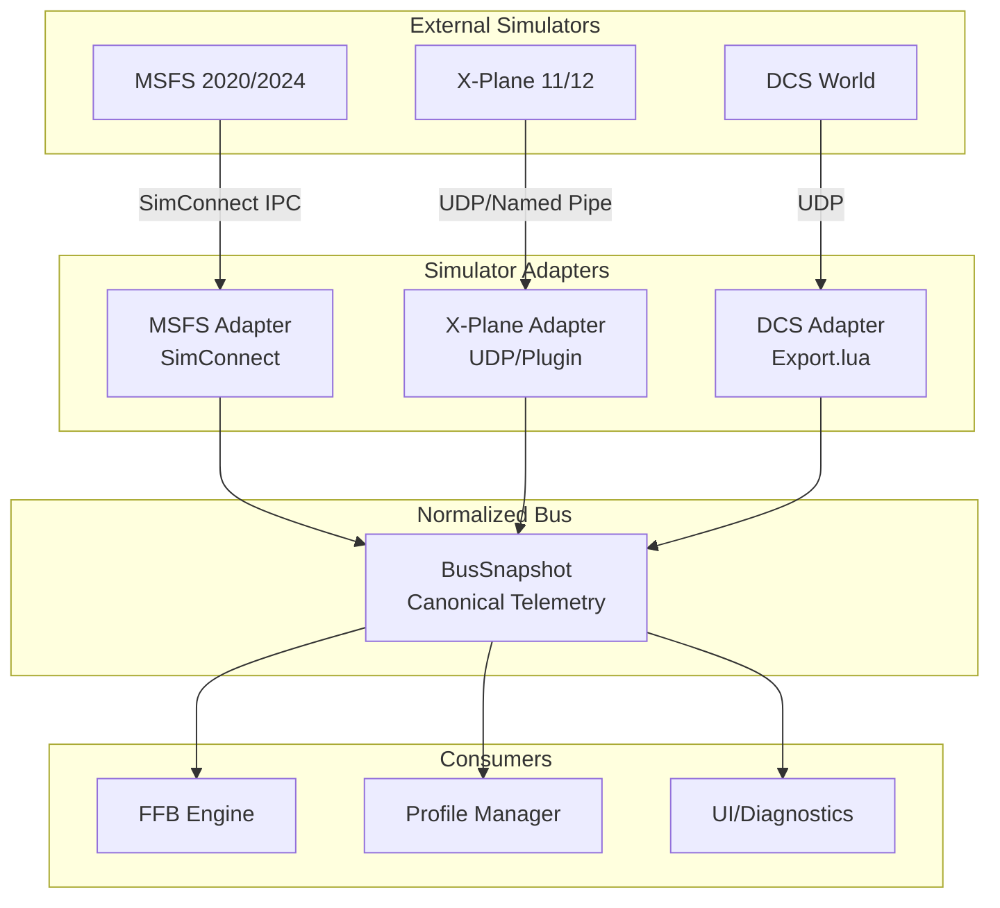

# Simulator Integration Implementation Design Document

## Overview

This design document provides the detailed technical architecture for implementing Flight Hub's simulator integration layer, force feedback protocol surface, and platform-specific runtime infrastructure. It translates the high-level adapter contracts from the parent flight-hub spec into concrete implementations with specific APIs, data structures, connection protocols, and OS integration patterns.

The design follows a "boring reliability" principle: use well-established patterns, official SDK interfaces, and conservative safety margins. Each simulator adapter is a pure mapping layer that normalizes heterogeneous telemetry into the canonical BusSnapshot structure, while the FFB and runtime layers provide deterministic, zero-surprise behavior under all conditions including faults.

### Design Principles

1. **Schema-First**: BusSnapshot is the contract; adapters are pure decoders
2. **Safety-First**: FFB never surprises; faults latch and require explicit recovery
3. **Official APIs Only**: SimConnect, X-Plane SDK, Export.lua - no reverse engineering
4. **Graceful Degradation**: Missing data → invalid flags, not crashes
5. **Observable**: Every adapter and runtime component exposes metrics for validation
6. **Testable**: Recorded fixtures drive integration tests; synthetic loads drive soak tests

## Architecture

### System Context



### Adapter Architecture Pattern

All simulator adapters follow the same pattern:

1. **Connection Layer**: Manages lifecycle (connect, reconnect, disconnect)
2. **Protocol Layer**: Handles wire format (SimConnect messages, UDP packets, Lua values)
3. **Mapping Layer**: Transforms native data → BusSnapshot with unit conversions
4. **Sanity Gate**: Validates plausibility and sets safe_for_ffb flag
5. **Metrics Layer**: Exposes update rate, sanity violations, connection state


## Components and Interfaces

### Normalized Telemetry Bus (BusSnapshot)

The BusSnapshot is the central data contract that all simulator adapters populate and all consumers read.

**Internal vs ABI Representation:**

The design separates ergonomic Rust types from ABI-safe wire formats:

- **BusSnapshot**: Internal, ergonomic struct with String, Option<T>, etc. for adapter logic
- **BusSnapshotRaw**: POD representation for lock-free ring buffers, FFI, and cross-thread sharing

**Internal Data Structure:**

```rust
// Internal, ergonomic representation (NOT repr(C))
pub struct BusSnapshot {
    // Identity
    pub sim_id: SimId,              // msfs, xplane, dcs, none
    pub aircraft_type: String,       // ICAO or internal type
    pub aircraft_name: String,       // Display name
    pub livery: Option<String>,
    
    // Kinematics (canonical units)
    pub attitude: Attitude,          // roll, pitch, yaw (radians)
    pub angular_rates: AngularRates, // p, q, r (rad/s)
    pub velocities: Velocities,      // body X/Y/Z (m/s), ias, tas, vs
    pub altitude_agl: f32,           // meters
    pub altitude_msl: f32,           // meters
    pub kinematics: Kinematics,      // nz_g, load_vector_body
    
    // Aerodynamics
    pub aero: Aero,                  // alpha, beta, mach
    
    // Flight condition
    pub on_ground: bool,
    pub gear_handle: u8,
    pub gear_position: f32,          // 0.0 = up, 1.0 = down
    pub flaps_handle: u8,
    pub flaps_position: f32,
    pub weight_on_wheels: WoWFlags,
    
    // Controls
    pub controls: Controls,          // stick/yoke ratios, trim, AP state
    
    // Metadata
    pub valid_flags: ValidFlags,     // per-group validity
    pub source_sim_timestamp: u64,   // sim's time (if available)
    pub bus_timestamp: u64,          // Flight Hub monotonic time (ns)
    pub safe_for_ffb: bool,          // Sanity gate output
}

#[repr(C)]
pub struct Attitude {
    pub roll: f32,   // radians, right-hand rule
    pub pitch: f32,  // radians
    pub yaw: f32,    // radians
}

#[repr(C)]
pub struct AngularRates {
    pub p: f32,  // rad/s, rotation about body X
    pub q: f32,  // rad/s, rotation about body Y
    pub r: f32,  // rad/s, rotation about body Z
}

#[repr(C)]
pub struct Velocities {
    pub body_x: f32,  // m/s, forward
    pub body_y: f32,  // m/s, right
    pub body_z: f32,  // m/s, down
    pub ias: f32,     // m/s
    pub tas: f32,     // m/s
    pub vs: f32,      // m/s, vertical speed
}

#[repr(C)]
pub struct Kinematics {
    pub nz_g: f32,                      // g along body Z (dimensionless)
    pub load_vector_body: Option<[f32; 3]>, // optional full load vector
}

#[repr(C)]
pub struct Aero {
    pub alpha: f32,  // rad, angle of attack
    pub beta: f32,   // rad, sideslip angle
    pub mach: f32,   // dimensionless (optional, 0.0 if unavailable)
}

#[repr(C)]
pub struct Controls {
    pub pitch_ratio: f32,  // -1.0 to 1.0
    pub roll_ratio: f32,   // -1.0 to 1.0
    pub yaw_ratio: f32,    // -1.0 to 1.0
    pub trim_pitch: f32,
    pub trim_roll: f32,
    pub trim_yaw: f32,
    pub ap_state: AutopilotState,
}

#[repr(C)]
pub struct ValidFlags {
    pub attitude_valid: bool,
    pub velocities_valid: bool,
    pub controls_valid: bool,
    pub aero_valid: bool,
    pub kinematics_valid: bool,
}
```

**Coordinate Frame Convention:**

- Body axes: +X forward, +Y to right wing, +Z down (right-handed)
- Attitude: roll/pitch/yaw follow standard aerospace convention (right-hand rule)
- Angular rates p/q/r: rotation about body X/Y/Z in rad/s, right-hand rule
- All adapters MUST convert their native coordinate systems into this canonical frame

**Unit Conventions:**

- Angles: radians
- Angular rates: rad/s
- Linear velocities: m/s
- Altitudes: meters
- Dimensionless: g-load, mach number
- Ratios: -1.0 to 1.0 for control inputs

**ABI-Safe Wire Format:**

```rust
// POD representation for lock-free ring buffers and FFI
#[repr(C)]
pub struct BusSnapshotRaw {
    // Identity (fixed-size arrays + lengths)
    pub sim_id: u8,  // 0=none, 1=msfs, 2=xplane, 3=dcs
    pub aircraft_type: [u8; 64],
    pub aircraft_type_len: u8,
    pub aircraft_name: [u8; 128],
    pub aircraft_name_len: u8,
    
    // Kinematics (plain floats)
    pub attitude_roll: f32,
    pub attitude_pitch: f32,
    pub attitude_yaw: f32,
    pub angular_rate_p: f32,
    pub angular_rate_q: f32,
    pub angular_rate_r: f32,
    pub velocity_body_x: f32,
    pub velocity_body_y: f32,
    pub velocity_body_z: f32,
    pub velocity_ias: f32,
    pub velocity_tas: f32,
    pub velocity_vs: f32,
    pub altitude_agl: f32,
    pub altitude_msl: f32,
    pub nz_g: f32,
    
    // Aero
    pub alpha: f32,
    pub beta: f32,
    pub mach: f32,
    
    // Flight condition
    pub on_ground: u8,  // 0=false, 1=true
    pub gear_handle: u8,
    pub gear_position: f32,
    pub flaps_handle: u8,
    pub flaps_position: f32,
    
    // Controls
    pub pitch_ratio: f32,
    pub roll_ratio: f32,
    pub yaw_ratio: f32,
    pub trim_pitch: f32,
    pub trim_roll: f32,
    pub trim_yaw: f32,
    pub ap_master: u8,
    pub ap_heading_lock: u8,
    pub ap_altitude_lock: u8,
    
    // Metadata (bitflags instead of bools)
    pub valid_flags: u32,  // Bitfield: 0x01=attitude, 0x02=velocities, 0x04=controls, 0x08=aero, 0x10=kinematics
    pub safe_for_ffb: u8,
    pub source_sim_timestamp: u64,
    pub bus_timestamp: u64,
}

impl From<&BusSnapshot> for BusSnapshotRaw {
    fn from(snapshot: &BusSnapshot) -> Self {
        // Conversion logic...
    }
}

impl From<&BusSnapshotRaw> for BusSnapshot {
    fn from(raw: &BusSnapshotRaw) -> Self {
        // Conversion logic...
    }
}
```

**Bus Publishing Model:**

- **Single Producer**: Exactly one active adapter at a time writes BusSnapshot into a lock-free ring buffer
- **Consumers**: FFB engine, profile manager, UI read the latest snapshot each loop
- **Immutability**: Each snapshot is treated as immutable by consumers
- **Rate Mismatch**: Adapters are event-driven (30-90 Hz); the 250 Hz FFB loop holds the last known snapshot
- **No Interpolation**: v1 uses last-known-good snapshot; no time-aware filtering or interpolation
- **Handoff**: Bounded lock-free SPSC ring buffer of BusSnapshotRaw for cross-thread communication


### MSFS SimConnect Adapter

**Connection Model:**

The MSFS adapter uses local SimConnect for lowest latency and simplest configuration.

```rust
pub struct MsfsAdapter {
    connection: Option<SimConnectHandle>,
    state: AdapterState,
    sanity_gate: SanityGate,
    metrics: AdapterMetrics,
    reconnect_backoff: ExponentialBackoff,
}

pub enum AdapterState {
    Disconnected,
    Connecting,
    Booting,      // Sim starting up
    Loading,      // Loading flight
    ActiveFlight, // In active flight
    Paused,       // Sim paused
    Faulted,      // Sanity violations exceeded threshold
}

impl MsfsAdapter {
    pub fn new() -> Self;
    pub fn tick(&mut self) -> Option<BusSnapshot>;
    pub fn disconnect(&mut self);
}
```

**SimConnect Data Definitions:**

The adapter registers two data definitions:

1. **High-rate telemetry** (requested every frame, 30-90 Hz)
2. **Low-rate identity** (requested on aircraft change or periodically at 1 Hz)

**Note:** The SimVar table below is illustrative. Actual unit strings and SimVar names should match the canonical mapping document at `docs/integration/msfs-simvar-mapping.md`.

```rust
// High-rate telemetry data definition
const FLIGHT_DATA_DEF: u32 = 0;

// SimVars to register for high-rate updates (with explicit units)
const HIGH_RATE_SIMVARS: &[(&str, &str, SimConnectDataType)] = &[
    // Attitude
    ("PLANE PITCH DEGREES", "degrees", F64),
    ("PLANE BANK DEGREES", "degrees", F64),
    ("PLANE HEADING DEGREES TRUE", "degrees", F64),
    
    // Angular rates
    ("ROTATION VELOCITY BODY X", "radians per second", F64),
    ("ROTATION VELOCITY BODY Y", "radians per second", F64),
    ("ROTATION VELOCITY BODY Z", "radians per second", F64),
    
    // Velocities
    ("INDICATED AIRSPEED", "knots", F64),
    ("TRUE AIRSPEED", "knots", F64),
    ("VERTICAL SPEED", "feet per minute", F64),
    ("VELOCITY BODY X", "feet per second", F64),
    ("VELOCITY BODY Y", "feet per second", F64),
    ("VELOCITY BODY Z", "feet per second", F64),
    
    // Kinematics
    ("G FORCE", "gforce", F64),
    
    // Aero
    ("INCIDENCE ALPHA", "degrees", F64),
    ("INCIDENCE BETA", "degrees", F64),
    
    // Altitudes
    ("PLANE ALT ABOVE GROUND", "feet", F64),
    ("PLANE ALTITUDE", "feet", F64),
    
    // Flight condition
    ("SIM ON GROUND", "bool", I32),
    ("GEAR HANDLE POSITION", "bool", I32),
    ("GEAR POSITION", "percent", F64),
    ("FLAPS HANDLE INDEX", "number", I32),
    ("FLAPS HANDLE PERCENT", "percent", F64),
    
    // Controls
    ("ELEVATOR POSITION", "position", F64),
    ("AILERON POSITION", "position", F64),
    ("RUDDER POSITION", "position", F64),
    ("ELEVATOR TRIM POSITION", "radians", F64),
    ("AILERON TRIM PCT", "percent", F64),
    ("RUDDER TRIM PCT", "percent", F64),
    
    // Autopilot
    ("AUTOPILOT MASTER", "bool", I32),
    ("AUTOPILOT HEADING LOCK", "bool", I32),
    ("AUTOPILOT ALTITUDE LOCK", "bool", I32),
];

// Low-rate identity data definition (1 Hz or on aircraft change)
const IDENTITY_DATA_DEF: u32 = 1;

const IDENTITY_SIMVARS: &[(&str, &str, SimConnectDataType)] = &[
    ("TITLE", "string", STRING256),
    ("ATC TYPE", "string", STRING256),
    ("ATC MODEL", "string", STRING256),
];
```

**Rationale:** Separating identity into a low-rate subscription avoids re-allocating and copying potentially large strings every frame, reducing cache pressure on the hot path. The adapter stores "last seen title" and a hash to detect aircraft changes.

**Unit Conversion:**

```rust
impl MsfsAdapter {
    fn map_to_bus_snapshot(&self, raw: &SimConnectData) -> BusSnapshot {
        let mut snapshot = BusSnapshot::default();
        
        // Attitude (degrees → radians)
        snapshot.attitude.pitch = raw.pitch_deg.to_radians();
        snapshot.attitude.roll = raw.bank_deg.to_radians();
        snapshot.attitude.yaw = raw.heading_deg.to_radians();
        
        // Angular rates (already rad/s)
        snapshot.angular_rates.p = raw.rot_vel_body_x;
        snapshot.angular_rates.q = raw.rot_vel_body_y;
        snapshot.angular_rates.r = raw.rot_vel_body_z;
        
        // Velocities (knots → m/s, ft/s → m/s, fpm → m/s)
        snapshot.velocities.ias = raw.ias_kt * 0.514444;
        snapshot.velocities.tas = raw.tas_kt * 0.514444;
        snapshot.velocities.vs = raw.vs_fpm * 0.00508;
        snapshot.velocities.body_x = raw.vel_body_x_fps * 0.3048;
        snapshot.velocities.body_y = raw.vel_body_y_fps * 0.3048;
        snapshot.velocities.body_z = raw.vel_body_z_fps * 0.3048;
        
        // Kinematics
        snapshot.kinematics.nz_g = raw.g_force;
        
        // Aero (degrees → radians)
        snapshot.aero.alpha = raw.alpha_deg.to_radians();
        snapshot.aero.beta = raw.beta_deg.to_radians();
        
        // Altitudes (feet → meters)
        snapshot.altitude_agl = raw.alt_agl_ft * 0.3048;
        snapshot.altitude_msl = raw.alt_msl_ft * 0.3048;
        
        // Flight condition
        snapshot.on_ground = raw.on_ground != 0;
        snapshot.gear_handle = if raw.gear_handle != 0 { 1 } else { 0 };
        snapshot.gear_position = raw.gear_position / 100.0;
        snapshot.flaps_handle = raw.flaps_handle_index as u8;
        snapshot.flaps_position = raw.flaps_handle_pct / 100.0;
        
        // Controls (SimConnect positions are -1 to 1 or 0 to 1)
        snapshot.controls.pitch_ratio = raw.elevator_position;
        snapshot.controls.roll_ratio = raw.aileron_position;
        snapshot.controls.yaw_ratio = raw.rudder_position;
        snapshot.controls.trim_pitch = raw.elevator_trim;
        snapshot.controls.trim_roll = raw.aileron_trim_pct / 100.0;
        snapshot.controls.trim_yaw = raw.rudder_trim_pct / 100.0;
        
        // Autopilot
        snapshot.controls.ap_state = AutopilotState {
            master: raw.ap_master != 0,
            heading_lock: raw.ap_heading_lock != 0,
            altitude_lock: raw.ap_altitude_lock != 0,
        };
        
        // Identity
        snapshot.sim_id = SimId::Msfs;
        snapshot.aircraft_name = raw.title.clone();
        snapshot.aircraft_type = raw.atc_type.clone();
        
        // Timestamps
        snapshot.bus_timestamp = self.monotonic_now_ns();
        
        snapshot
    }
}
```

**Sanity Gate:**

The Sanity Gate validates telemetry plausibility and controls the safe_for_ffb flag through a state machine.

**State Machine:**

```
Disconnected → Connecting → Booting → Loading → ActiveFlight ⇄ Paused
                                                      ↓
                                                   Faulted
```

**State Transitions (MSFS):**

- **Disconnected → Connecting**: SimConnect connection attempt initiated
- **Connecting → Booting**: SimConnect connection established
- **Booting → Loading**: Valid telemetry received, waiting for initialized position
- **Loading → ActiveFlight**: SIM_ON_GROUND valid and SIMULATION_STATE indicates active flight
- **ActiveFlight → Paused**: Sim reports paused state
- **Paused → ActiveFlight**: Sim resumes
- **Any → Faulted**: Sanity violation count exceeds threshold
- **Faulted → Disconnected**: Power cycle or explicit fault clear

**safe_for_ffb Rules:**

- `true` only in ActiveFlight state
- `false` in all other states (Disconnected, Booting, Loading, Paused, Faulted)

```rust
pub struct SanityGate {
    state: AdapterState,
    // Store only minimal previous state for sanity checks (not full snapshot)
    last_attitude: Option<Attitude>,
    last_velocities: Option<Velocities>,
    last_timestamp: u64,
    violation_count: u32,
    violation_threshold: u32,  // Default: 10
    last_violation_log: Instant,
}

impl SanityGate {
    pub fn check(&mut self, snapshot: &mut BusSnapshot) {
        // Check for NaN/Inf
        if self.has_nan_or_inf(snapshot) {
            self.record_violation("NaN or Inf detected");
            self.mark_invalid(snapshot);
            return;
        }
        
        // Check for physically implausible jumps
        if let (Some(last_att), Some(last_vel)) = (&self.last_attitude, &self.last_velocities) {
            let dt = (snapshot.bus_timestamp - self.last_timestamp) as f64 / 1e9;
            
            // Attitude shouldn't change > 180 deg/s
            let d_pitch = (snapshot.attitude.pitch - last_att.pitch).abs();
            if d_pitch / dt > std::f32::consts::PI {
                self.record_violation("Implausible pitch rate");
                self.mark_invalid(snapshot);
                return;
            }
            
            // Similar checks for roll, yaw, velocities...
        }
        
        // Update state machine based on sim state
        self.update_state(snapshot);
        
        // Only set safe_for_ffb in ActiveFlight
        snapshot.safe_for_ffb = matches!(self.state, AdapterState::ActiveFlight);
        
        // Store minimal state for next check
        self.last_attitude = Some(snapshot.attitude);
        self.last_velocities = Some(snapshot.velocities);
        self.last_timestamp = snapshot.bus_timestamp;
    }
    
    fn record_violation(&mut self, reason: &str) {
        self.violation_count += 1;
        
        // Rate-limited logging
        if self.last_violation_log.elapsed() > Duration::from_secs(5) {
            warn!("Sanity violation: {} (count: {})", reason, self.violation_count);
            self.last_violation_log = Instant::now();
        }
        
        // Transition to Faulted if threshold exceeded
        if self.violation_count >= self.violation_threshold {
            self.state = AdapterState::Faulted;
        }
    }
}
```

**Connection Management:**

```rust
impl MsfsAdapter {
    fn tick(&mut self) -> Option<BusSnapshot> {
        match self.state {
            AdapterState::Disconnected => {
                if self.should_attempt_connect() {
                    self.attempt_connect();
                }
                None
            }
            AdapterState::Connecting => {
                self.poll_connection();
                None
            }
            _ => {
                self.poll_simconnect()
            }
        }
    }
    
    fn attempt_connect(&mut self) {
        match SimConnect::open("Flight Hub", None, 0, 0) {
            Ok(conn) => {
                self.connection = Some(conn);
                self.register_data_definitions();
                self.state = AdapterState::Booting;
                self.reconnect_backoff.reset();
            }
            Err(e) => {
                warn!("SimConnect connection failed: {}", e);
                self.reconnect_backoff.wait();
            }
        }
    }
    
    fn poll_simconnect(&mut self) -> Option<BusSnapshot> {
        let conn = self.connection.as_mut()?;
        
        // Drain the dispatch queue each tick to handle bursts of events
        // SimConnect often delivers multiple messages per frame
        let mut latest_snapshot = None;
        
        while let Ok(Some(msg)) = conn.get_next_dispatch() {
            match msg {
                DispatchResult::SimObjectData(data) => {
                    let mut snapshot = self.map_to_bus_snapshot(&data);
                    self.sanity_gate.check(&mut snapshot);
                    self.metrics.update_rate.record();
                    latest_snapshot = Some(snapshot);
                }
                DispatchResult::Quit => {
                    self.disconnect();
                    return None;
                }
                _ => {}
            }
        }
        
        latest_snapshot
    }
}
```

**Update Rate:**

The adapter requests data at SIMCONNECT_PERIOD_SIM_FRAME which typically delivers 30-90 Hz depending on sim frame rate. The adapter targets a minimum effective rate of 60 Hz and exposes metrics to verify actual delivery rate.

**Dispatch Queue Handling:**

The `poll_simconnect()` method drains the entire dispatch queue each tick rather than processing only one message. This handles burst scenarios where SimConnect delivers multiple events per frame, ensuring we always use the latest telemetry data.


### X-Plane UDP Adapter

**Connection Model:**

The v1 X-Plane adapter uses UDP data output configured by the user in X-Plane's "Data Output" screen.

```rust
pub struct XPlaneAdapter {
    socket: UdpSocket,
    state: AdapterState,
    sanity_gate: SanityGate,
    metrics: AdapterMetrics,
    last_packet_time: Instant,
}

impl XPlaneAdapter {
    pub fn new(bind_addr: SocketAddr) -> Result<Self>;
    pub fn tick(&mut self) -> Option<BusSnapshot>;
}
```

**Aircraft Identity Limitation (UDP-only mode):**

**Important:** UDP DATA packets do not carry aircraft identity information (aircraft path/name). In v1 UDP-only mode:

- Aircraft identity may be unavailable or inferred poorly from heuristics
- Profile switching based on aircraft type may fall back to class-level heuristics
- True identity-based profile switching requires either:
  - The full X-Plane plugin (future v2 feature), or
  - A minimal companion plugin that sends identity over UDP

This limitation is documented in requirements as acceptable for v1.

**UDP Packet Format:**

X-Plane sends DATA packets with this structure:

```
Header: "DATA" (4 bytes) + padding (1 byte)
Records: N × 36-byte records
  Each record:
    Index (4 bytes, i32) - identifies data group
    Data (8 × 4 bytes, f32) - 8 float values
```

**Required Data Output Configuration:**

Users must enable the following Data Output indices in X-Plane's "Settings > Data Output" screen:

| Index | Group Name | Contains | Recommended Rate |
|-------|------------|----------|------------------|
| 3 | Speeds | IAS, TAS, ground speed | 20/sec |
| 4 | Mach, VVI, G-load | Mach number, vertical speed, g-forces | 20/sec |
| 16 | Angular velocities | P, Q, R (deg/s) | 20/sec |
| 17 | Pitch, roll, headings | Attitude angles | 20/sec |
| 18 | Alpha, beta, etc. | Angle of attack, sideslip | 20/sec |
| 21 | Body velocities | Vx, Vy, Vz in body frame | 20/sec |

**Setup Instructions:** In X-Plane, navigate to Settings > Data Output, check the "UDP" column for indices 3, 4, 16, 17, 18, and 21. Set the rate to "20 per second" for optimal balance between latency and CPU usage.

**Data Group Indices:**

```rust
const DATA_GROUP_SPEEDS: i32 = 3;      // IAS, TAS, GS, etc.
const DATA_GROUP_MACH: i32 = 4;        // Mach, VVI, g-load
const DATA_GROUP_ATMOSPHERE: i32 = 6;  // Pressure, temp
const DATA_GROUP_ATTITUDE: i32 = 17;   // pitch, roll, heading (true/mag)
const DATA_GROUP_AOA: i32 = 18;        // alpha, beta, etc.
const DATA_GROUP_ANGULAR_RATES: i32 = 16; // P, Q, R
const DATA_GROUP_VELOCITIES: i32 = 21; // body velocities
```

**Parsing:**

```rust
impl XPlaneAdapter {
    fn parse_data_packet(&self, buf: &[u8]) -> Result<HashMap<i32, [f32; 8]>> {
        if buf.len() < 5 || &buf[0..4] != b"DATA" {
            return Err(Error::InvalidPacket);
        }
        
        let mut groups = HashMap::new();
        let mut offset = 5;
        
        while offset + 36 <= buf.len() {
            let index = i32::from_le_bytes(buf[offset..offset+4].try_into()?);
            let mut data = [0.0f32; 8];
            
            for i in 0..8 {
                let start = offset + 4 + (i * 4);
                data[i] = f32::from_le_bytes(buf[start..start+4].try_into()?);
            }
            
            groups.insert(index, data);
            offset += 36;
        }
        
        Ok(groups)
    }
    
    fn map_to_bus_snapshot(&self, groups: &HashMap<i32, [f32; 8]>) -> BusSnapshot {
        let mut snapshot = BusSnapshot::default();
        
        // Attitude (group 17: pitch, roll, heading_true, heading_mag)
        if let Some(att) = groups.get(&DATA_GROUP_ATTITUDE) {
            snapshot.attitude.pitch = att[0].to_radians();
            snapshot.attitude.roll = att[1].to_radians();
            snapshot.attitude.yaw = att[2].to_radians();
            snapshot.valid_flags.attitude_valid = true;
        }
        
        // Angular rates (group 16: P, Q, R in deg/s)
        if let Some(rates) = groups.get(&DATA_GROUP_ANGULAR_RATES) {
            snapshot.angular_rates.p = rates[0].to_radians();
            snapshot.angular_rates.q = rates[1].to_radians();
            snapshot.angular_rates.r = rates[2].to_radians();
        }
        
        // Speeds (group 3: IAS, TAS in knots)
        if let Some(speeds) = groups.get(&DATA_GROUP_SPEEDS) {
            snapshot.velocities.ias = speeds[0] * 0.514444; // knots → m/s
            snapshot.velocities.tas = speeds[1] * 0.514444;
            snapshot.valid_flags.velocities_valid = true;
        }
        
        // Mach and g-load (group 4)
        if let Some(mach_data) = groups.get(&DATA_GROUP_MACH) {
            snapshot.aero.mach = mach_data[0];
            snapshot.kinematics.nz_g = mach_data[4]; // g-load normal
            snapshot.velocities.vs = mach_data[1] * 0.00508; // fpm → m/s
        }
        
        // AoA and sideslip (group 18: alpha, beta in degrees)
        if let Some(aoa_data) = groups.get(&DATA_GROUP_AOA) {
            snapshot.aero.alpha = aoa_data[0].to_radians();
            snapshot.aero.beta = aoa_data[1].to_radians();
            snapshot.valid_flags.aero_valid = true;
        }
        
        // Body velocities (group 21: vx, vy, vz in m/s)
        if let Some(vel) = groups.get(&DATA_GROUP_VELOCITIES) {
            snapshot.velocities.body_x = vel[0];
            snapshot.velocities.body_y = vel[1];
            snapshot.velocities.body_z = vel[2];
        }
        
        snapshot.sim_id = SimId::XPlane;
        snapshot.bus_timestamp = self.monotonic_now_ns();
        
        snapshot
    }
}
```

**Connection Monitoring:**

```rust
impl XPlaneAdapter {
    fn tick(&mut self) -> Option<BusSnapshot> {
        let mut buf = [0u8; 4096];
        
        match self.socket.recv_from(&mut buf) {
            Ok((len, _addr)) => {
                self.last_packet_time = Instant::now();
                
                match self.parse_data_packet(&buf[..len]) {
                    Ok(groups) => {
                        let mut snapshot = self.map_to_bus_snapshot(&groups);
                        self.sanity_gate.check(&mut snapshot);
                        self.metrics.update_rate.record();
                        Some(snapshot)
                    }
                    Err(e) => {
                        warn!("Failed to parse X-Plane packet: {}", e);
                        None
                    }
                }
            }
            Err(ref e) if e.kind() == std::io::ErrorKind::WouldBlock => {
                // Check for timeout (no packets for 2 seconds)
                if self.last_packet_time.elapsed() > Duration::from_secs(2) {
                    if self.state != AdapterState::Disconnected {
                        warn!("X-Plane connection timeout");
                        self.state = AdapterState::Disconnected;
                    }
                }
                None
            }
            Err(e) => {
                error!("X-Plane UDP error: {}", e);
                None
            }
        }
    }
}
```

**Future Plugin Design:**

When the plugin is implemented, it will follow this pattern:

```c
// X-Plane plugin entry points
PLUGIN_API int XPluginStart(char *name, char *sig, char *desc);
PLUGIN_API void XPluginStop(void);
PLUGIN_API int XPluginEnable(void);
PLUGIN_API void XPluginDisable(void);

// Flight loop callback
float FlightLoopCallback(
    float elapsedSinceLastCall,
    float elapsedTimeSinceLastFlightLoop,
    int counter,
    void *refcon)
{
    // Read DataRefs
    double lat = XPLMGetDatad(g_lat_ref);
    double pitch = XPLMGetDataf(g_pitch_ref);
    // ... read all required DataRefs
    
    // Write to lock-free queue for IPC thread
    push_to_queue(&telemetry_data);
    
    // Return 0.0 to be called every frame, or -1.0 to be called next cycle
    return 0.0;
}
```

The plugin will communicate with Flight Hub via UDP or named pipe using the same binary packet format, ensuring it's a drop-in replacement for the UDP adapter at the BusSnapshot boundary.


### DCS Export.lua Adapter

**Installation Strategy:**

The DCS adapter uses a shim pattern to coexist with other tools:

```lua
-- Flight Hub's Export.lua shim (installed by user or installer)
-- Location: Saved Games\DCS\Scripts\Export.lua (or DCS.openbeta)

-- Preserve existing Export.lua if present
local existing_export = package.loaded["existing_export"]
if existing_export then
    -- Chain to existing export functions
end

-- Load Flight Hub export script
dofile(lfs.writedir() .. [[Scripts\FlightHub\FlightHubExport.lua]])
```

**Export Script Structure:**

```lua
-- FlightHubExport.lua
local socket = require("socket")
local JSON = require("JSON")

local FlightHub = {
    udp = nil,
    host = "127.0.0.1",
    port = 7778,
    export_interval = 1.0 / 60.0,  -- 60 Hz target
    last_export_time = 0,
    mp_detected = false,
}

function FlightHub.LuaExportStart()
    FlightHub.udp = socket.udp()
    FlightHub.udp:settimeout(0)  -- Non-blocking
    
    -- Detect MP mode (heuristic: check if certain functions are restricted)
    local test_data = LoGetWorldObjects()
    if test_data == nil then
        FlightHub.mp_detected = true
        log.write("FlightHub", log.INFO, "Multiplayer mode detected")
    end
end

function FlightHub.LuaExportStop()
    if FlightHub.udp then
        FlightHub.udp:close()
        FlightHub.udp = nil
    end
end

function FlightHub.LuaExportAfterNextFrame()
    local current_time = LoGetModelTime()
    
    if current_time - FlightHub.last_export_time < FlightHub.export_interval then
        return
    end
    
    FlightHub.last_export_time = current_time
    
    -- Gather telemetry
    local data = FlightHub.gather_telemetry()
    if data then
        local json = JSON:encode(data)
        FlightHub.udp:sendto(json, FlightHub.host, FlightHub.port)
    end
end

function FlightHub.gather_telemetry()
    -- Self aircraft data only
    local self_data = LoGetSelfData()
    if not self_data then
        return nil
    end
    
    local ias = LoGetIndicatedAirSpeed()
    local accel = LoGetAccelerationUnits()
    local aoa = LoGetAngleOfAttack()
    
    -- MP Integrity Check Whitelist:
    -- Always allowed: self attitude, self velocities, self g-load, IAS/TAS, AoA
    -- Never exported in MP: world objects, RWR, sensors, weapons
    
    -- Build telemetry with self-aircraft data (allowed in both SP and MP)
    local telemetry = {
        timestamp = LoGetModelTime(),
        mp_detected = FlightHub.mp_detected,
        attitude = {
            pitch = self_data.Pitch,
            roll = self_data.Bank,
            yaw = self_data.Heading,
        },
        angular_rates = {
            p = self_data.AngularVelocity.x,
            q = self_data.AngularVelocity.y,
            r = self_data.AngularVelocity.z,
        },
        velocities = {
            body_x = self_data.Velocity.x,
            body_y = self_data.Velocity.y,
            body_z = self_data.Velocity.z,
        },
        ias = ias,
        tas = LoGetTrueAirSpeed(),
        aoa = aoa,
        accel = {
            x = accel.x,
            y = accel.y,
            z = accel.z,
        },
        altitude_asl = self_data.Altitude,
        altitude_agl = LoGetAltitudeAboveGroundLevel(),
        unit_type = self_data.Name,
    }
    
    -- Note: We do NOT invalidate self-aircraft data in MP mode
    -- The Rust adapter will annotate MP status but keep valid self-aircraft telemetry
    
    return telemetry
end

-- Properly chain to existing Export.lua hooks
local PrevLuaExportStart = LuaExportStart
local PrevLuaExportStop = LuaExportStop
local PrevLuaExportAfterNextFrame = LuaExportAfterNextFrame

function LuaExportStart()
    if PrevLuaExportStart then PrevLuaExportStart() end
    FlightHub.LuaExportStart()
end

function LuaExportStop()
    FlightHub.LuaExportStop()
    if PrevLuaExportStop then PrevLuaExportStop() end
end

function LuaExportAfterNextFrame()
    if PrevLuaExportAfterNextFrame then PrevLuaExportAfterNextFrame() end
    FlightHub.LuaExportAfterNextFrame()
end
```

**Export.lua Chaining Pattern:**

The script properly chains to existing Export.lua hooks by:
1. Storing references to previous hook functions before redefining them
2. Calling previous hooks at appropriate points (before or after Flight Hub logic)
3. This ensures compatibility with SRS, Tacview, and other tools that use Export.lua

**JSON Wire Format:**

v1 uses JSON for the UDP payload for debuggability and ease of implementation. The payload schema is under Flight Hub's control and can be swapped to a compact binary encoding in future versions if performance profiling indicates a need.

**Multiplayer Integrity Check Compliance:**

The adapter respects DCS's Multiplayer Integrity Check by:
- **Always exporting** self-aircraft data (attitude, velocities, g-load, IAS/TAS, AoA) - these are allowed by IC
- **Never exporting** world objects, RWR data, sensors, or weapons data in MP mode
- **Annotating** MP status in the payload (`mp_detected` flag) for UI/logging purposes
- **Not invalidating** self-aircraft telemetry just because MP is active

This approach provides the minimal set of data needed for FFB while respecting IC restrictions.estamp = LoGetModelTime(),
        mp_limited = false,
        attitude = {
            pitch = self_data.Pitch,
            roll = self_data.Bank,
            yaw = self_data.Heading,
        },
        angular_rates = {
            p = self_data.AngularVelocity.x,
            q = self_data.AngularVelocity.y,
            r = self_data.AngularVelocity.z,
        },
        velocities = {
            body_x = self_data.Velocity.x,
            body_y = self_data.Velocity.y,
            body_z = self_data.Velocity.z,
        },
        ias = ias,
        tas = LoGetTrueAirSpeed(),
        aoa = aoa,
        accel = {
            x = accel.x,
            y = accel.y,
            z = accel.z,
        },
        altitude_asl = self_data.Altitude,
        altitude_agl = LoGetAltitudeAboveGroundLevel(),
        unit_type = self_data.Name,
    }
end

-- Register hooks
LuaExportStart = FlightHub.LuaExportStart
LuaExportStop = FlightHub.LuaExportStop
LuaExportAfterNextFrame = FlightHub.LuaExportAfterNextFrame
```

**Rust Adapter:**

```rust
pub struct DcsAdapter {
    socket: UdpSocket,
    state: AdapterState,
    sanity_gate: SanityGate,
    metrics: AdapterMetrics,
    last_packet_time: Instant,
    mp_detected: bool,  // Annotation only, does not affect data validity
}

impl DcsAdapter {
    fn map_to_bus_snapshot(&self, json: &serde_json::Value) -> BusSnapshot {
        let mut snapshot = BusSnapshot::default();
        
        // Check if MP detected (annotation only, does not invalidate self-aircraft data)
        let mp_detected = json["mp_detected"].as_bool().unwrap_or(false);
        
        // Attitude (DCS uses radians natively)
        if let Some(att) = json["attitude"].as_object() {
            snapshot.attitude.pitch = att["pitch"].as_f64().unwrap_or(0.0) as f32;
            snapshot.attitude.roll = att["roll"].as_f64().unwrap_or(0.0) as f32;
            snapshot.attitude.yaw = att["yaw"].as_f64().unwrap_or(0.0) as f32;
            snapshot.valid_flags.attitude_valid = true;
        }
        
        // Angular rates (rad/s)
        if let Some(rates) = json["angular_rates"].as_object() {
            snapshot.angular_rates.p = rates["p"].as_f64().unwrap_or(0.0) as f32;
            snapshot.angular_rates.q = rates["q"].as_f64().unwrap_or(0.0) as f32;
            snapshot.angular_rates.r = rates["r"].as_f64().unwrap_or(0.0) as f32;
        }
        
        // Velocities (DCS uses m/s natively)
        if let Some(vel) = json["velocities"].as_object() {
            snapshot.velocities.body_x = vel["body_x"].as_f64().unwrap_or(0.0) as f32;
            snapshot.velocities.body_y = vel["body_y"].as_f64().unwrap_or(0.0) as f32;
            snapshot.velocities.body_z = vel["body_z"].as_f64().unwrap_or(0.0) as f32;
            snapshot.valid_flags.velocities_valid = true;
        }
        
        // Speeds (m/s)
        snapshot.velocities.ias = json["ias"].as_f64().unwrap_or(0.0) as f32;
        snapshot.velocities.tas = json["tas"].as_f64().unwrap_or(0.0) as f32;
        
        // Aero
        snapshot.aero.alpha = json["aoa"].as_f64().unwrap_or(0.0) as f32;
        snapshot.valid_flags.aero_valid = true;
        
        // Acceleration → g-load
        if let Some(accel) = json["accel"].as_object() {
            let az = accel["z"].as_f64().unwrap_or(0.0) as f32;
            snapshot.kinematics.nz_g = -az / 9.81; // Convert m/s² to g
            snapshot.valid_flags.kinematics_valid = true;
        }
        
        // Altitudes (meters)
        snapshot.altitude_msl = json["altitude_asl"].as_f64().unwrap_or(0.0) as f32;
        snapshot.altitude_agl = json["altitude_agl"].as_f64().unwrap_or(0.0) as f32;
        
        // Aircraft identity
        snapshot.sim_id = SimId::Dcs;
        snapshot.aircraft_type = json["unit_type"]
            .as_str()
            .unwrap_or("unknown")
            .to_string();
        
        snapshot.bus_timestamp = self.monotonic_now_ns();
        
        // Store MP status for UI/logging (does NOT invalidate self-aircraft data)
        self.mp_detected = mp_detected;
        
        // Note: We do NOT invalidate self-aircraft telemetry in MP mode
        // Self-aircraft data (attitude, velocities, g-load, IAS/TAS, AoA) is allowed by IC
        // Only world objects, RWR, sensors, and weapons are restricted in MP
        
        snapshot
    }
}
```

**Installer Integration:**

```rust
pub struct DcsInstaller {
    dcs_variants: Vec<DcsVariant>,
}

pub struct DcsVariant {
    name: String,              // "DCS", "DCS.openbeta"
    saved_games_path: PathBuf, // e.g., C:\Users\...\Saved Games\DCS
    export_lua_path: PathBuf,  // Scripts\Export.lua
}

impl DcsInstaller {
    pub fn detect_variants() -> Vec<DcsVariant> {
        let saved_games = dirs::document_dir()
            .expect("Could not find Documents folder")
            .join("Saved Games");
        
        let mut variants = Vec::new();
        
        for entry in ["DCS", "DCS.openbeta", "DCS.openalpha"] {
            let path = saved_games.join(entry);
            if path.exists() {
                variants.push(DcsVariant {
                    name: entry.to_string(),
                    saved_games_path: path.clone(),
                    export_lua_path: path.join("Scripts").join("Export.lua"),
                });
            }
        }
        
        variants
    }
    
    pub fn install(&self, variant: &DcsVariant) -> Result<()> {
        let export_path = &variant.export_lua_path;
        
        // Backup existing Export.lua
        if export_path.exists() {
            let backup_path = export_path.with_extension("lua.flighthub_backup");
            std::fs::copy(export_path, backup_path)?;
        }
        
        // Append or create Export.lua with dofile reference
        let flighthub_script_path = variant.saved_games_path
            .join("Scripts")
            .join("FlightHub")
            .join("FlightHubExport.lua");
        
        // Create FlightHub directory and copy script
        std::fs::create_dir_all(flighthub_script_path.parent().unwrap())?;
        std::fs::write(&flighthub_script_path, include_str!("FlightHubExport.lua"))?;
        
        // Append dofile to Export.lua
        let dofile_line = format!(
            "\ndofile(lfs.writedir() .. [[Scripts\\FlightHub\\FlightHubExport.lua]])\n"
        );
        
        let mut export_content = if export_path.exists() {
            std::fs::read_to_string(export_path)?
        } else {
            String::new()
        };
        
        if !export_content.contains("FlightHubExport.lua") {
            export_content.push_str(&dofile_line);
            std::fs::write(export_path, export_content)?;
        }
        
        Ok(())
    }
    
    pub fn uninstall(&self, variant: &DcsVariant) -> Result<()> {
        let backup_path = variant.export_lua_path.with_extension("lua.flighthub_backup");
        
        if backup_path.exists() {
            std::fs::copy(backup_path, &variant.export_lua_path)?;
            std::fs::remove_file(backup_path)?;
        } else {
            // Remove our dofile line
            let export_content = std::fs::read_to_string(&variant.export_lua_path)?;
            let cleaned = export_content
                .lines()
                .filter(|line| !line.contains("FlightHubExport.lua"))
                .collect::<Vec<_>>()
                .join("\n");
            std::fs::write(&variant.export_lua_path, cleaned)?;
        }
        
        Ok(())
    }
}
```


## Force Feedback Implementation

### Windows DirectInput FFB

**Device Abstraction:**

```rust
pub struct DirectInputFfbDevice {
    device: ComPtr<IDirectInputDevice8>,
    capabilities: FfbCapabilities,
    effects: EffectPool,
    safety_state: SafetyState,
    metrics: FfbMetrics,
}

pub struct FfbCapabilities {
    pub supports_pid: bool,
    pub supports_raw_torque: bool,
    pub max_torque_nm: f32,          // Queried from device firmware or config
    pub min_period_us: u32,           // Queried from device firmware
    pub thermal_limit_c: Option<f32>, // Optional thermal limit
    pub current_limit_a: Option<f32>, // Optional current limit
    pub has_health_stream: bool,
}

pub enum SafetyState {
    SafeTorque,
    HighTorque,
    Faulted { reason: FaultReason, timestamp: Instant },
}
```

**Torque Direction Mapping:**

For a 2-axis stick (pitch and roll), Flight Hub maintains separate torque values for each axis:

- **Pitch torque** → DirectInput Y axis (constant force effect)
- **Roll torque** → DirectInput X axis (constant force effect)

Each axis has its own `torque_nm` value and independent constant-force effect. The `set_constant_force()` method is called per-axis with the corresponding torque value.

**Device Calibration:**

On first connect, Flight Hub queries the device firmware (via HID feature reports or vendor-specific protocols) for:

- `max_torque_nm`: Maximum rated torque for the device
- `min_period_us`: Minimum update period supported
- Thermal and current limits (if available)

Per-device calibration is stored in a configuration file (e.g., `~/.config/flighthub/devices/<device_id>.toml`) rather than hardcoded constants. This allows Flight Hub to respect device-specific safety limits.

**Effect Management:**

```rust
pub struct EffectPool {
    constant_force_pitch: Option<ComPtr<IDirectInputEffect>>,  // Y axis
    constant_force_roll: Option<ComPtr<IDirectInputEffect>>,   // X axis
    spring: Option<ComPtr<IDirectInputEffect>>,
    damper: Option<ComPtr<IDirectInputEffect>>,
    periodic_sine: Option<ComPtr<IDirectInputEffect>>,
}

impl DirectInputFfbDevice {
    pub fn new(device_guid: GUID) -> Result<Self> {
        // Create DirectInput8 interface
        let dinput = DirectInput8Create()?;
        
        // Create device
        let device = dinput.CreateDevice(device_guid)?;
        device.SetDataFormat(&c_dfDIJoystick2)?;
        device.SetCooperativeLevel(hwnd, DISCL_EXCLUSIVE | DISCL_BACKGROUND)?;
        
        // Query capabilities
        let mut caps = DIDEVCAPS::default();
        caps.dwSize = std::mem::size_of::<DIDEVCAPS>() as u32;
        device.GetCapabilities(&mut caps)?;
        
        let capabilities = FfbCapabilities {
            supports_pid: (caps.dwFlags & DIDC_FORCEFEEDBACK) != 0,
            supports_raw_torque: false, // Detect via vendor-specific query
            max_torque_nm: 10.0, // Default, should be device-specific
            min_period_us: 1000, // 1ms minimum
            has_health_stream: false,
        };
        
        // Acquire device
        device.Acquire()?;
        
        Ok(Self {
            device,
            capabilities,
            effects: EffectPool::default(),
            safety_state: SafetyState::SafeTorque,
            metrics: FfbMetrics::default(),
        })
    }
    
    pub fn create_constant_force(&mut self) -> Result<()> {
        let mut effect_params = DIEFFECT {
            dwSize: std::mem::size_of::<DIEFFECT>() as u32,
            dwFlags: DIEFF_CARTESIAN | DIEFF_OBJECTOFFSETS,
            dwDuration: INFINITE,
            dwSamplePeriod: 0,
            dwGain: DI_FFNOMINALMAX,
            dwTriggerButton: DIEB_NOTRIGGER,
            dwTriggerRepeatInterval: 0,
            cAxes: 2, // X and Y axes
            rgdwAxes: [DIJOFS_X, DIJOFS_Y].as_ptr() as *mut _,
            rglDirection: [0, 0].as_ptr() as *mut _,
            lpEnvelope: std::ptr::null_mut(),
            cbTypeSpecificParams: std::mem::size_of::<DICONSTANTFORCE>() as u32,
            lpvTypeSpecificParams: std::ptr::null_mut(),
            dwStartDelay: 0,
        };
        
        let constant_force = DICONSTANTFORCE {
            lMagnitude: 0, // Start at zero
        };
        
        effect_params.lpvTypeSpecificParams = &constant_force as *const _ as *mut _;
        
        let mut effect: *mut IDirectInputEffect = std::ptr::null_mut();
        self.device.CreateEffect(
            &GUID_ConstantForce,
            &effect_params,
            &mut effect,
            std::ptr::null_mut(),
        )?;
        
        self.effects.constant_force = Some(ComPtr::from_raw(effect));
        Ok(())
    }
    
    pub fn set_constant_force(&mut self, torque_nm: f32) -> Result<()> {
        // Safety checks
        if !matches!(self.safety_state, SafetyState::HighTorque) {
            return self.set_zero_torque();
        }
        
        // Clamp to device limits
        let clamped = torque_nm.clamp(-self.capabilities.max_torque_nm, 
                                       self.capabilities.max_torque_nm);
        
        // Convert to DirectInput magnitude (-10000 to 10000)
        let magnitude = (clamped / self.capabilities.max_torque_nm * 10000.0) as i32;
        
        let constant_force = DICONSTANTFORCE {
            lMagnitude: magnitude,
        };
        
        let mut effect_params = DIEFFECT {
            dwSize: std::mem::size_of::<DIEFFECT>() as u32,
            dwFlags: DIEFF_CARTESIAN | DIEFF_OBJECTOFFSETS,
            cbTypeSpecificParams: std::mem::size_of::<DICONSTANTFORCE>() as u32,
            lpvTypeSpecificParams: &constant_force as *const _ as *mut _,
            ..Default::default()
        };
        
        if let Some(effect) = &self.effects.constant_force {
            effect.SetParameters(&effect_params, DIEP_TYPESPECIFICPARAMS)?;
            effect.Start(1, 0)?;
        }
        
        self.metrics.last_torque_nm = clamped;
        Ok(())
    }
    
    pub fn set_spring(&mut self, center: f32, stiffness: f32, damping: f32) -> Result<()> {
        // Create or update spring condition effect
        let condition = DICONDITION {
            lOffset: (center * 10000.0) as i32,
            lPositiveCoefficient: (stiffness * 10000.0) as i32,
            lNegativeCoefficient: (stiffness * 10000.0) as i32,
            dwPositiveSaturation: DI_FFNOMINALMAX,
            dwNegativeSaturation: DI_FFNOMINALMAX,
            lDeadBand: 0,
        };
        
        // Similar pattern to constant force...
        // Create DIEFFECT with GUID_Spring and DICONDITION params
        
        Ok(())
    }
}
```

**Safety Envelope:**

```rust
pub struct FfbSafetyEnvelope {
    max_torque_nm: f32,
    max_slew_rate_nm_per_s: f32,
    max_jerk_nm_per_s2: f32,
    last_setpoint: f32,
    last_setpoint_time: Instant,
    fault_start_time: Option<Instant>,  // Explicit fault timestamp for 50ms enforcement
    fault_detector: FaultDetector,
}

impl FfbSafetyEnvelope {
    pub fn apply_limits(&mut self, desired_torque: f32, safe_for_ffb: bool) -> f32 {
        // If not safe, ramp to zero
        if !safe_for_ffb {
            // Record fault start time if not already faulted
            if self.fault_start_time.is_none() {
                self.fault_start_time = Some(Instant::now());
            }
            return self.ramp_to_zero();
        } else {
            // Clear fault state when safe again
            self.fault_start_time = None;
        }
        
        // Clamp magnitude
        let clamped = desired_torque.clamp(-self.max_torque_nm, self.max_torque_nm);
        
        // Rate limiting
        let now = Instant::now();
        let dt = (now - self.last_setpoint_time).as_secs_f32();
        
        if dt > 0.0 {
            let delta = clamped - self.last_setpoint;
            let slew_rate = delta / dt;
            
            // Limit slew rate
            let max_delta = self.max_slew_rate_nm_per_s * dt;
            let limited = if delta.abs() > max_delta {
                self.last_setpoint + delta.signum() * max_delta
            } else {
                clamped
            };
            
            self.last_setpoint = limited;
            self.last_setpoint_time = now;
            
            limited
        } else {
            self.last_setpoint
        }
    }
    
    fn ramp_to_zero(&mut self) -> f32 {
        // Ramp to zero within 50ms, enforced from fault_start_time
        let ramp_time = 0.050; // 50ms hard requirement
        
        if let Some(fault_start) = self.fault_start_time {
            let dt = fault_start.elapsed().as_secs_f32();
            
            if dt >= ramp_time {
                self.last_setpoint = 0.0;
                0.0
            } else {
                let progress = dt / ramp_time;
                let initial_torque = self.last_setpoint;
                initial_torque * (1.0 - progress)
            }
        } else {
            // Fallback: immediate zero if no fault_start_time
            self.last_setpoint = 0.0;
            0.0
        }
    }
}

pub struct FaultDetector {
    usb_stall_count: u32,
    last_write_time: Instant,
}

impl FaultDetector {
    pub fn check_faults(&mut self, device: &DirectInputFfbDevice) -> Option<FaultReason> {
        // Check for USB stalls (3 consecutive failed writes)
        if self.usb_stall_count >= 3 {
            return Some(FaultReason::UsbStall);
        }
        
        // Check for NaN in pipeline (caller's responsibility to check before calling)
        
        // Check device health if available
        if device.capabilities.has_health_stream {
            // Query device health status
            // if over_temp || over_current { return Some(FaultReason::DeviceHealth); }
        }
        
        None
    }
    
    pub fn record_write_success(&mut self) {
        self.usb_stall_count = 0;
        self.last_write_time = Instant::now();
    }
    
    pub fn record_write_failure(&mut self) {
        self.usb_stall_count += 1;
    }
}
```

**XInput Rumble (Limited FFB):**

```rust
pub struct XInputRumbleDevice {
    user_index: u32,
}

impl XInputRumbleDevice {
    pub fn set_rumble(&mut self, low_freq: f32, high_freq: f32) -> Result<()> {
        // XInput only supports two rumble motors, not full torque control
        let vibration = XINPUT_VIBRATION {
            wLeftMotorSpeed: (low_freq.clamp(0.0, 1.0) * 65535.0) as u16,
            wRightMotorSpeed: (high_freq.clamp(0.0, 1.0) * 65535.0) as u16,
        };
        
        unsafe {
            XInputSetState(self.user_index, &vibration);
        }
        
        Ok(())
    }
}
```

**XInput Limitations:**

XInput rumble is mapped into FFB synthesis as **coarse vibration only**. The two rumble motors provide:

- Low-frequency motor: Used for buffeting and stall vibration
- High-frequency motor: Used for engine vibration and fine effects

**Important:** Full stick torque modeling (directional forces, spring centering, damping) is **NOT** attempted through XInput. XInput devices are limited to simple vibration effects and cannot provide realistic control loading. For full FFB, a DirectInput-compatible force feedback device is required.


## Platform Runtime Implementation

### Windows Real-Time Scheduling

**Thread Configuration:**

```rust
pub struct WindowsRtThread {
    handle: HANDLE,
    mmcss_handle: Option<HANDLE>,
    timer: HANDLE,
    qpc_freq: i64,
}

impl WindowsRtThread {
    pub fn new(name: &str, target_hz: u32) -> Result<Self> {
        unsafe {
            // Get QPC frequency
            let mut freq: LARGE_INTEGER = std::mem::zeroed();
            QueryPerformanceFrequency(&mut freq);
            let qpc_freq = *freq.QuadPart();
            
            // Create waitable timer
            let timer = CreateWaitableTimerExW(
                std::ptr::null_mut(),
                std::ptr::null(),
                CREATE_WAITABLE_TIMER_HIGH_RESOLUTION,
                TIMER_ALL_ACCESS,
            );
            
            if timer.is_null() {
                // Fallback: use timeBeginPeriod(1) to improve timer resolution
                // We measure actual jitter with and without timeBeginPeriod(1) on target hardware
                // and enable it only when necessary (high jitter without it)
                timeBeginPeriod(1);
            }
            
            // Get current thread handle
            let handle = GetCurrentThread();
            
            // Set thread priority
            SetThreadPriority(handle, THREAD_PRIORITY_TIME_CRITICAL);
            
            // Register with MMCSS
            let mut task_index = 0u32;
            let mmcss_handle = AvSetMmThreadCharacteristicsW(
                w!("Games"),
                &mut task_index,
            );
            
            // Disable power throttling for process
            let mut power_throttling = PROCESS_POWER_THROTTLING_STATE {
                Version: PROCESS_POWER_THROTTLING_CURRENT_VERSION,
                ControlMask: PROCESS_POWER_THROTTLING_EXECUTION_SPEED,
                StateMask: 0, // Disable throttling
            };
            
            SetProcessInformation(
                GetCurrentProcess(),
                ProcessPowerThrottling,
                &power_throttling as *const _ as *const _,
                std::mem::size_of::<PROCESS_POWER_THROTTLING_STATE>() as u32,
            );
            
            Ok(Self {
                handle,
                mmcss_handle: if mmcss_handle.is_null() { None } else { Some(mmcss_handle) },
                timer,
                qpc_freq,
            })
        }
    }
    
    pub fn run_loop<F>(&mut self, mut tick_fn: F) -> Result<()>
    where
        F: FnMut() -> ControlFlow,
    {
        let period_ns = 1_000_000_000 / 250; // 250 Hz = 4ms period
        let period_100ns = period_ns / 100;  // Convert to 100ns units for Windows
        
        unsafe {
            // Set periodic timer
            let mut due_time: LARGE_INTEGER = std::mem::zeroed();
            *due_time.QuadPart_mut() = -(period_100ns as i64); // Negative = relative time
            
            SetWaitableTimerEx(
                self.timer,
                &due_time,
                period_100ns as i32 / 10000, // Period in ms
                None,
                std::ptr::null_mut(),
                std::ptr::null_mut(),
                0,
            );
            
            loop {
                // Wait for timer
                WaitForSingleObject(self.timer, INFINITE);
                
                // Get tick start time
                let mut tick_start: LARGE_INTEGER = std::mem::zeroed();
                QueryPerformanceCounter(&mut tick_start);
                
                // Execute tick
                match tick_fn() {
                    ControlFlow::Continue => {}
                    ControlFlow::Break => break,
                }
                
                // Busy-spin for final portion to minimize jitter
                // Configurable: 50-80μs is the default, tunable for jitter vs CPU trade-off
                let busy_spin_threshold_ns = 80_000; // Configurable via settings
                let target_end = *tick_start.QuadPart() + 
                    (period_ns as i64 * self.qpc_freq / 1_000_000_000);
                
                loop {
                    let mut now: LARGE_INTEGER = std::mem::zeroed();
                    QueryPerformanceCounter(&mut now);
                    
                    let remaining_ticks = target_end - *now.QuadPart();
                    let remaining_ns = remaining_ticks * 1_000_000_000 / self.qpc_freq;
                    
                    if remaining_ns <= 0 {
                        break;
                    }
                    
                    if remaining_ns < busy_spin_threshold_ns {
                        // Busy-spin for precise timing
                        std::hint::spin_loop();
                    } else {
                        // Still have time, yield
                        break;
                    }
                }
            }
        }
        
        Ok(())
    }
}

impl Drop for WindowsRtThread {
    fn drop(&mut self) {
        unsafe {
            if let Some(mmcss) = self.mmcss_handle {
                AvRevertMmThreadCharacteristics(mmcss);
            }
            
            if !self.timer.is_null() {
                CloseHandle(self.timer);
            }
        }
    }
}
```

**Power Management:**

```rust
pub struct PowerManager {
    execution_request: Option<HANDLE>,
    system_request: Option<HANDLE>,
}

impl PowerManager {
    pub fn prevent_sleep(&mut self) -> Result<()> {
        unsafe {
            self.execution_request = Some(PowerSetRequest(
                PowerRequestExecutionRequired,
            )?);
            
            self.system_request = Some(PowerSetRequest(
                PowerRequestSystemRequired,
            )?);
        }
        
        Ok(())
    }
    
    pub fn allow_sleep(&mut self) {
        unsafe {
            if let Some(req) = self.execution_request.take() {
                PowerClearRequest(req, PowerRequestExecutionRequired);
                CloseHandle(req);
            }
            
            if let Some(req) = self.system_request.take() {
                PowerClearRequest(req, PowerRequestSystemRequired);
                CloseHandle(req);
            }
        }
    }
}
```

### Linux Real-Time Scheduling

**Thread Configuration:**

```rust
pub struct LinuxRtThread {
    tid: libc::pid_t,
    has_rt_priority: bool,
    clockid: libc::clockid_t,
}

impl LinuxRtThread {
    pub fn new() -> Result<Self> {
        let tid = unsafe { libc::gettid() };
        
        // Try to acquire RT priority via rtkit
        let has_rt_priority = match Self::acquire_rt_via_rtkit() {
            Ok(()) => true,
            Err(e) => {
                warn!("Failed to acquire RT priority via rtkit: {}", e);
                
                // Try direct SCHED_FIFO
                match Self::set_sched_fifo(49) {
                    Ok(()) => true,
                    Err(e) => {
                        warn!("Failed to set SCHED_FIFO: {}", e);
                        warn!("Running at normal priority - timing may be degraded");
                        false
                    }
                }
            }
        };
        
        // Lock memory if we have RT priority
        if has_rt_priority {
            unsafe {
                if libc::mlockall(libc::MCL_CURRENT | libc::MCL_FUTURE) != 0 {
                    warn!("mlockall failed: {}", std::io::Error::last_os_error());
                }
            }
        }
        
        Ok(Self {
            tid,
            has_rt_priority,
            clockid: libc::CLOCK_MONOTONIC,
        })
    }
    
    fn acquire_rt_via_rtkit() -> Result<()> {
        // Connect to rtkit D-Bus service
        // Request RT scheduling with priority 49
        // This is a simplified outline - actual implementation uses dbus crate
        
        use dbus::blocking::Connection;
        
        let conn = Connection::new_system()?;
        let proxy = conn.with_proxy(
            "org.freedesktop.RealtimeKit1",
            "/org/freedesktop/RealtimeKit1",
            std::time::Duration::from_secs(5),
        );
        
        // Get thread ID
        let tid = unsafe { libc::gettid() };
        
        // Request RT scheduling
        proxy.method_call(
            "org.freedesktop.RealtimeKit1",
            "MakeThreadRealtime",
            (tid as u64, 49u32),
        )?;
        
        Ok(())
    }
    
    fn set_sched_fifo(priority: i32) -> Result<()> {
        unsafe {
            let param = libc::sched_param {
                sched_priority: priority,
            };
            
            if libc::sched_setscheduler(0, libc::SCHED_FIFO, &param) != 0 {
                return Err(std::io::Error::last_os_error().into());
            }
        }
        
        Ok(())
    }
    
    pub fn run_loop<F>(&mut self, mut tick_fn: F) -> Result<()>
    where
        F: FnMut() -> ControlFlow,
    {
        let period_ns = 1_000_000_000 / 250; // 250 Hz = 4ms period
        
        unsafe {
            let mut next_tick = libc::timespec {
                tv_sec: 0,
                tv_nsec: 0,
            };
            
            // Get current time
            libc::clock_gettime(self.clockid, &mut next_tick);
            
            loop {
                // Calculate next tick time
                next_tick.tv_nsec += period_ns as i64;
                if next_tick.tv_nsec >= 1_000_000_000 {
                    next_tick.tv_sec += 1;
                    next_tick.tv_nsec -= 1_000_000_000;
                }
                
                // Sleep until next tick (absolute time)
                libc::clock_nanosleep(
                    self.clockid,
                    libc::TIMER_ABSTIME,
                    &next_tick,
                    std::ptr::null_mut(),
                );
                
                // Execute tick
                match tick_fn() {
                    ControlFlow::Continue => {}
                    ControlFlow::Break => break,
                }
                
                // Busy-spin for final portion
                let mut now = libc::timespec {
                    tv_sec: 0,
                    tv_nsec: 0,
                };
                
                loop {
                    libc::clock_gettime(self.clockid, &mut now);
                    
                    let remaining_ns = (next_tick.tv_sec - now.tv_sec) * 1_000_000_000
                        + (next_tick.tv_nsec - now.tv_nsec);
                    
                    if remaining_ns <= 0 {
                        break;
                    }
                    
                    if remaining_ns < 50_000 { // < 50μs
                        std::hint::spin_loop();
                    } else {
                        break;
                    }
                }
            }
        }
        
        Ok(())
    }
}
```

**Limits Configuration Helper:**

```bash
#!/bin/bash
# scripts/setup-linux-rt.sh

# Add RT priority limits for Flight Hub
LIMITS_FILE="/etc/security/limits.conf"
USER=$(whoami)

echo "Adding RT priority limits for user: $USER"

# Check if already configured
if grep -q "# Flight Hub RT limits" "$LIMITS_FILE"; then
    echo "RT limits already configured"
    exit 0
fi

# Add limits
sudo tee -a "$LIMITS_FILE" > /dev/null <<EOF

# Flight Hub RT limits
$USER    -    rtprio    95
$USER    -    memlock   unlimited
EOF

echo "RT limits configured. Please log out and log back in for changes to take effect."
```


## Packaging and Distribution

### Windows Installer (MSI)

**WiX Toolset Configuration:**

```xml
<?xml version="1.0" encoding="UTF-8"?>
<Wix xmlns="http://schemas.microsoft.com/wix/2006/wi">
  <Product Id="*" 
           Name="Flight Hub" 
           Language="1033" 
           Version="1.0.0.0" 
           Manufacturer="Flight Hub Project" 
           UpgradeCode="PUT-GUID-HERE">
    
    <Package InstallerVersion="200" Compressed="yes" InstallScope="perUser" />
    
    <!-- Note: Core Flight Hub can be per-user, but simulator integrations and 
         virtual controller drivers may require per-machine/admin install to:
         - Drop files into Program Files
         - Install drivers like ViGEmBus
         - Modify system-level simulator configurations
         
         The installer detects privilege level and adjusts feature availability accordingly. -->
    
    <MajorUpgrade DowngradeErrorMessage="A newer version is already installed." />
    
    <MediaTemplate EmbedCab="yes" />
    
    <!-- Main application files -->
    <Feature Id="Core" Title="Flight Hub Core" Level="1">
      <ComponentGroupRef Id="MainExecutables" />
      <ComponentGroupRef Id="Libraries" />
    </Feature>
    
    <!-- Optional simulator integrations -->
    <Feature Id="MsfsIntegration" Title="MSFS Integration" Level="1000">
      <ComponentGroupRef Id="MsfsAdapter" />
    </Feature>
    
    <Feature Id="XPlaneIntegration" Title="X-Plane Integration" Level="1000">
      <ComponentGroupRef Id="XPlanePlugin" />
    </Feature>
    
    <Feature Id="DcsIntegration" Title="DCS Integration" Level="1000">
      <ComponentGroupRef Id="DcsExportLua" />
    </Feature>
    
    <!-- UI for feature selection -->
    <UIRef Id="WixUI_FeatureTree" />
    <UIRef Id="WixUI_ErrorProgressText" />
    
    <!-- Custom action to show product posture -->
    <CustomAction Id="ShowProductPosture" 
                  BinaryKey="CustomActions" 
                  DllEntry="ShowPostureDialog" />
    
    <InstallExecuteSequence>
      <Custom Action="ShowProductPosture" After="InstallInitialize" />
    </InstallExecuteSequence>
  </Product>
  
  <!-- Component groups -->
  <Fragment>
    <ComponentGroup Id="MainExecutables" Directory="INSTALLFOLDER">
      <Component Id="FlightHubExe">
        <File Id="FlightHubExe" Source="$(var.BuildDir)\flightd.exe" KeyPath="yes">
          <DigitalSignature />
        </File>
      </Component>
      <Component Id="FlightCtlExe">
        <File Id="FlightCtlExe" Source="$(var.BuildDir)\flightctl.exe">
          <DigitalSignature />
        </File>
      </Component>
    </ComponentGroup>
    
    <ComponentGroup Id="XPlanePlugin" Directory="XPlanePluginDir">
      <Component Id="XPlanePluginWin64">
        <File Id="XPlanePluginDll" 
              Source="$(var.BuildDir)\FlightHubBridge.xpl" 
              KeyPath="yes">
          <DigitalSignature />
        </File>
      </Component>
    </ComponentGroup>
  </Fragment>
</Wix>
```

**Code Signing Integration:**

```powershell
# scripts/sign-binaries.ps1

param(
    [Parameter(Mandatory=$true)]
    [string]$CertificateThumbprint,
    
    [Parameter(Mandatory=$true)]
    [string]$BuildDir
)

$FilesToSign = @(
    "$BuildDir\flightd.exe",
    "$BuildDir\flightctl.exe",
    "$BuildDir\*.dll",
    "$BuildDir\FlightHubBridge.xpl"
)

foreach ($Pattern in $FilesToSign) {
    Get-ChildItem $Pattern | ForEach-Object {
        Write-Host "Signing: $($_.FullName)"
        
        signtool sign `
            /sha1 $CertificateThumbprint `
            /fd SHA256 `
            /tr http://timestamp.digicert.com `
            /td SHA256 `
            /v `
            $_.FullName
        
        if ($LASTEXITCODE -ne 0) {
            throw "Failed to sign $($_.FullName)"
        }
    }
}

Write-Host "All binaries signed successfully"
```

**Third-Party Component Inventory:**

```toml
# third-party-components.toml

[[component]]
name = "ViGEmBus"
version = "1.21.442"
license = "BSD-3-Clause"
usage = "Virtual gamepad driver for XInput output (optional)"
url = "https://github.com/ViGEm/ViGEmBus"
included_in_installer = false
user_must_install = true
install_flow = "user_prerequisite"
graceful_degradation = "XInput output disabled if not present"
notes = """
ViGEmBus is required only if the user wants to expose virtual XInput controllers.
Flight Hub detects its presence via registry keys and degrades gracefully if missing.
The installer provides a link to download ViGEmBus but does not bundle it.
"""

[[component]]
name = "SimConnect SDK"
version = "MSFS 2020/2024"
license = "Microsoft Flight Simulator SDK EULA"
usage = "MSFS telemetry integration"
url = "https://docs.flightsimulator.com/html/Programming_Tools/SimConnect/SimConnect_SDK.htm"
included_in_installer = false
user_must_install = false
install_flow = "bundled_with_sim"
notes = "Installed with MSFS, no separate installation required"

[[component]]
name = "tokio"
version = "1.35.0"
license = "MIT"
usage = "Async runtime"
url = "https://tokio.rs"
included_in_installer = true

# ... more components
```

**Install Flow for Virtual Controller Drivers:**

1. **Detection**: Flight Hub checks for ViGEmBus via registry key `HKLM\SOFTWARE\Nefarius Software Solutions e.U.\ViGEmBus`
2. **Graceful Degradation**: If not present, XInput output features are disabled in the UI
3. **User Guidance**: The installer provides a link to the ViGEmBus download page if the user selects XInput features
4. **No Bundling**: ViGEmBus is not bundled to avoid licensing complications and ensure users get the latest version

### Linux Packaging

**Debian Package (.deb):**

```
debian/
├── control
├── rules
├── changelog
├── copyright
├── flighthub.install
├── flighthub.udev
└── postinst
```

**control:**

```
Source: flighthub
Section: games
Priority: optional
Maintainer: Flight Hub Project <contact@flighthub.example>
Build-Depends: debhelper (>= 11), cargo, rustc
Standards-Version: 4.5.0

Package: flighthub
Architecture: amd64
Depends: ${shlibs:Depends}, ${misc:Depends}, libudev1
Recommends: rtkit
Description: Flight simulation input management system
 Flight Hub provides unified control plane for flight controls,
 panels, and force feedback devices across multiple simulators.
```

**flighthub.udev:**

```
# udev rules for Flight Hub device access
# Allow users in 'input' group to access HID devices

SUBSYSTEM=="hidraw", ATTRS{idVendor}=="044f", MODE="0660", GROUP="input"
SUBSYSTEM=="hidraw", ATTRS{idVendor}=="06a3", MODE="0660", GROUP="input"
# Add more vendor IDs as needed
```

**postinst:**

```bash
#!/bin/bash
set -e

case "$1" in
    configure)
        # Add user to input group if not already
        if ! groups $SUDO_USER | grep -q '\binput\b'; then
            echo "Adding user to 'input' group for device access"
            usermod -a -G input $SUDO_USER
            echo "Please log out and log back in for group changes to take effect"
        fi
        
        # Reload udev rules
        udevadm control --reload-rules
        udevadm trigger
        
        # Show RT limits setup instructions
        cat <<EOF

Flight Hub has been installed successfully.

For optimal real-time performance, you may want to configure RT priority limits.
Run the following command to set up RT limits:

    sudo /usr/share/flighthub/setup-linux-rt.sh

This will allow Flight Hub to use real-time scheduling for precise timing.

EOF
        ;;
esac

exit 0
```

**AppImage:**

```yaml
# AppImageBuilder.yml
version: 1

AppDir:
  path: ./AppDir
  
  app_info:
    id: com.flighthub.FlightHub
    name: Flight Hub
    icon: flighthub
    version: 1.0.0
    exec: usr/bin/flightd
    exec_args: $@
  
  apt:
    arch: amd64
    sources:
      - sourceline: 'deb [arch=amd64] http://archive.ubuntu.com/ubuntu/ focal main restricted universe multiverse'
    
    include:
      - libudev1
      - libusb-1.0-0
  
  files:
    include:
      - usr/bin/flightd
      - usr/bin/flightctl
      - usr/share/flighthub
    
  runtime:
    env:
      LD_LIBRARY_PATH: '${APPDIR}/usr/lib:${LD_LIBRARY_PATH}'

AppImage:
  arch: x86_64
  update-information: guess
```

## Telemetry and Metrics

Flight Hub exposes comprehensive metrics for validation, debugging, and performance monitoring.

### Naming Convention

Metrics follow a hierarchical naming scheme:

- `sim.<sim_name>.<metric>` - Simulator adapter metrics
- `ffb.<metric>` - Force feedback metrics
- `runtime.<metric>` - Runtime loop metrics
- `bus.<metric>` - Telemetry bus metrics

Examples:
- `sim.msfs.update_hz` - MSFS adapter update rate
- `sim.msfs.sanity_violations` - Sanity gate violation count
- `ffb.usb_write_latency_p99` - 99th percentile USB write latency
- `ffb.torque_setpoint_nm` - Current torque setpoint
- `runtime.loop_jitter_p99_us` - 99th percentile loop jitter in microseconds
- `bus.snapshot_age_ms` - Age of latest BusSnapshot

### Cardinality Discipline

Metrics are scoped per-adapter or per-device, **not** per-aircraft. This prevents cardinality explosion and keeps metric storage bounded.

- ✅ Good: `sim.msfs.update_hz` (one metric per adapter)
- ❌ Bad: `sim.msfs.update_hz{aircraft="C172"}` (unbounded cardinality)

Aircraft-specific information is logged but not exposed as high-cardinality metrics.

### Export Destinations

Metrics can be exported to multiple destinations:

1. **Prometheus Exporter** (optional): HTTP endpoint at `:9090/metrics` for Prometheus scraping
2. **In-Process Ring Buffer**: Latest 60 seconds of metrics stored in memory for UI display
3. **Log-Structured**: Periodic metric snapshots written to structured logs (JSON lines)

The export destination is configurable via `~/.config/flighthub/telemetry.toml`.

### Metric Types

- **Gauges**: Current value (e.g., `ffb.torque_setpoint_nm`)
- **Counters**: Monotonically increasing (e.g., `sim.msfs.sanity_violations`)
- **Histograms**: Distribution of values (e.g., `ffb.usb_write_latency_p99`)

## Testing Strategy

### Adapter Testing

**Unit Tests with Fixtures:**

```rust
#[cfg(test)]
mod tests {
    use super::*;
    
    #[test]
    fn test_msfs_attitude_conversion() {
        let raw = SimConnectData {
            pitch_deg: 10.0,
            bank_deg: -5.0,
            heading_deg: 270.0,
            ..Default::default()
        };
        
        let adapter = MsfsAdapter::new();
        let snapshot = adapter.map_to_bus_snapshot(&raw);
        
        assert_approx_eq!(snapshot.attitude.pitch, 10.0_f32.to_radians());
        assert_approx_eq!(snapshot.attitude.roll, -5.0_f32.to_radians());
        assert_approx_eq!(snapshot.attitude.yaw, 270.0_f32.to_radians());
    }
    
    #[test]
    fn test_msfs_velocity_conversion() {
        let raw = SimConnectData {
            ias_kt: 120.0,  // knots
            tas_kt: 130.0,
            vs_fpm: 500.0,  // feet per minute
            ..Default::default()
        };
        
        let adapter = MsfsAdapter::new();
        let snapshot = adapter.map_to_bus_snapshot(&raw);
        
        // 120 knots = 61.73 m/s
        assert_approx_eq!(snapshot.velocities.ias, 61.73, epsilon = 0.01);
        // 500 fpm = 2.54 m/s
        assert_approx_eq!(snapshot.velocities.vs, 2.54, epsilon = 0.01);
    }
    
    #[test]
    fn test_sanity_gate_nan_detection() {
        let mut gate = SanityGate::new();
        let mut snapshot = BusSnapshot::default();
        snapshot.attitude.pitch = f32::NAN;
        
        gate.check(&mut snapshot);
        
        assert!(!snapshot.safe_for_ffb);
        assert!(!snapshot.valid_flags.attitude_valid);
        assert_eq!(gate.violation_count, 1);
    }
}
```

**Fixture-Based Integration Tests:**

```rust
// tests/fixtures/msfs_c172_cruise.json
{
  "description": "C172 in cruise at 2500ft, 100 knots",
  "simconnect_data": {
    "pitch_deg": 2.5,
    "bank_deg": 0.0,
    "heading_deg": 90.0,
    "ias_kt": 100.0,
    "alt_msl_ft": 2500.0,
    "on_ground": 0
  },
  "expected_bus_snapshot": {
    "attitude": {
      "pitch": 0.0436,
      "roll": 0.0,
      "yaw": 1.5708
    },
    "velocities": {
      "ias": 51.44
    },
    "altitude_msl": 762.0,
    "safe_for_ffb": true
  }
}

#[test]
fn test_msfs_fixture_c172_cruise() {
    let fixture: Fixture = serde_json::from_str(
        include_str!("fixtures/msfs_c172_cruise.json")
    ).unwrap();
    
    let adapter = MsfsAdapter::new();
    let snapshot = adapter.map_to_bus_snapshot(&fixture.simconnect_data);
    
    assert_bus_snapshot_matches(&snapshot, &fixture.expected_bus_snapshot);
}
```

### Runtime Performance Testing

**Jitter Measurement:**

```rust
pub struct JitterMeasurement {
    target_period_ns: u64,
    samples: Vec<i64>,  // Deviation from target in ns
    start_time: Instant,
}

impl JitterMeasurement {
    pub fn new(target_hz: u32) -> Self {
        Self {
            target_period_ns: 1_000_000_000 / target_hz as u64,
            samples: Vec::with_capacity(60 * target_hz as usize), // 1 minute
            start_time: Instant::now(),
        }
    }
    
    pub fn record_tick(&mut self, actual_period_ns: u64) {
        // Skip first 5 seconds (warm-up)
        if self.start_time.elapsed() < Duration::from_secs(5) {
            return;
        }
        
        let deviation = actual_period_ns as i64 - self.target_period_ns as i64;
        self.samples.push(deviation);
    }
    
    pub fn compute_p99(&self) -> f64 {
        if self.samples.is_empty() {
            return 0.0;
        }
        
        let mut sorted = self.samples.clone();
        sorted.sort_unstable();
        
        let p99_index = (sorted.len() as f64 * 0.99) as usize;
        sorted[p99_index].abs() as f64 / 1_000_000.0 // Convert to ms
    }
}

#[test]
#[ignore] // Long-running test
fn test_axis_loop_jitter() {
    let mut rt_thread = WindowsRtThread::new("test", 250).unwrap();
    let mut jitter = JitterMeasurement::new(250);
    let mut last_tick = Instant::now();
    
    let start = Instant::now();
    
    rt_thread.run_loop(|| {
        let now = Instant::now();
        let period_ns = (now - last_tick).as_nanos() as u64;
        jitter.record_tick(period_ns);
        last_tick = now;
        
        if start.elapsed() >= Duration::from_secs(600) { // 10 minutes
            ControlFlow::Break
        } else {
            ControlFlow::Continue
        }
    }).unwrap();
    
    let p99_jitter_ms = jitter.compute_p99();
    assert!(p99_jitter_ms <= 0.5, "p99 jitter {} ms exceeds 0.5ms", p99_jitter_ms);
}
```

**Test Environment Requirements:**

Jitter tests are run on **hardware-backed runners** with:
- Non-virtualized hardware (bare metal or dedicated VM with CPU pinning)
- Fixed CPU governor (performance mode, no frequency scaling)
- Isolated CPU cores (via kernel boot parameters on Linux)

Generic CI nodes (shared VMs, variable CPU allocation) may skip or downgrade jitter tests to avoid false failures. The test harness detects virtualization and adjusts expectations accordingly.
```

## Security and Legal Compliance

### Product Posture Document

```markdown
# Flight Hub Product Posture

## What Flight Hub Is

Flight Hub is an **accessory and input management system** for flight simulation enthusiasts. It provides:

- Unified control plane for flight controls, panels, and force feedback devices
- Telemetry-driven force feedback synthesis
- Profile management and auto-switching
- External control APIs for StreamDeck and similar devices

## What Flight Hub Is Not

Flight Hub is **not**:

- A flight simulator (requires MSFS, X-Plane, or DCS)
- A replacement for any simulator
- A data collection or analytics platform
- A training device (not certified for professional training)

## Simulator Integration

Flight Hub integrates with simulators using only official, documented APIs:

- **MSFS**: SimConnect SDK
- **X-Plane**: Plugin SDK and UDP data output
- **DCS**: User-installed Export.lua

Flight Hub does **not**:

- Modify simulator binaries
- Bypass DRM or copy protection
- Inject code into simulator processes
- Train ML models on simulator data
- Create competing simulator products

## Data Handling

- All telemetry is runtime-only by default
- Logs are ring-buffered and stored locally
- Analytics require explicit opt-in
- No data is sent to external servers without user consent

## Licensing

Flight Hub respects all simulator EULAs and licensing terms. Users are responsible for complying with the terms of their simulator licenses.

For commercial or professional training use, additional licensing may be required from simulator vendors.

## Support

For questions about Flight Hub's integration with specific simulators, see the "What We Touch" documentation for each simulator.
```

### "What We Touch" Documentation

**MSFS:**

```markdown
# Flight Hub MSFS Integration - What We Touch

## Files Modified

None. Flight Hub does not modify any MSFS files.

## Network Connections

- **SimConnect**: Local IPC connection (named pipes) to MSFS process
- **Port**: Uses default SimConnect port (no configuration required)

## Data Accessed

Flight Hub reads the following SimVars via SimConnect:

- Aircraft attitude (pitch, roll, yaw)
- Angular rates (P, Q, R)
- Velocities (IAS, TAS, body velocities)
- Flight condition (gear, flaps, on ground)
- Control positions (elevator, aileron, rudder)
- Autopilot state

See `docs/msfs-simvar-mapping.md` for complete list.

## Data Written

None in v1. Flight Hub is read-only.

## How to Revert

Simply close Flight Hub. No files are modified, so no reversion is needed.

## Multiplayer Integrity

Flight Hub does not affect multiplayer integrity. It only reads telemetry data that is already available to the pilot.
```

## Version Scope and Future Work

### v1 Scope (This Design)

The following components are **in scope for v1** and fully specified in this design:

- MSFS SimConnect adapter (UDP and local IPC)
- X-Plane UDP adapter (user-configured Data Output)
- DCS Export.lua adapter (JSON over UDP)
- Windows DirectInput FFB (constant force, spring, damper)
- Windows real-time scheduling (MMCSS, waitable timers)
- Linux real-time scheduling (rtkit, SCHED_FIFO)
- BusSnapshot normalization and sanity gating
- Packaging and distribution (MSI, .deb, AppImage)

### v2 and Future Work

The following components are **out of scope for v1** and marked as future work:

- **X-Plane Plugin (v2):** Full plugin with DataRef access and aircraft identity
  - The "Future Plugin Design" section in this document is illustrative only
  - v1 relies on UDP Data Output; plugin is a v2 enhancement
  
- **Linux FFB Support (v2 Candidate):** evdev-based force feedback on Linux
  - The Linux FFB code in this document is a candidate implementation
  - v1 focuses on Windows DirectInput; Linux FFB is a v2 feature
  
- **Kernel-Level Drivers:** Any custom kernel drivers (e.g., OFP-1 driver)
  - Explicitly out of scope for v1
  - Flight Hub v1 uses existing HID and DirectInput infrastructure

- **Binary Telemetry Protocols:** Compact binary encoding for DCS/X-Plane
  - v1 uses JSON for debuggability
  - Binary protocols are a performance optimization for v2+

### Design Document Purpose

This design provides a complete, implementable specification for the v1 simulator integration layer, FFB protocols, and platform runtime infrastructure. All components follow the established patterns from the parent flight-hub spec while providing the concrete details needed for implementation.

Future work sections are included for architectural continuity but should not be interpreted as v1 delivery commitments.

