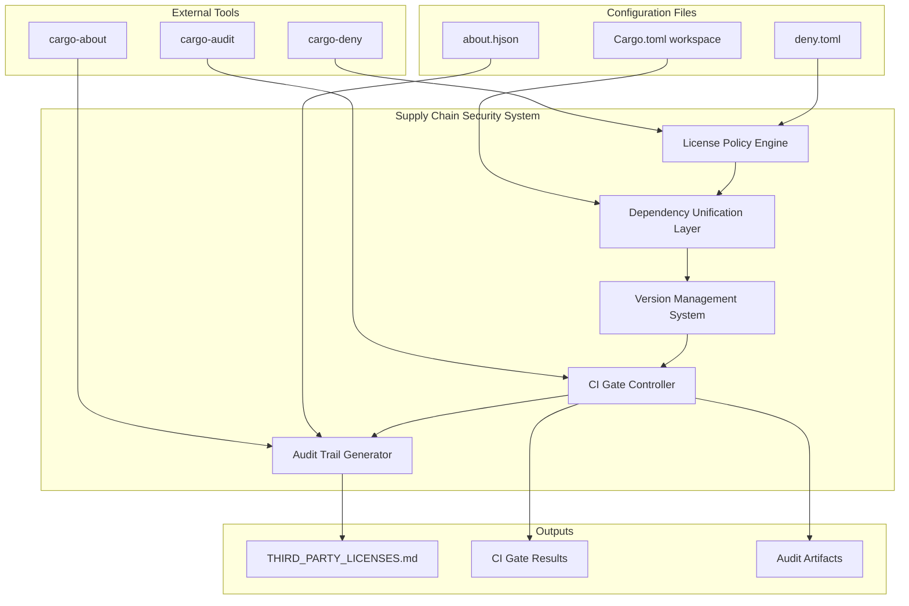

# Design Document

## Overview

This design addresses the critical P0 supply chain security issues identified in the CI gates. The solution involves a systematic approach to fix licensing compliance, unify HTTP dependencies, update major dependency versions, and improve CI gate logic. The design ensures minimal disruption to existing functionality while establishing a robust, compliant dependency baseline.

The implementation follows a phased approach: first addressing blocking P0 issues, then implementing dependency unification, and finally enhancing monitoring and compliance tooling.

## Architecture

### Component Overview



### Dependency Management Strategy

The design implements a three-tier dependency management approach:

1. **Core Dependencies**: Essential runtime dependencies with strict version control
2. **Platform Dependencies**: OS-specific dependencies with controlled feature sets  
3. **Development Dependencies**: Build and test dependencies excluded from production counts

## Components and Interfaces

### 1. License Policy Engine

**Purpose**: Manages license compliance and policy enforcement

**Configuration**: `deny.toml`
```toml
[graph]
exclude-dev-dependencies = true
include-build-dependencies = false

[licenses]
allow = [
    "MIT", "Apache-2.0", "BSD-2-Clause", "BSD-3-Clause",
    "Unicode-3.0", "Unicode-DFS-2016", "MPL-2.0"
]
unused-allowed-licenses = "warn"

[[licenses.exceptions]]
name = "unicode-ident"
allow = ["MIT", "Apache-2.0", "Unicode-3.0"]

[sources]
unknown-registry = "deny"
unknown-git = "deny"
allow-registry = ["https://github.com/rust-lang/crates.io-index"]
```

**Interface**: 
- Input: JSON output from `cargo deny --format json`
- Output: Structured gate results with violation details
- Integration: Called by CI gate controller with deterministic parsing

### 2. Dependency Unification Layer

**Purpose**: Ensures consistent HTTP stack and eliminates version conflicts

**Key Responsibilities**:
- Enforce single hyper version (1.x only)
- Mandate rustls-tls for all HTTP clients
- Eliminate OpenSSL/native-tls dependencies
- Unify major version families (axum, tower, thiserror, syn)

**Configuration Strategy**:
```toml
# Workspace dependencies with unified versions
reqwest = { version = "0.12.8", default-features = false, features = ["rustls-tls", "http2", "json"] }
tonic = { version = "0.14", default-features = false, features = ["transport", "codegen", "prost"] }
prost = "0.14"
tonic-build = "0.14"

# Workspace patches to enforce unification
[patch.crates-io]
hyper = { version = "1.4", default-features = true }
http = { version = "1.1" }
reqwest = { version = "0.12.8", default-features = false, features = ["rustls-tls", "http2", "json"] }
```

**Validation Commands**:
```bash
# Negative proofs for HTTP unification
cargo tree -i native-tls | (! grep .)
cargo tree -i hyper-tls | (! grep .)
cargo tree -i openssl | (! grep .)
cargo tree -i hyper | awk '/hyper v/{print $2}' | sort -u | grep -qx 'v1.*'
```

### 3. Version Management System

**Purpose**: Coordinates major version updates across the workspace

**Update Targets**:
- **tonic/prost**: 0.10 → 0.14 (HTTP/2 stack unification)
- **nix**: 0.29 → 0.30 (typed file descriptor APIs)
- **windows**: 0.52 → 0.62 (updated bindings)
- **thiserror**: 1.x → 2.x (error handling improvements)

**Migration Strategy**:
- Incremental updates with compatibility testing
- Feature flag management for heavy dependencies
- API adaptation layers for breaking changes

### 4. CI Gate Controller

**Purpose**: Orchestrates supply chain security validation

**Enhanced Logic**:
```rust
use serde::Deserialize;

#[derive(Deserialize)]
struct DenyReport {
    diagnostics: Vec<Diagnostic>,
}

#[derive(Deserialize)]
struct Diagnostic {
    severity: String,
    message: String,
}

fn evaluate_gate_result(exit_code: i32, json_output: &str) -> GateResult {
    // Always check exit code first
    if exit_code != 0 {
        return GateResult::Failed;
    }
    
    // Parse JSON output for structured analysis
    let report: DenyReport = serde_json::from_str(json_output)
        .unwrap_or_default();
    
    let has_errors = report.diagnostics.iter()
        .any(|d| d.severity == "error");
    
    let has_warnings = report.diagnostics.iter()
        .any(|d| d.severity == "warn" && d.message.contains("license-not-encountered"));
    
    match (has_errors, has_warnings) {
        (true, _) => GateResult::Failed,
        (false, true) => GateResult::Warning,
        (false, false) => GateResult::Passed,
    }
}
```

**Dependency Counting Logic**:
```bash
# Count only runtime dependencies using metadata
cargo metadata --format-version 1 | jq -r '
  .packages[] | 
  select(.source == null or (.source | contains("registry"))) |
  .dependencies[] | 
  select(.kind == "normal") | 
  .name' | sort -u | wc -l
```

**Duplicate Major Detection**:
```bash
# Ensure single major per family
cargo tree -d | rg -E '(axum|tower|hyper|thiserror|syn)' && exit 1 || true
```

### 5. Audit Trail Generator

**Purpose**: Produces comprehensive license documentation

**Configuration**: `about.hjson`
```hjson
{
    name: "Flight Hub"
    license: "MIT OR Apache-2.0"
    ignore-dev-dependencies: true
    ignore-build-dependencies: true
    accepted: [
        "MIT", "Apache-2.0", "BSD-2-Clause", "BSD-3-Clause",
        "Unicode-3.0", "Unicode-DFS-2016", "MPL-2.0"
    ]
    unlicensed: "deny"
    template: "about.hbs"
}
```

**Deterministic Generation**:
```bash
# Ensure reproducible output
git diff --quiet Cargo.lock || { echo "Lockfile dirty"; exit 1; }

# Use pinned tool versions
cargo install cargo-about --locked --version 0.6.4

# Generate with deterministic inputs
cargo about generate -o THIRD_PARTY_LICENSES.md
```

## Data Models

### Gate Result Model
```rust
#[derive(Debug, Clone)]
pub struct GateResult {
    pub gate_id: String,
    pub status: GateStatus,
    pub message: String,
    pub violations: Vec<Violation>,
    pub artifacts: Vec<ArtifactPath>,
}

#[derive(Debug, Clone)]
pub enum GateStatus {
    Passed,
    Failed,
    Warning,
}

#[derive(Debug, Clone)]
pub struct Violation {
    pub violation_type: ViolationType,
    pub crate_name: String,
    pub details: String,
    pub remediation: String,
}
```

### Dependency Model
```rust
#[derive(Debug, Clone)]
pub struct DependencyInfo {
    pub name: String,
    pub version: String,
    pub license: Option<String>,
    pub dependency_type: DependencyType,
    pub source: DependencySource,
}

#[derive(Debug, Clone)]
pub enum DependencyType {
    Runtime,
    Development,
    Build,
}
```

## Error Handling

### License Compliance Errors
- **Unknown License**: Treat as warning, require manual review
- **Incompatible License**: Hard failure, block build
- **Missing License**: Warning for dev deps, failure for runtime deps

### Dependency Resolution Errors
- **Version Conflicts**: Provide specific unification guidance
- **Missing Dependencies**: Clear error messages with resolution steps
- **Circular Dependencies**: Detect and report with dependency path

### CI Gate Errors
- **Tool Execution Failures**: Retry logic with exponential backoff
- **Parse Failures**: Fallback to exit code evaluation
- **Artifact Generation Failures**: Continue with warnings, preserve partial results

## Testing Strategy

### Unit Testing
- License policy engine validation
- Dependency counting algorithms
- Gate result evaluation logic
- Configuration parsing and validation

### Integration Testing
- End-to-end CI gate execution
- Dependency resolution with real workspace
- License document generation
- Cross-platform compatibility (Windows/Linux)

### Validation Testing
- Verify HTTP stack unification
- Confirm license compliance
- Test dependency count accuracy
- Validate audit trail completeness

### Performance Testing
- Gate execution time benchmarks (target: p95 < 45s)
- Memory usage during large dependency analysis
- Parallel gate execution efficiency

### Determinism Testing
- Verify reproducible THIRD_PARTY_LICENSES.md generation
- Confirm stable dependency counting across runs
- Validate consistent tool output with same inputs

## Implementation Phases

### Phase 1: P0 Fixes (Immediate)
1. Update `deny.toml` with Unicode/MPL licenses
2. Add unicode-ident exception
3. Fix CI gate logic for accurate pass/fail reporting
4. Ensure examples crate has proper license

### Phase 2: HTTP Stack Unification
1. Audit current HTTP dependencies
2. Add workspace patches to enforce unification
3. Update reqwest to 0.12.8 with rustls-tls
4. Migrate tonic/prost/tonic-build to 0.14.x (same minor)
5. Remove all native-tls/hyper-tls dependencies
6. Validate single hyper version with negative proofs
7. Add RUSTFLAGS="-Dwarnings" for public API crates

### Phase 3: System Dependencies Update
1. Update nix to 0.30 with typed FD migration
2. Update windows to 0.62 with binding refresh
3. Migrate thiserror to 2.x
4. Update criterion to 0.7 (dev-only)

### Phase 4: Enhanced Monitoring
1. Implement cargo-about integration with deterministic generation
2. Generate comprehensive license documentation with Unicode/MPL texts
3. Add dependency count monitoring (runtime deps only)
4. Create audit artifact retention with JSON outputs
5. Implement metrics collection with defined SLOs

## Security Considerations

### Supply Chain Security
- Restrict registry sources to crates.io only
- Implement SPDX identifier validation
- Maintain audit trail for all changes
- Regular security advisory monitoring

### License Compliance
- Automated license compatibility checking
- Legal review integration points
- Attribution requirement tracking
- License change detection

### Dependency Management
- Version pinning for security-critical dependencies
- Automated vulnerability scanning
- Dependency update approval workflow
- Transitive dependency monitoring

## Monitoring and Observability

### Metrics Collection

| Metric | Type | Target SLO |
|--------|------|------------|
| `scm.gate.duration_ms{gate=licenses}` | histogram | p95 < 45s |
| `scm.gate.status{gate=*}` | gauge (0/1) | 1 (pass) |
| `scm.deps.direct_nondev_total` | gauge | ≤ 150 |
| `scm.licenses.unified_http_ok` | gauge | 1 |
| `scm.licenses.third_party_completeness` | gauge | 1 |
| `scm.audit.osv_open_findings` | gauge | 0 |

### Alerting
- Failed gate notifications with remediation guidance
- New security advisories with impact assessment
- License compliance violations with legal review triggers
- Dependency count threshold breaches with unification recommendations

### Reporting
- Weekly supply chain health reports with trend analysis
- Quarterly dependency audit summaries with risk assessment
- License compliance dashboards with attribution tracking
- Security posture assessments with vulnerability metrics

### Artifact Retention
- Raw JSON outputs from all tools (cargo-deny, cargo-about, cargo-audit)
- Tool versions and execution environment details
- Generated license documentation with timestamps
- Dependency graphs and resolution metadata