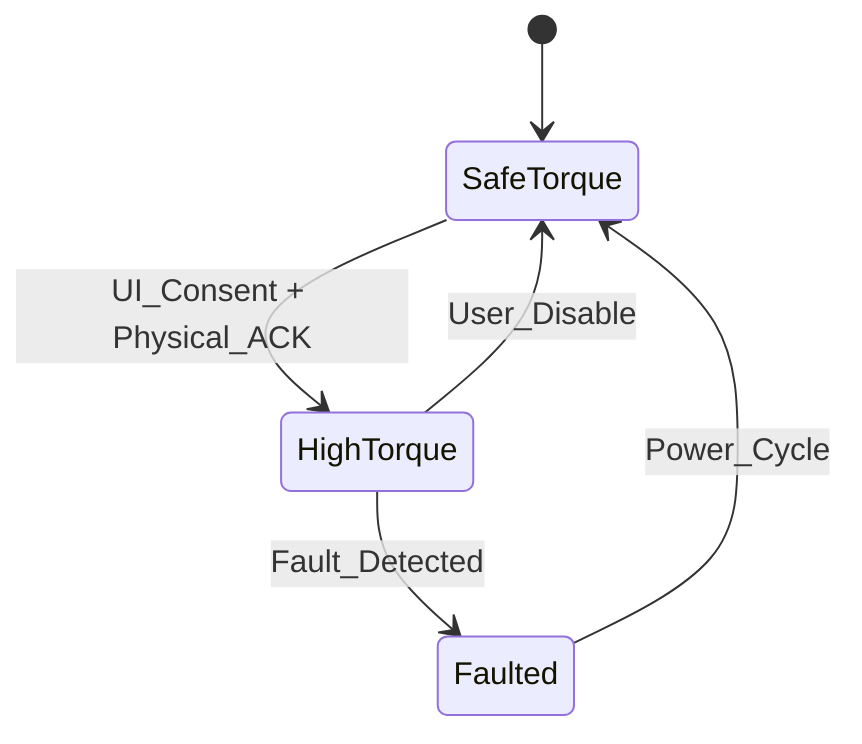

# flight-ffb

Force feedback engine for Flight Hub with safety-first design and multi-mode support.

## Overview

The flight-ffb crate provides safe and controlled force feedback operation for Flight Hub. It implements a comprehensive safety state machine, physical interlocks, and multiple FFB modes while maintaining real-time performance. The engine prioritizes safety above all else, with multiple layers of protection against unsafe torque conditions.

## Key Features

- **Safety State Machine**: SafeTorque/HighTorque/Faulted states with physical interlocks
- **Multi-Mode Support**: DirectInput pass-through, raw torque (OFP-1), and telemetry synthesis
- **Physical Interlocks**: Button combination challenges with rolling token validation
- **Fault Detection**: Comprehensive fault matrix with immediate torque cutoff
- **Trim Correctness**: Rate/jerk limited setpoint changes with no torque steps
- **Real-Time Operation**: 500-1000Hz operation for raw torque mode

## Architecture

This crate implements key safety and architectural decisions:

- **[ADR-001: Real-Time Spine Architecture](../../docs/adr/001-rt-spine-architecture.md)** - Protected RT core for FFB processing
- **[ADR-004: Zero-Allocation Constraint](../../docs/adr/004-zero-allocation-constraint.md)** - No allocations in RT FFB path
- **[ADR-008: Force Feedback Mode Selection](../../docs/adr/008-ffb-mode-selection.md)** - Capability-based FFB mode negotiation
- **[ADR-009: Safety Interlock Design](../../docs/adr/009-safety-interlock-design.md)** - Multi-layered safety interlock system

## Safety State Machine



## Core Components

### FFB Engine

```rust
use flight_ffb::{FfbEngine, FfbConfig, SafetyState};

// Create FFB engine with safety configuration
let config = FfbConfig {
    max_torque_nm: 15.0,
    fault_timeout_ms: 50,
    interlock_required: true,
    mode: FfbMode::Auto,
};

let mut engine = FfbEngine::new(config)?;

// Check safety state
match engine.safety_state() {
    SafetyState::SafeTorque => println!("Safe operation"),
    SafetyState::HighTorque => println!("High torque enabled"),
    SafetyState::Faulted => println!("Fault detected - torque disabled"),
}
```

### Physical Interlock System

```rust
use flight_ffb::{InterlockChallenge, InterlockResponse};

// Generate challenge for device
let challenge = engine.generate_interlock_challenge()?;

// Device must respond with correct pattern
let response = device.execute_challenge(challenge)?;

// Validate response before enabling high torque
if engine.validate_interlock_response(response)? {
    engine.enable_high_torque()?;
}
```

## FFB Modes

### 1. DirectInput Pass-Through

For simulators with rich FFB support:

```rust
use flight_ffb::{FfbMode, DirectInputEffect};

engine.set_mode(FfbMode::DirectInput)?;

// Forward PID effects to device
let effect = DirectInputEffect::Spring { 
    center: 0.0, 
    strength: 0.8 
};
engine.apply_effect(effect)?;
```

### 2. Raw Torque (OFP-1)

For precise host-computed torque:

```rust
use flight_ffb::{FfbMode, TorqueCommand};

engine.set_mode(FfbMode::RawTorque)?;

// Real-time torque loop (500-1000Hz)
loop {
    let torque = compute_torque_from_telemetry();
    
    let command = TorqueCommand {
        torque_nm: torque,
        timestamp: get_monotonic_time(),
    };
    
    engine.apply_torque(command)?;
}
```

### 3. Telemetry Synthesis

Generate effects from normalized telemetry:

```rust
use flight_ffb::{FfbMode, TelemetryEffects, StallBuffet};

engine.set_mode(FfbMode::TelemetrySynth)?;

let effects = TelemetryEffects {
    stall_buffet: StallBuffet {
        intensity: calculate_stall_intensity(aoa),
        frequency: 15.0, // Hz
    },
    ground_roll: calculate_ground_effects(speed, surface),
    touchdown: calculate_touchdown_impulse(vertical_speed),
};

engine.apply_telemetry_effects(effects)?;
```

## Safety Systems

### Fault Detection Matrix

```rust
use flight_ffb::{FaultType, FaultAction};

// Comprehensive fault detection
let fault_matrix = vec![
    (FaultType::UsbStall, FaultAction::TorqueZero50ms),
    (FaultType::EndpointWedged, FaultAction::DeviceReset),
    (FaultType::NanValue, FaultAction::TorqueZero50ms),
    (FaultType::OverTemp, FaultAction::TorqueZero50ms),
    (FaultType::OverCurrent, FaultAction::TorqueZero50ms),
];

engine.configure_fault_matrix(fault_matrix)?;
```

### Soft-Stop Implementation

```rust
use flight_ffb::{SoftStop, RampProfile};

// Configure torque ramp for safe shutdown
let soft_stop = SoftStop {
    ramp_time_ms: 50,
    profile: RampProfile::Linear,
    audio_cue: true,
    led_indication: true,
};

engine.configure_soft_stop(soft_stop)?;

// Trigger on USB disconnect or fault
engine.trigger_soft_stop()?;
```

## Trim Correctness

### Non-FFB Devices

For spring-centered devices without FFB:

```rust
use flight_ffb::{TrimMode, SpringConfig};

// Freeze spring during trim hold
engine.set_trim_mode(TrimMode::FreezeSpring)?;

// Apply new center position
engine.set_trim_center(new_center)?;

// Re-enable spring with ramp
engine.ramp_spring_enable(150)?; // 150ms ramp
```

### FFB Devices

For true force feedback devices:

```rust
use flight_ffb::{TrimLimits, SetpointChange};

// Configure rate and jerk limits
let limits = TrimLimits {
    max_rate_nm_per_s: 5.0,
    max_jerk_nm_per_s2: 20.0,
};

engine.configure_trim_limits(limits)?;

// Apply setpoint change with limits
let change = SetpointChange {
    target_nm: new_setpoint,
    limits: limits,
};

engine.apply_setpoint_change(change)?;
```

## Device Capability Negotiation

```rust
use flight_ffb::{DeviceCapabilities, FfbModeSelection};

// Query device capabilities
let caps = engine.query_device_capabilities()?;

let mode = match caps {
    DeviceCapabilities { supports_raw_torque: true, .. } => {
        FfbMode::RawTorque
    },
    DeviceCapabilities { supports_pid: true, .. } => {
        FfbMode::DirectInput
    },
    _ => FfbMode::TelemetrySynth,
};

engine.set_mode(mode)?;
```

## Performance Guarantees

- **Torque Response**: ≤ 2ms latency for raw torque mode
- **Fault Response**: Torque → 0 within 50ms (enforced by CI)
- **Jitter**: ≤ 0.1ms p99 for 1000Hz operation
- **Safety**: No torque steps during setpoint changes

## Quality Gates

This crate enforces strict safety and performance gates:

- **Soft-stop timing**: USB yank → torque zero ≤ 50ms
- **Interlock validation**: Physical challenge/response testing
- **Fault injection**: Synthetic fault testing with recovery validation
- **Trim correctness**: Rate/jerk limit enforcement

## Testing

```bash
# Run safety tests
cargo test --package flight-ffb

# Run hardware-in-loop tests (requires physical device)
cargo test --package flight-ffb test_hil -- --ignored

# Test fault injection
cargo test --package flight-ffb test_fault_injection

# Validate soft-stop timing
cargo test --package flight-ffb test_soft_stop_timing
```

## Hardware Integration

### OFP-1 Protocol Support

```rust
use flight_ffb::{Ofp1Device, Ofp1Capabilities};

// Negotiate OFP-1 capabilities
let device = Ofp1Device::new(device_path)?;
let caps = device.negotiate_capabilities()?;

if caps.supports_health_stream {
    let health_stream = device.subscribe_health()?;
    // Monitor device health in real-time
}
```

### Health Monitoring

```rust
use flight_ffb::{DeviceHealth, HealthEvent};

// Subscribe to device health events
let mut health_stream = engine.subscribe_health()?;

while let Some(event) = health_stream.next().await {
    match event? {
        HealthEvent::Temperature { celsius } if celsius > 60.0 => {
            engine.trigger_thermal_protection()?;
        },
        HealthEvent::Current { amperes } if amperes > 5.0 => {
            engine.trigger_overcurrent_protection()?;
        },
        _ => {}
    }
}
```

## Safety Considerations

- **Physical Interlocks**: Always required for high-torque operation
- **Fault Tolerance**: Multiple independent fault detection systems
- **Graceful Degradation**: Safe fallback modes for all failure conditions
- **User Consent**: Explicit UI consent required for high-torque mode
- **Power Cycle Reset**: High-torque consent resets on device power cycle

## Requirements

This crate satisfies the following requirements:

- **FFB-01**: Force feedback safety and control with comprehensive interlocks
- **SAFE-01**: Safety systems with fault detection and response
- **NFR-01**: Real-time performance constraints for FFB operation

## License

Licensed under either of Apache License, Version 2.0 or MIT license at your option.