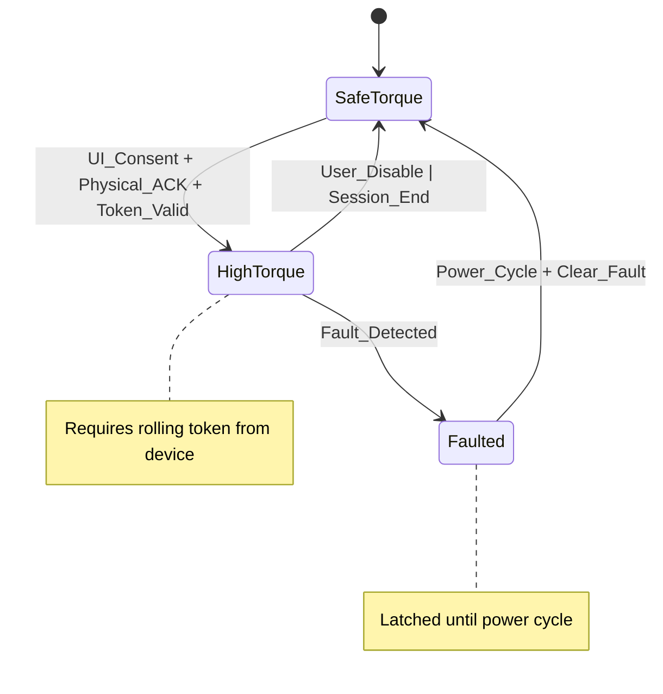

# ADR-009: Safety Interlock Design

## Status
Accepted

## Context

Force feedback devices can generate significant torque that poses safety risks if not properly controlled. The system needs robust safety interlocks to prevent injury while maintaining usability. Traditional software-only approaches are insufficient for high-torque scenarios, requiring physical confirmation of user intent.

## Decision

We implement a multi-layered safety interlock system with physical confirmation:

### 1. Safety State Machine



### 2. Physical Interlock Protocol

**Challenge-Response System:**
1. User initiates high-torque mode in UI
2. System sends challenge pattern to device (LED blink sequence)
3. User performs physical button combination (hold 2+ buttons for 2+ seconds)
4. Device returns rolling token based on challenge
5. System validates token and enables high-torque mode

```rust
pub struct InterlockChallenge {
    pub sequence_id: u32,
    pub challenge_pattern: [u8; 16],  // LED blink pattern
    pub timestamp: u64,
    pub device_id: DeviceId,
}

pub struct InterlockResponse {
    pub sequence_id: u32,
    pub token: [u8; 32],              // HMAC of challenge + device secret
    pub button_state: u16,            // Physical button confirmation
    pub hold_duration_ms: u32,        // Must be ≥2000ms
}
```

### 3. Torque Limiting Hierarchy

```rust
pub struct TorqueLimits {
    // Hardware limits (device-specific)
    pub hardware_max_nm: f32,
    
    // Safety limits (configurable)
    pub safe_torque_nm: f32,      // Default: 2.0 Nm
    pub high_torque_nm: f32,      // Requires interlock: 8.0 Nm
    
    // Dynamic limits (runtime)
    pub current_limit_nm: f32,    // Active limit based on state
    pub thermal_limit_nm: f32,    // Reduced if overheating
}

impl TorqueLimits {
    pub fn effective_limit(&self, state: SafetyState) -> f32 {
        match state {
            SafetyState::SafeTorque => self.safe_torque_nm,
            SafetyState::HighTorque => self.high_torque_nm.min(self.thermal_limit_nm),
            SafetyState::Faulted => 0.0,
        }
    }
}
```

### 4. Fault Detection Matrix

| Fault Type | Detection Method | Response Time | Action |
|------------|------------------|---------------|---------|
| USB Stall | Frame timeout ≥3 | <50ms | Torque→0, Audio |
| Endpoint Error | HID error code | <10ms | Torque→0, Latch |
| NaN/Invalid | Value validation | <1ms | Torque→0, Log |
| Over-Temperature | Device health | <100ms | Reduce limit |
| Over-Current | Device health | <50ms | Torque→0, Latch |
| Plugin Overrun | Watchdog | <100μs | Quarantine |

### 5. Emergency Response

```rust
impl SafetySystem {
    pub fn emergency_stop(&mut self, fault: FaultType) {
        // Immediate torque cutoff
        self.set_torque_immediate(0.0);
        
        // Latch fault state
        self.state = SafetyState::Faulted;
        self.fault_reason = Some(fault);
        
        // Audible/visual warning
        self.trigger_warning_cues();
        
        // Capture pre-fault data
        self.blackbox.capture_pre_fault_window();
        
        // Log with stable error code
        self.log_fault_event(fault);
    }
}
```

## Consequences

### Positive
- Physical confirmation prevents accidental high-torque activation
- Multi-layered approach provides defense in depth
- Clear fault taxonomy enables systematic response
- Rolling tokens prevent replay attacks

### Negative
- Complex user interaction for high-torque mode
- Additional hardware requirements for full safety
- Potential user frustration with safety procedures
- Increased testing complexity

## Alternatives Considered

1. **Software-Only Interlocks**: Rejected due to insufficient safety for high torque
2. **Hardware Kill Switch**: Rejected due to device compatibility issues
3. **Biometric Confirmation**: Rejected due to complexity and reliability
4. **Time-Based Tokens**: Rejected due to clock synchronization issues

## Implementation Details

### Token Generation

```rust
impl TokenGenerator {
    pub fn generate_token(&self, challenge: &InterlockChallenge, device_secret: &[u8]) -> [u8; 32] {
        let mut hmac = Hmac::<Sha256>::new_from_slice(device_secret).unwrap();
        hmac.update(&challenge.sequence_id.to_le_bytes());
        hmac.update(&challenge.challenge_pattern);
        hmac.update(&challenge.timestamp.to_le_bytes());
        hmac.finalize().into_bytes().into()
    }
    
    pub fn validate_token(&self, response: &InterlockResponse, challenge: &InterlockChallenge) -> bool {
        let expected = self.generate_token(challenge, &self.device_secret);
        
        // Constant-time comparison
        expected == response.token &&
        response.sequence_id == challenge.sequence_id &&
        response.hold_duration_ms >= 2000 &&
        self.validate_button_combination(response.button_state)
    }
}
```

### Fault Response Timing

```rust
impl FaultDetector {
    pub fn check_faults(&mut self) -> Option<FaultType> {
        // USB health check (every frame)
        if self.usb_stall_count >= 3 {
            return Some(FaultType::UsbStall);
        }
        
        // Value validation (every sample)
        if !self.current_torque.is_finite() {
            return Some(FaultType::InvalidValue);
        }
        
        // Device health (10Hz)
        if let Some(health) = self.device_health.latest() {
            if health.temperature_c > 85.0 {
                return Some(FaultType::OverTemperature);
            }
            if health.current_a > self.max_current {
                return Some(FaultType::OverCurrent);
            }
        }
        
        None
    }
}
```

### Rate and Jerk Limiting

```rust
impl TorqueController {
    pub fn apply_torque(&mut self, target_nm: f32) -> f32 {
        let dt = self.last_update.elapsed().as_secs_f32();
        
        // Rate limiting (Nm/s)
        let max_delta = self.max_rate_nm_per_s * dt;
        let rate_limited = (target_nm - self.current_torque)
            .clamp(-max_delta, max_delta) + self.current_torque;
        
        // Jerk limiting (Nm/s²)
        let target_rate = (rate_limited - self.current_torque) / dt;
        let max_jerk_delta = self.max_jerk_nm_per_s2 * dt;
        let jerk_limited_rate = (target_rate - self.current_rate)
            .clamp(-max_jerk_delta, max_jerk_delta) + self.current_rate;
        
        let final_torque = self.current_torque + jerk_limited_rate * dt;
        
        // Safety clamp
        let safety_limit = self.limits.effective_limit(self.safety_state);
        let clamped_torque = final_torque.clamp(-safety_limit, safety_limit);
        
        self.current_torque = clamped_torque;
        self.current_rate = jerk_limited_rate;
        
        clamped_torque
    }
}
```

## User Experience

### High-Torque Activation Flow
1. User clicks "Enable High Torque" in UI
2. System displays safety warning and instructions
3. Device begins challenge pattern (LED blink)
4. User holds specified button combination for 2+ seconds
5. System validates response and enables high-torque mode
6. Clear visual/audio confirmation provided

### Fault Handling UX
- Immediate audio cue on fault detection
- Clear fault description with resolution steps
- Visual indication of safety state
- One-click fault acknowledgment (after resolution)

## Testing Strategy

### Unit Tests
- Token generation and validation
- Fault detection logic
- Rate/jerk limiting mathematics
- State machine transitions

### Integration Tests
- End-to-end interlock flow
- Fault injection scenarios
- Multi-device safety isolation
- Recovery procedures

### Hardware Tests
- Physical button combination validation
- Actual torque measurement and limiting
- USB fault simulation
- Thermal protection validation

### Safety Validation
- Independent safety system review
- Failure mode analysis
- User acceptance testing
- Regulatory compliance verification

## Compliance and Standards

- Follow IEC 61508 functional safety principles
- Implement defense-in-depth architecture
- Document all safety-critical code paths
- Maintain traceability to safety requirements

## References

- Flight Hub Requirements: FFB-01, SAFE-01
- [IEC 61508 Functional Safety](https://example.com)
- [Hardware Security Modules](https://example.com)
- [Safety-Critical Systems Design](https://example.com)