# OpenFlight Workspace Modularization Plan

## Executive Summary

This document outlines a comprehensive modularization strategy for the OpenFlight project to reduce code duplication, improve maintainability, and establish clear architectural boundaries while respecting the RT Spine Architecture (ADR-001) and Plugin Classification System (ADR-003).

**Current State:**
- 23+ crates with significant code duplication
- 85% project completion - requires non-disruptive migration
- flight-core is a central hub (16 of 23 crates depend on it)

**Goal:**
- Reduce duplication across 9 identified patterns
- Establish clear crate responsibilities
- Maintain RT/non-RT boundaries
- Enable gradual migration without breaking changes

---

## 1. Proposed New Crates

### 1.1 `flight-adapter-common`

**Purpose:** Centralize common adapter patterns, error handling, and configuration for simulator adapters.

**Contents:**
```rust
// Common adapter error types
pub enum AdapterError {
    NotConnected,
    ConnectionTimeout,
    Configuration(String),
    AircraftNotDetected,
    ReconnectExhausted,
    // ... adapter-specific variants via From impls
}

// Common adapter configuration trait
pub trait AdapterConfig {
    fn connection_timeout(&self) -> Duration;
    fn max_reconnect_attempts(&self) -> u32;
    fn publish_rate(&self) -> f32;
    fn enable_auto_reconnect(&self) -> bool;
}

// Common adapter state machine
pub enum AdapterState {
    Disconnected,
    Connecting,
    Connected,
    DetectingAircraft,
    Active,
    Error,
}

// Reconnection strategy with exponential backoff
pub struct ReconnectionStrategy {
    max_attempts: u32,
    initial_backoff: Duration,
    max_backoff: Duration,
}

impl ReconnectionStrategy {
    pub fn next_backoff(&mut self, attempt: u32) -> Duration;
    pub fn should_retry(&self, attempt: u32) -> bool;
}

// Common adapter metrics
pub struct AdapterMetrics {
    pub total_updates: u64,
    pub last_update_time: Option<Instant>,
    pub update_intervals: Vec<Duration>,
    pub actual_update_rate: f32,
    pub update_jitter_p99_ms: f32,
}
```

**Rationale:**
- Eliminates duplicate error enums in MSFS, X-Plane, DCS adapters
- Provides reusable reconnection logic (currently duplicated 3 times)
- Establishes common adapter state machine pattern
- Centralizes metrics collection patterns

**RT Classification:** Non-RT (adapter coordination layer)

---

### 1.2 `flight-device-common`

**Purpose:** Provide common interfaces and patterns for device management across HID, panels, and StreamDeck.

**Contents:**
```rust
// Common device identification
pub struct DeviceId {
    pub vendor_id: u16,
    pub product_id: u16,
    pub serial_number: Option<String>,
    pub device_path: String,
}

// Common device health status
pub enum DeviceHealth {
    Healthy,
    Degraded { reason: String },
    Quarantined { since: Instant },
    Failed { error: String },
}

// Common device manager trait
pub trait DeviceManager {
    type Device;
    type Error;

    fn enumerate_devices(&mut self) -> Result<Vec<Self::Device>, Self::Error>;
    fn register_device(&mut self, device: Self::Device) -> Result<(), Self::Error>;
    fn unregister_device(&mut self, id: &DeviceId) -> Result<(), Self::Error>;
    fn get_device_health(&self, id: &DeviceId) -> Option<DeviceHealth>;
}

// Common device metrics
pub struct DeviceMetrics {
    pub operations_total: u64,
    pub operations_failed: u64,
    pub bytes_transferred: u64,
    pub last_operation_time: Option<Instant>,
}
```

**Rationale:**
- Unifies device management patterns across flight-hid, flight-panels, flight-streamdeck
- Provides common health monitoring interface
- Enables consistent metrics collection
- Supports future device types

**RT Classification:** Non-RT (device coordination)

---

### 1.3 `flight-test-helpers`

**Purpose:** Centralize test utilities, fixtures, and common test patterns.

**Contents:**
```rust
// Common test fixtures
pub mod fixtures {
    pub struct TestSnapshotBuilder;
    pub struct TestDeviceBuilder;
    pub struct TestConfigBuilder;
}

// Common test assertions
pub mod assertions {
    pub fn assert_adapter_state_transition(initial: AdapterState, final: AdapterState);
    pub fn assert_snapshot_valid(snapshot: &BusSnapshot);
    pub fn assert_device_connected(device: &DeviceId);
}

// Common test utilities
pub mod utils {
    pub fn setup_test_logger();
    pub fn create_temp_dir() -> PathBuf;
    pub fn wait_for_condition<F>(condition: F, timeout: Duration) -> bool
    where F: Fn() -> bool;
}

// Integration test helpers
pub mod integration {
    pub struct TestSimulator;
    pub struct TestBus;
    pub struct TestDevice;
}
```

**Rationale:**
- Eliminates duplicate test patterns across 4+ modules
- Provides consistent test infrastructure
- Reduces boilerplate in integration tests
- Improves test maintainability

**RT Classification:** Test-only (no runtime impact)

---

### 1.4 `flight-metrics`

**Purpose:** Centralized metrics collection and reporting infrastructure.

**Contents:**
```rust
// Metrics registry
pub struct MetricsRegistry {
    counters: HashMap<String, AtomicU64>,
    gauges: HashMap<String, AtomicF64>,
    histograms: HashMap<String, Histogram>,
}

// Metric types
pub enum Metric {
    Counter { name: String, value: u64 },
    Gauge { name: String, value: f64 },
    Histogram { name: String, value: f64 },
}

// Metrics collector trait
pub trait MetricsCollector {
    fn collect(&self) -> Vec<Metric>;
    fn reset(&mut self);
}

// Common metrics
pub mod common {
    pub const ADAPTER_UPDATES_TOTAL: &str = "adapter_updates_total";
    pub const ADAPTER_ERRORS_TOTAL: &str = "adapter_errors_total";
    pub const DEVICE_OPERATIONS_TOTAL: &str = "device_operations_total";
    pub const DEVICE_ERRORS_TOTAL: &str = "device_errors_total";
}
```

**Rationale:**
- Unifies metrics collection across adapters and devices
- Eliminates duplicate metrics tracking in 3+ modules
- Provides consistent metrics export interface
- Enables centralized observability

**RT Classification:** Non-RT (metrics aggregation)

---

## 2. Crate Responsibility Matrix

### 2.1 Foundation Layer

| Crate | Current Responsibilities | Post-Modularization Responsibilities |
|--------|----------------------|-----------------------------------|
| **flight-core** | Profiles, rules, security, diagnostics, aircraft detection, units, watchdog, writers | Profiles, rules, security, diagnostics, aircraft detection, units, watchdog, writers (unchanged - central hub) |
| **flight-ipc** | gRPC client/server, transport, negotiation | gRPC client/server, transport, negotiation (unchanged) |
| **flight-bus** | Telemetry model, publisher, adapters (converters only), types | Telemetry model, publisher, adapter converters, types (unchanged) |
| **flight-scheduler** | Task scheduling | Task scheduling (unchanged) |
| **flight-tracing** | Logging infrastructure | Logging infrastructure (unchanged) |

### 2.2 Real-Time Layer

| Crate | Current Responsibilities | Post-Modularization Responsibilities |
|--------|----------------------|-----------------------------------|
| **flight-axis** | Axis processing (250Hz RT loop) | Axis processing (unchanged - RT core) |
| **flight-ffb** | Force feedback processing | Force feedback processing (unchanged - RT core) |
| **flight-tactile** | Tactile feedback processing | Tactile feedback processing (unchanged - RT core) |

### 2.3 Device Layer

| Crate | Current Responsibilities | Post-Modularization Responsibilities |
|--------|----------------------|-----------------------------------|
| **flight-hid** | HID device management, OFP-1 protocol, watchdog integration | HID device management, OFP-1 protocol, watchdog integration (use flight-device-common for DeviceManager) |
| **flight-panels** | Panel management, LED control, rules evaluation, Saitek/Cougar writers | Panel management, LED control, rules evaluation, Saitek/Cougar writers (use flight-device-common for DeviceManager) |
| **flight-streamdeck** | StreamDeck integration, web API, profiles | StreamDeck integration, web API, profiles (use flight-device-common for DeviceManager) |
| **flight-virtual** | Virtual devices for testing | Virtual devices for testing (use flight-device-common for DeviceManager) |

### 2.4 Simulator Layer

| Crate | Current Responsibilities | Post-Modularization Responsibilities |
|--------|----------------------|-----------------------------------|
| **flight-simconnect** | MSFS adapter, session management, aircraft detection, event handling | MSFS adapter (use flight-adapter-common for errors, config, reconnection) |
| **flight-xplane** | X-Plane adapter, UDP, plugin interface, aircraft detection | X-Plane adapter (use flight-adapter-common for errors, config, reconnection) |
| **flight-dcs-export** | DCS adapter, socket bridge, MP detection, telemetry parsing | DCS adapter (use flight-adapter-common for errors, config, reconnection) |

### 2.5 Application Layer

| Crate | Current Responsibilities | Post-Modularization Responsibilities |
|--------|----------------------|-----------------------------------|
| **flight-service** | Main service, aggregates 8 crates | Main service, aggregates 8 crates (unchanged) |
| **flight-cli** | Command-line interface | Command-line interface (unchanged) |
| **flight-ui** | User interface | User interface (unchanged) |
| **flight-updater** | Simulator update management | Simulator update management (unchanged) |

### 2.6 Utilities

| Crate | Current Responsibilities | Post-Modularization Responsibilities |
|--------|----------------------|-----------------------------------|
| **flight-writers** | Writer management, verification, rollback | Writer management, verification, rollback (unchanged) |
| **flight-replay** | Telemetry replay | Telemetry replay (unchanged) |

---

## 3. Dependency Graph Changes

### 3.1 Current Dependency Graph

```mermaid
graph TD
    flight_core[flight-core]
    flight_bus[flight-bus]
    flight_ipc[flight-ipc]
    flight_scheduler[flight-scheduler]
    flight_tracing[flight-tracing]
    
    flight_axis[flight-axis]
    flight_ffb[flight-ffb]
    flight_tactile[flight-tactile]
    
    flight_hid[flight-hid]
    flight_panels[flight-panels]
    flight_streamdeck[flight-streamdeck]
    flight_virtual[flight-virtual]
    
    flight_simconnect[flight-simconnect]
    flight_xplane[flight-xplane]
    flight_dcs_export[flight-dcs-export]
    
    flight_service[flight-service]
    flight_cli[flight-cli]
    flight_ui[flight-ui]
    flight_updater[flight-updater]
    
    flight_writers[flight-writers]
    flight_replay[flight-replay]
    
    %% Dependencies
    flight_axis --> flight_core
    flight_axis --> flight_bus
    flight_ffb --> flight_core
    flight_ffb --> flight_bus
    flight_tactile --> flight_core
    flight_tactile --> flight_bus
    
    flight_hid --> flight_core
    flight_panels --> flight_core
    flight_panels --> flight_hid
    flight_streamdeck --> flight_core
    flight_virtual --> flight_core
    
    flight_simconnect --> flight_core
    flight_simconnect --> flight_bus
    flight_xplane --> flight_core
    flight_xplane --> flight_bus
    flight_dcs_export --> flight_core
    flight_dcs_export --> flight_bus
    
    flight_service --> flight_core
    flight_service --> flight_bus
    flight_service --> flight_ipc
    flight_service --> flight_hid
    flight_service --> flight_panels
    flight_service --> flight_streamdeck
    flight_service --> flight_simconnect
    flight_service --> flight_xplane
    flight_service --> flight_dcs_export
    flight_service --> flight_axis
    flight_service --> flight_ffb
    flight_service --> flight_tactile
    
    flight_writers --> flight_core
    flight_replay --> flight_core
    flight_replay --> flight_bus
```



### 3.2 Post-Modularization Dependency Graph

```mermaid
graph TD
    %% Foundation Layer
    flight_core[flight-core]
    flight_bus[flight-bus]
    flight_ipc[flight-ipc]
    flight_scheduler[flight-scheduler]
    flight_tracing[flight-tracing]
    
    %% New Common Crates
    flight_adapter_common[flight-adapter-common]
    flight_device_common[flight-device-common]
    flight_test_helpers[flight-test-helpers]
    flight_metrics[flight-metrics]
    
    %% Real-Time Layer
    flight_axis[flight-axis]
    flight_ffb[flight-ffb]
    flight_tactile[flight-tactile]
    
    %% Device Layer
    flight_hid[flight-hid]
    flight_panels[flight-panels]
    flight_streamdeck[flight-streamdeck]
    flight_virtual[flight-virtual]
    
    %% Simulator Layer
    flight_simconnect[flight-simconnect]
    flight_xplane[flight-xplane]
    flight_dcs_export[flight-dcs-export]
    
    %% Application Layer
    flight_service[flight-service]
    flight_cli[flight-cli]
    flight_ui[flight-ui]
    flight_updater[flight-updater]
    
    %% Utilities
    flight_writers[flight-writers]
    flight_replay[flight-replay]
    
    %% Dependencies
    flight_adapter_common --> flight_core
    flight_adapter_common --> flight_bus
    
    flight_device_common --> flight_core
    flight_device_common --> flight_metrics
    
    flight_metrics --> flight_core
    
    flight_test_helpers --> flight_core
    flight_test_helpers --> flight_bus
    
    %% RT Layer dependencies
    flight_axis --> flight_core
    flight_axis --> flight_bus
    flight_ffb --> flight_core
    flight_ffb --> flight_bus
    flight_tactile --> flight_core
    flight_tactile --> flight_bus
    
    %% Device Layer dependencies
    flight_hid --> flight_core
    flight_hid --> flight_device_common
    flight_hid --> flight_metrics
    
    flight_panels --> flight_core
    flight_panels --> flight_hid
    flight_panels --> flight_device_common
    flight_panels --> flight_metrics
    
    flight_streamdeck --> flight_core
    flight_streamdeck --> flight_device_common
    flight_streamdeck --> flight_metrics
    
    flight_virtual --> flight_core
    flight_virtual --> flight_device_common
    
    %% Simulator Layer dependencies
    flight_simconnect --> flight_core
    flight_simconnect --> flight_bus
    flight_simconnect --> flight_adapter_common
    flight_simconnect --> flight_metrics
    
    flight_xplane --> flight_core
    flight_xplane --> flight_bus
    flight_xplane --> flight_adapter_common
    flight_xplane --> flight_metrics
    
    flight_dcs_export --> flight_core
    flight_dcs_export --> flight_bus
    flight_dcs_export --> flight_adapter_common
    flight_dcs_export --> flight_metrics
    
    %% Application Layer dependencies
    flight_service --> flight_core
    flight_service --> flight_bus
    flight_service --> flight_ipc
    flight_service --> flight_hid
    flight_service --> flight_panels
    flight_service --> flight_streamdeck
    flight_service --> flight_simconnect
    flight_service --> flight_xplane
    flight_service --> flight_dcs_export
    flight_service --> flight_axis
    flight_service --> flight_ffb
    flight_service --> flight_tactile
    flight_service --> flight_metrics
    
    %% Utilities dependencies
    flight_writers --> flight_core
    flight_replay --> flight_core
    flight_replay --> flight_bus
    
    %% Test dependencies (dashed lines)
    flight_test_helpers -.-> flight_adapter_common
    flight_test_helpers -.-> flight_device_common
```



### 3.3 Dependency Analysis

**New Dependencies Added:**
- `flight-adapter-common` → `flight-core`, `flight-bus`
- `flight-device-common` → `flight-core`, `flight-metrics`
- `flight-metrics` → `flight-core`
- `flight-test-helpers` → `flight-core`, `flight-bus`

**Dependencies Removed (via consolidation):**
- Adapter crates no longer need to define their own error types
- Device crates no longer need to define their own management patterns

**Circular Dependency Risks:**
- No circular dependencies introduced
- All new crates are in Foundation layer (no dependencies on higher layers)
- RT layer remains isolated from new common crates

---

## 4. Prioritized Implementation Roadmap

### 4.1 Priority Matrix

| Priority | Change | Impact | Complexity | Dependencies |
|----------|---------|--------|-------------|--------------|
| **HIGH** | Create `flight-adapter-common` | High (3 adapters benefit) | Medium | None |
| **HIGH** | Create `flight-metrics` | High (6+ crates benefit) | Low | None |
| **HIGH** | Migrate MSFS adapter to common | High (largest adapter) | Medium | flight-adapter-common |
| **MEDIUM** | Create `flight-device-common` | Medium (4 crates benefit) | Medium | flight-metrics |
| **MEDIUM** | Migrate X-Plane adapter to common | Medium | Low | flight-adapter-common |
| **MEDIUM** | Migrate DCS adapter to common | Medium | Low | flight-adapter-common |
| **MEDIUM** | Migrate HID to device common | Medium | Low | flight-device-common |
| **LOW** | Create `flight-test-helpers` | Low (test-only) | Low | None |
| **LOW** | Migrate panels to device common | Low | Low | flight-device-common |
| **LOW** | Migrate StreamDeck to device common | Low | Low | flight-device-common |

### 4.2 Implementation Phases

#### Phase 1: Foundation (Weeks 1-2)
**Goal:** Establish common infrastructure without disrupting existing code

1. Create `flight-metrics` crate
   - Implement MetricsRegistry
   - Define common metric names
   - Add tests
   - **Risk:** Low - new crate, no existing dependencies

2. Create `flight-adapter-common` crate
   - Define AdapterError enum
   - Implement AdapterConfig trait
   - Implement ReconnectionStrategy
   - Add AdapterMetrics
   - Add tests
   - **Risk:** Low - new crate, no existing dependencies

**Success Criteria:**
- All tests pass
- Documentation complete
- No breaking changes to existing crates

---

#### Phase 2: Adapter Migration (Weeks 3-5)
**Goal:** Migrate simulator adapters to use common infrastructure

3. Migrate MSFS adapter
   - Replace MsfsAdapterError with AdapterError
   - Implement AdapterConfig for MsfsAdapterConfig
   - Use ReconnectionStrategy
   - Integrate with flight-metrics
   - Keep old types as deprecated aliases for backward compatibility
   - **Risk:** Medium - largest adapter, complex state machine

4. Migrate X-Plane adapter
   - Replace XPlaneError with AdapterError
   - Implement AdapterConfig for XPlaneAdapterConfig
   - Use ReconnectionStrategy
   - Integrate with flight-metrics
   - Keep old types as deprecated aliases
   - **Risk:** Low - simpler adapter

5. Migrate DCS adapter
   - Replace DcsAdapterError with AdapterError
   - Implement AdapterConfig for DcsAdapterConfig
   - Use ReconnectionStrategy
   - Integrate with flight-metrics
   - Keep old types as deprecated aliases
   - **Risk:** Low - simplest adapter

**Success Criteria:**
- All adapters compile and pass tests
- Backward compatibility maintained via deprecated aliases
- Metrics properly exported

---

#### Phase 3: Device Infrastructure (Weeks 6-7)
**Goal:** Establish common device management

6. Create `flight-device-common` crate
   - Define DeviceId struct
   - Define DeviceHealth enum
   - Implement DeviceManager trait
   - Define DeviceMetrics
   - Add tests
   - **Risk:** Medium - affects multiple crates

**Success Criteria:**
- All tests pass
- Documentation complete
- Clear migration path for device crates

---

#### Phase 4: Device Migration (Weeks 8-9)
**Goal:** Migrate device crates to use common infrastructure

7. Migrate HID crate
   - Implement DeviceManager trait
   - Replace internal metrics with flight-metrics
   - Use DeviceHealth enum
   - Keep old types as deprecated aliases
   - **Risk:** Medium - complex OFP-1 protocol integration

8. Migrate panels crate
   - Implement DeviceManager trait
   - Replace internal metrics with flight-metrics
   - Use DeviceHealth enum
   - Keep old types as deprecated aliases
   - **Risk:** Low - well-structured crate

9. Migrate StreamDeck crate
   - Implement DeviceManager trait
   - Replace internal metrics with flight-metrics
   - Use DeviceHealth enum
   - Keep old types as deprecated aliases
   - **Risk:** Low - isolated crate

**Success Criteria:**
- All device crates compile and pass tests
- Backward compatibility maintained
- Metrics properly exported

---

#### Phase 5: Test Infrastructure (Week 10)
**Goal:** Consolidate test utilities

10. Create `flight-test-helpers` crate
    - Extract common test fixtures
    - Extract common test assertions
    - Extract common test utilities
    - Add integration test helpers
    - **Risk:** Low - test-only changes

11. Update existing tests
    - Replace duplicate test code with flight-test-helpers
    - Update test imports
    - **Risk:** Low - test-only changes

**Success Criteria:**
- All tests pass
- Test code reduced by 30%+
- Test coverage maintained

---

#### Phase 6: Cleanup (Week 11)
**Goal:** Remove deprecated code and finalize migration

12. Remove deprecated aliases
    - Remove deprecated error types
    - Remove deprecated config fields
    - Update all internal references
    - **Risk:** High - breaking change

13. Update documentation
    - Update ADRs if needed
    - Update README files
    - Update examples
    - **Risk:** Low - documentation only

**Success Criteria:**
- No deprecated code remaining
- Documentation updated
- All tests pass

---

## 5. Risk Assessment and Mitigation

### 5.1 Risk Register

| Risk | Probability | Impact | Mitigation Strategy |
|------|-------------|---------|-------------------|
| **Breaking changes during migration** | Medium | High | Use deprecated aliases for backward compatibility; gradual deprecation period |
| **Circular dependency introduced** | Low | High | Dependency graph review before each phase; cargo check --all-features |
| **RT performance degradation** | Low | High | New crates are non-RT; RT layer unchanged; benchmark before/after |
| **Test coverage loss** | Medium | Medium | Maintain tests during migration; add integration tests for new crates |
| **Documentation drift** | Medium | Low | Update docs alongside code; require doc changes in PRs |
| **Feature regression** | Low | High | Comprehensive integration tests; feature gate testing |
| **Migration timeline overrun** | Medium | Medium | Prioritize high-impact changes; defer low-priority items |
| **Team adoption issues** | Medium | Medium | Clear migration guide; pair programming for first migrations |

### 5.2 Backward Compatibility Strategy

**Phase 1-4: Compatibility Mode**
- Keep all existing types as `#[deprecated]` aliases
- Implement `From` conversions between old and new types
- Provide feature flags to enable old behavior

**Phase 5-6: Deprecation Period**
- Emit deprecation warnings in CI
- Document migration path
- Provide automated migration tools

**Phase 6: Breaking Change**
- Remove deprecated types
- Update all internal code
- Release as major version bump

### 5.3 Testing Strategy

**Unit Testing:**
- Each new crate requires 80%+ test coverage
- All existing tests must pass after migration

**Integration Testing:**
- Test adapter lifecycle with common infrastructure
- Test device management with common infrastructure
- Test metrics collection and export

**Performance Testing:**
- Benchmark RT layer before/after (should be unchanged)
- Benchmark adapter performance before/after
- Benchmark device operations before/after

**Regression Testing:**
- Run full test suite after each phase
- Use existing fixtures for validation
- Monitor CI for regressions

### 5.4 Rollback Strategy

**Per-Phase Rollback:**
- Each phase is independently revertable
- Git tags before each phase
- Feature flags to enable/disable new behavior

**Full Rollback:**
- If critical issues arise, revert to pre-migration state
- Document issues for future attempts
- Plan alternative approach

---

## 6. Migration Guide

### 6.1 For Adapter Authors

**Before:**
```rust
#[derive(Error, Debug)]
pub enum MyAdapterError {
    #[error("Not connected")]
    NotConnected,
    #[error("Timeout: {0}")]
    Timeout(String),
}
```

**After:**
```rust
use flight_adapter_common::AdapterError;

// AdapterError already includes NotConnected, Timeout, etc.
// Add adapter-specific variants via From impl
#[derive(Error, Debug)]
pub enum MyAdapterError {
    #[error("My specific error: {0}")]
    Specific(String),
}

impl From<MyAdapterError> for AdapterError {
    fn from(err: MyAdapterError) -> Self {
        AdapterError::AdapterSpecific(Box::new(err))
    }
}
```

### 6.2 For Device Authors

**Before:**
```rust
struct MyDeviceManager {
    devices: HashMap<String, MyDevice>,
    health: HashMap<String, DeviceHealth>,
}
```

**After:**
```rust
use flight_device_common::{DeviceManager, DeviceId, DeviceHealth};

struct MyDeviceManager {
    // Use common DeviceManager trait
}

impl DeviceManager for MyDeviceManager {
    type Device = MyDevice;
    type Error = MyError;

    fn enumerate_devices(&mut self) -> Result<Vec<Self::Device>, Self::Error> {
        // implementation
    }
    // ... other methods
}
```

### 6.3 For Test Authors

**Before:**
```rust
#[test]
fn test_adapter() {
    let adapter = MyAdapter::new();
    assert_eq!(adapter.state(), AdapterState::Disconnected);
    // ... custom test setup
}
```

**After:**
```rust
use flight_test_helpers::{TestConfigBuilder, assert_adapter_state_transition};

#[test]
fn test_adapter() {
    let config = TestConfigBuilder::default()
        .with_timeout(Duration::from_secs(5))
        .build();
    let adapter = MyAdapter::new(config);
    assert_adapter_state_transition(
        AdapterState::Disconnected,
        adapter.state(),
    );
}
```

---

## 7. Success Metrics

### 7.1 Code Quality Metrics

| Metric | Current | Target | Measurement |
|--------|---------|--------|-------------|
| Lines of code (LOC) | ~50,000 | -10% | cloc |
| Code duplication | ~15% | <5% | cargo-duplication |
| Test coverage | ~70% | >80% | tarpaulin |
| Cyclomatic complexity | High | Reduced | cargo-complexity |

### 7.2 Architecture Metrics

| Metric | Current | Target | Measurement |
|--------|---------|--------|-------------|
| Crate coupling | High | Reduced | cargo-depgraph |
| Dependency depth | 4-5 | ≤4 | cargo-tree |
| Circular dependencies | 0 | 0 | cargo-circular |
| RT boundary violations | 0 | 0 | manual review |

### 7.3 Maintenance Metrics

| Metric | Current | Target | Measurement |
|--------|---------|--------|-------------|
| Time to add new adapter | High | Reduced | manual |
| Time to add new device | High | Reduced | manual |
| Bug fix propagation | High | Reduced | manual |
| Documentation completeness | ~70% | >90% | cargo-docs |

---

## 8. Conclusion

This modularization plan provides a structured approach to reducing code duplication while maintaining the RT Spine Architecture and respecting the 85% completion status of the project.

**Key Benefits:**
- Reduces code duplication from ~15% to <5%
- Establishes clear crate responsibilities
- Enables faster development of new adapters and devices
- Improves test coverage and maintainability
- Maintains RT/non-RT boundaries

**Next Steps:**
1. Review and approve this plan
2. Create Phase 1 tickets (flight-metrics, flight-adapter-common)
3. Begin Phase 1 implementation
4. Review Phase 1 results before proceeding

**Estimated Timeline:** 11 weeks for complete migration
**Risk Level:** Medium (mitigated by phased approach and backward compatibility)
**Resource Requirements:** 1-2 developers, full-time

---

## Appendix A: ADR Considerations

### ADR-001: RT Spine Architecture
- New crates are all non-RT (Foundation layer)
- RT layer (flight-axis, flight-ffb, flight-tactile) unchanged
- No RT boundary violations introduced

### ADR-003: Plugin Classification
- Plugin system unchanged
- New common crates support all plugin types
- No impact on capability-based security

---

## Appendix B: File Structure

```
crates/
├── flight-adapter-common/  (NEW)
│   ├── src/
│   │   ├── error.rs
│   │   ├── config.rs
│   │   ├── state.rs
│   │   ├── reconnection.rs
│   │   └── metrics.rs
│   └── Cargo.toml
├── flight-device-common/    (NEW)
│   ├── src/
│   │   ├── device.rs
│   │   ├── manager.rs
│   │   ├── health.rs
│   │   └── metrics.rs
│   └── Cargo.toml
├── flight-metrics/         (NEW)
│   ├── src/
│   │   ├── registry.rs
│   │   ├── types.rs
│   │   ├── collector.rs
│   │   └── common.rs
│   └── Cargo.toml
├── flight-test-helpers/    (NEW)
│   ├── src/
│   │   ├── fixtures.rs
│   │   ├── assertions.rs
│   │   ├── utils.rs
│   │   └── integration.rs
│   └── Cargo.toml
└── [existing crates...]
```
